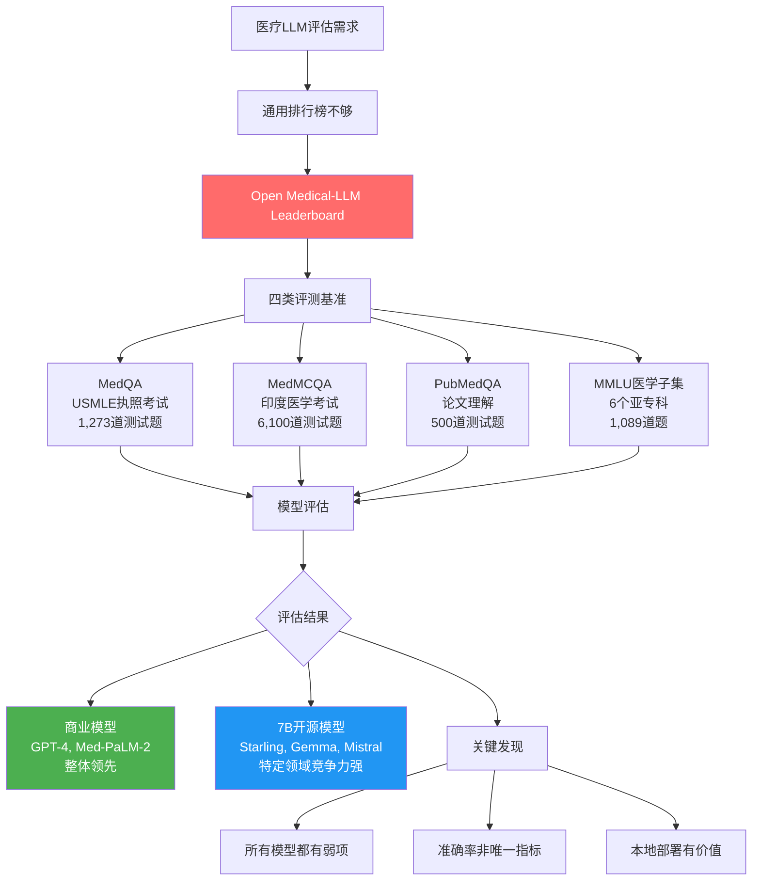

> 📊 难度：⭐⭐⭐ | ⏱️ 阅读：13分钟 | 📅 2024年4月19日 | 🏷️ 医疗AI, 模型评估, 领域基准

# The Open Medical-LLM Leaderboard
# 医疗大模型开放排行榜：当AI进入诊室，评测标准必须足够严格

## 一句话摘要

Hugging Face联合开源社区推出医疗大模型排行榜，使用MedQA（USMLE）、MedMCQA、PubMedQA和MMLU医学子集等四类基准，系统评估LLM在医疗问答场景中的准确性——因为在这个领域，AI的错误可能危及生命。

---

## 核心内容

### 为什么医疗LLM需要专门的排行榜？

通用LLM排行榜无法衡量模型在医疗场景中的可靠性。白皮书引用了一个触目惊心的例子：

> GPT-3在回答用药问题时，先正确解释了四环素对孕妇的禁忌，却随后**错误地推荐孕妇使用四环素**——这在真实场景中可能导致胎儿伤害。

在休闲AI应用中，错误的代价是用户体验不佳。在医疗AI应用中，**错误的代价可能是生命**。

### 四类评测基准

**1. MedQA（美国执业医师考试题）**
- 来源：USMLE（美国医学执照考试）
- 规模：11,450道训练题 + 1,273道测试题
- 格式：4-5选项选择题
- 测试：临床推理、疾病诊断、治疗方案选择
- 意义：这是美国医生必须通过的资格考试

**2. MedMCQA（印度医学入学考试题）**
- 来源：AIIMS/NEET考试
- 规模：187,000道训练题 + 6,100道测试题
- 覆盖：2,400个医疗主题，21个医学学科
- 特点：附带详细解释，格式为4选1
- 意义：规模最大的医疗问答数据集之一

**3. PubMedQA（生物医学文献问答）**
- 来源：PubMed学术论文摘要
- 规模：500道训练题 + 500道测试题
- 格式：基于论文摘要回答Yes/No/Maybe
- 测试：科学文献理解和推理能力
- 意义：评估模型对最新医学研究的理解

**4. MMLU医学子集（六个专项）**

| 子集 | 题目数 | 测试领域 |
|------|--------|----------|
| 临床知识 | 265 | 临床决策技能 |
| 医学遗传学 | 100 | 遗传学概念 |
| 人体解剖学 | 135 | 解剖学知识 |
| 专业医学 | 272 | 医学专业知识 |
| 大学生物 | 144 | 生物学基础 |
| 大学医学 | 173 | 医学基础 |

### 关键发现

**商业模型领先**
- GPT-4-base和Med-PaLM-2在所有医学数据集上保持一致的高准确率
- 这些模型在跨域表现上更加稳定

**开源模型竞争力强**
以下7B参数级模型表现出令人惊讶的竞争力：
- Starling-LM-7B
- Gemma-7B
- Mistral-7B-v0.1
- Hermes-2-Pro-Mistral-7B

**Gemini Pro的优劣势分析**
- 强项：数据密集型任务（生物统计学、细胞生物学、妇产科）
- 弱项：解剖学、心脏病学、皮肤科
- 结论：需要针对性改进才能全面应用于医疗场景

**共同的强势领域**
- PubMedQA：大多数模型在文献理解上表现良好
- MMLU临床知识：临床决策相关知识掌握较好

### 模型提交流程

1. 转换为Safetensors格式（更安全、更快速）
2. 确保AutoClass兼容性（transformers库自动加载）
3. 模型必须公开可访问
4. 目前不支持远程代码执行
5. 通过排行榜网站提交

---

## 技术要点

1. **以准确率为主要指标**的选择反映了医疗场景的特殊需求——在这个领域，F1分数或BLEU分数不够直观，医生需要知道"AI答对了多少"
2. **多来源基准设计**覆盖了从医学教育（MedQA/MedMCQA）到科研文献（PubMedQA）到专业知识（MMLU）的完整能力谱
3. **7B参数开源模型的竞争力**表明医疗知识可以被高效压缩到较小的模型中——这对本地部署和隐私保护至关重要
4. **Gemini Pro的不均衡表现**揭示了通用模型在医疗领域的盲区——某些亚专科知识需要专门训练
5. **Safetensors格式要求**体现了安全优先的设计理念——pickle格式的模型文件存在代码注入风险

---

## 解读

### 🟢 通俗版解读

想象你在招聘医院的AI助手。你会怎么面试它？

不能用普通面试题（"你的优点是什么？"），而要用**真正的医学考试题**来测试：

1. **USMLE题**（美国医生执照考试）——如果AI连医生资格考试都通不过，怎么能让它进诊室？
2. **印度医学入学考试题**——用18万道题库来全面检验，覆盖21个医学领域
3. **论文理解题**——给AI一篇最新的医学研究，看它能否正确理解结论
4. **各科知识测验**——解剖学、遗传学、临床知识...分科检查有没有短板

结果发现：
- "名校毕业"的大模型（GPT-4）整体最强
- 但一些"小而精"的开源模型（7B参数）在某些科目上意外地表现不错
- 没有哪个模型在所有科目都完美——即使是最好的AI也有弱项

这意味着：现在让AI独立行医还太早，但让它作为医生的"参考助手"已经很有价值。

### 🔴 深入版解读

**评估指标的局限性**：排行榜使用准确率作为唯一指标，这在医疗场景中有重要的局限。医疗决策中，不同类型的错误有截然不同的后果——假阳性（过度诊断）和假阴性（漏诊）的代价可能相差百倍。一个在整体准确率上略低但漏诊率极低的模型，在某些场景中可能比高准确率模型更有价值。

**选择题vs.开放式回答**：所有评测基准都是选择题格式，这与真实医疗场景存在显著差距。医生需要的是生成式输出——撰写病历、解释诊断、制定治疗方案。选择题准确率高不等于生成式回答的质量高。

**知识时效性问题**：医学知识更新速度快（平均5-7年更新一半），而模型的知识截止于训练时间。PubMedQA基于论文摘要的测试部分缓解了这个问题，但无法完全解决知识过时的风险。

**7B模型的实际部署价值**：开源7B模型的竞争力具有重要的实际意义。医疗数据的隐私要求（HIPAA、GDPR）使得将患者数据发送到云端API存在合规风险。能在本地GPU上运行的7B模型可以在保护隐私的同时提供有价值的辅助——这可能是医疗AI最现实的部署路径。

---

## 流程图

---

## 延伸思考

1. **从评测到部署**：排行榜分数能多大程度预测模型在真实临床场景中的表现？
2. **专科 vs. 全科**：是否应该为每个医学亚专科开发专门的模型和评测基准？
3. **安全基线**：在医疗AI中，是否需要设定最低准确率阈值——低于该阈值的模型不应被用于临床场景？
4. **多语言挑战**：当前基准以英文为主（少数印度语言），如何评估中文、日文等语言的医疗LLM？

---

## 原文链接

- [The Open Medical-LLM Leaderboard | Hugging Face Blog](https://huggingface.co/blog/leaderboard-medicalllm)
- [Medical-LLM Leaderboard Space](https://huggingface.co/spaces/openlifescienceai/open_medical_llm_leaderboard)
