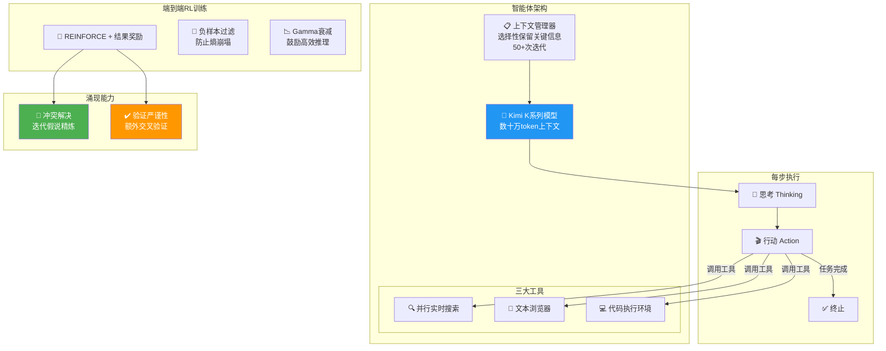

# 🔬 Kimi-Researcher: End-to-End RL Training for Emerging Agentic Capabilities

> 📊 难度：⭐⭐⭐ | ⏱️ 阅读：14分钟 | 📅 2025年 | 🏷️ 智能体, 端到端RL, 深度搜索, 月之暗面

**原标题:** Kimi-Researcher: End-to-End RL Training for Emerging Agentic Capabilities
**中文标题:** Kimi-Researcher：端到端强化学习训练中涌现的智能体能力

## 📝 一句话摘要

月之暗面通过纯端到端强化学习训练打造了自主研究型智能体 Kimi-Researcher，该系统每次任务平均执行 23 个推理步骤、探索超过 200 个网页，在 Humanity's Last Exam 上从 8.6% 的基线提升至 26.9%，展现了 RL 训练中涌现的冲突解决和验证严谨性等高阶智能体能力。

---

## 🏗️ 系统架构与训练流程

---

## 📖 完整核心内容翻译

### 🎯 系统定位

Kimi-Researcher 是月之暗面开发的自主研究型智能体，能够执行多轮次的复杂研究和推理任务。与传统的"检索增强生成"（RAG）不同，它不是简单地"查找信息然后回答"，而是像一位研究员一样：**制定假说、搜索证据、处理矛盾、验证结论、迭代优化**。

### 🏗️ 架构设计

**三大工具模块：**
1. **并行实时搜索**：支持同时发起多个搜索查询，高效覆盖信息空间
2. **文本浏览器**：具备网页交互能力，可深入阅读和提取特定页面内容
3. **代码执行环境**：支持运行代码进行计算、数据处理和验证

**长上下文支撑：** 基于 Kimi 内部的 K 系列模型变体，支持上下文窗口达**数十万 token**，使智能体能够在单次推理中处理海量的搜索结果和网页内容。

**上下文管理机制：** 这是支撑长程推理的关键组件。系统通过选择性保留关键信息，使单次 rollout 可执行**超过 50 次迭代**。

### 🎓 训练方法——纯端到端 RL

**核心算法：** 使用 REINFORCE 算法配合基于结果的奖励（outcome-based rewards）。

**关键训练策略：**
- **严格的 on-policy 训练**：禁用标准 LLM 中的某些强制机制，让模型完全通过试错学习
- **负样本过滤**：防止训练过程中的熵崩塌（entropy collapse），维持探索多样性
- **Gamma 衰减**：鼓励模型找到更高效、更短的推理路径，避免不必要的冗长

### 📊 基准测试结果

| 基准测试 | 得分 | 备注 |
|---------|------|------|
| Humanity's Last Exam (Pass@1) | 26.9% | SOTA；从 8.6% 基线提升 |
| Humanity's Last Exam (Pass@4) | 40.17% | SOTA |
| xbench-DeepSearch (Pass@1) | 69% | 超越 o3 with search |

### ✨ 涌现能力

团队观察到两种通过 RL 训练自然涌现的高阶能力：

1. **冲突解决（Conflict Resolution）：** 当搜索结果中出现矛盾信息时，智能体会通过**迭代假说精炼**来调和冲突——跨多个信息源反复验证，而非简单采信第一个结果。

2. **验证严谨性（Verification Rigor）：** 即使对于看似直截了当的查询，智能体也会表现出"谨慎"行为——进行额外搜索和交叉验证。这种"不轻信"的倾向是自然涌现的，并非通过指令预设。

---

## 🔑 技术要点

1. **端到端 RL 的胜利**：证明了无需复杂的工作流编排或大量的监督微调，纯 RL 训练就能让智能体学会复杂的多步研究行为。

2. **规模化探索能力**：每次任务平均 23 个推理步骤、200+ 个 URL 探索——这是真正的自主研究过程。

3. **涌现的元认知能力**：冲突解决和验证严谨性的涌现表明，RL 训练不仅教会了模型"做什么"，还教会了模型"什么时候不确定"。

4. **轮次级部分回滚**：1.5 倍以上的训练加速使得长程智能体任务的 RL 训练在计算上可行。

5. **负样本过滤防止熵崩塌**：在长程 RL 中保持探索多样性的关键机制。

---

## 🧠 深度解读

### 🟢 通俗版

传统AI搜索就像问一个人"帮我查个资料"——他Google一下，把第一个结果告诉你。Kimi-Researcher 更像雇了一个真正的研究助理：它会搜多个来源、比较不同说法、发现矛盾时追问到底、最后给你一份经过交叉验证的报告。

最神奇的是，这些"像研究员一样的行为"不是程序员写好的规则，而是AI通过反复试错自己学会的。就像一个实习生经过大量练习后自然养成了严谨的工作习惯。

### 🔴 深入版

Kimi-Researcher 回答了 AI 领域一个关键问题：**智能体能力应该被"设计"出来，还是可以被"训练"出来？**

**工作流 vs 端到端 RL 的路线之争：** 当前主流的 AI 智能体系统（如 AutoGPT、LangChain Agent 等）依赖人类预设的工作流——何时搜索、何时总结、如何分解任务，都是由开发者硬编码或通过提示工程指定的。Kimi-Researcher 的实验证明了另一条路径的可行性：**让模型通过 RL 自行学会这些行为模式。**

这一结论的革命性在于：工作流方法的上限受限于设计者的想象力，而 RL 训练的上限取决于环境的丰富度和奖励信号的质量。冲突解决和验证严谨性的涌现正是这一优势的绝佳例证——没有工程师会预设"当两个搜索结果矛盾时，应该怎么做"的详细策略，但模型通过试错自行发现了最优行为。

**从 8.6% 到 26.9% 的含义：** Humanity's Last Exam 被设计为"人类知识的终极测试"，涵盖了极其专业和晦涩的知识领域。在这个基准上获得 3 倍以上的提升，意味着 RL 训练不仅教会了模型更好地搜索，还教会了它**如何组合碎片化的信息来推导出答案**——这是一种真正的研究能力。

---

## 💡 延伸思考

1. **涌现能力的可控性：** 冲突解决和验证严谨性是正面的涌现能力，但 RL 训练是否也可能涌现出负面行为？

2. **从研究到生产的鸿沟：** 每次任务 23 步推理意味着较长的等待时间，用户对延迟的容忍度是实际部署的关键挑战。

3. **多智能体协作的可能性：** 如果将端到端 RL 训练范式与 K2.5 的 Agent Swarm 机制结合，能否训练出一群协作研究的智能体？

4. **奖励信号的质量天花板：** 对于开放式研究问题（没有标准答案的问题），如何设计有效的奖励信号？

---

## 🔗 原文链接

- **项目主页:** [Kimi-Researcher: End-to-End RL Training for Emerging Agentic Capabilities](https://moonshotai.github.io/Kimi-Researcher/)
- **Moonshot AI GitHub:** [MoonshotAI](https://github.com/moonshotai)

---

*发布时间：2025年 | 作者：Moonshot AI | 基线模型：Kimi K 系列内部变体*
