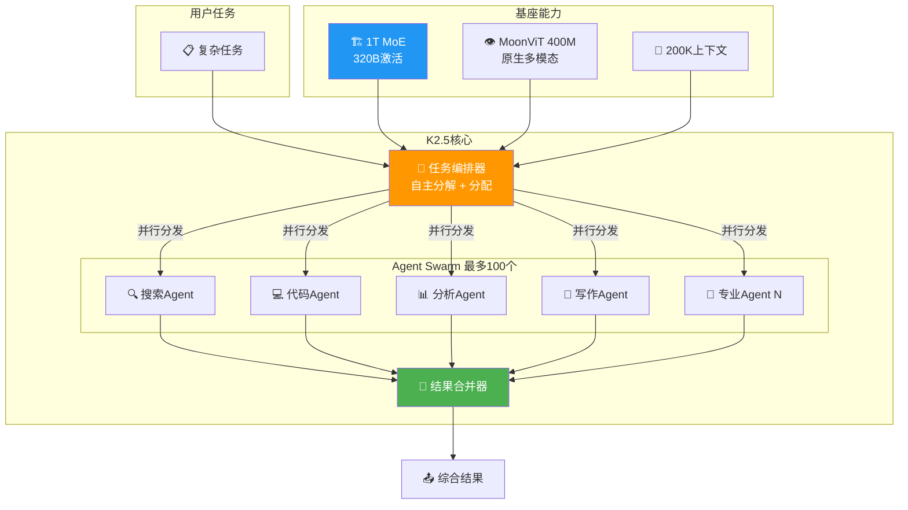

# 🐝 Kimi K2.5: Open Visual Agentic Model for Real Work

> 📊 难度：⭐⭐⭐ | ⏱️ 阅读：15分钟 | 📅 2026年1月 | 🏷️ Agent Swarm, 多模态, MoE, 月之暗面

**原标题:** Kimi K2.5: Open Visual Agentic Model for Real Work
**中文标题:** Kimi K2.5：面向真实工作的开源视觉智能体模型

## 📝 一句话摘要

月之暗面在 2026 年 1 月发布了 Kimi K2.5——一个万亿参数的原生多模态 MoE 模型，引入创新的 Agent Swarm（智能体集群）机制，可协调多达 100 个专业智能体并行工作，在多项基准上超越 GPT-5.2 和 Claude Opus 4.5，同时以开源形式发布并实现 76% 的成本优势。

---

## 🏗️ Agent Swarm 架构

---

## 📖 完整核心内容翻译

### 🎯 模型定位

Kimi K2.5 不仅仅是 K2 的升级版本，而是代表了月之暗面从"单一对话模型"向"多智能体协作系统"的战略跃迁。正如 CEO 杨植麟所言，2026 年的核心战略是**将模型训练与智能体产品开发垂直整合**，K2.5 正是这一战略的技术载体。

### 📐 架构与参数

| 参数 | 数值 |
|-----|------|
| 总参数量 | 1 万亿 |
| 每 token 激活参数 | ~320 亿 |
| 架构 | 混合专家（MoE） |
| 视觉编码器 | MoonViT（4 亿参数） |
| 继续预训练数据 | ~15 万亿混合视觉+文本 token |
| 上下文窗口 | 200K token |
| 推理模式 | Instant（即时） / Thinking（深度思考） |

**原生多模态设计：** K2.5 不是"语言模型 + 视觉适配器"的拼接方案，而是通过在 15 万亿混合视觉和文本 token 上进行继续预训练，实现了**真正的原生多模态融合**。

### 🐝 Agent Swarm：从单体到集群

K2.5 最具颠覆性的创新是 **Agent Swarm（智能体集群）** 机制：

**核心思想：** 将复杂任务分解为多个子任务，由多达 100 个专业化智能体并行处理，大幅缩短执行时间。

**实际效果：**
- 执行时间缩短 **4.5 倍**
- 在 Humanity's Last Exam 上达到 **50.2%**，成本比 Claude Opus 4.5 低 **76%**
- BrowseComp 从 60.6%（单智能体）提升至 **78.4%**（Agent Swarm）

### 📊 基准测试全面超越

**代码能力：**

| 基准测试 | Kimi K2.5 | 对比 |
|---------|-----------|------|
| SWE-Bench Verified | 76.8% | 超越 Gemini 3 Pro |
| SWE-Bench Multilingual | 73.0% | 超越 GPT-5.2 |
| AIME 2025 | 96.1% | — |

**智能体任务（Agent Swarm 加持）：**

| 基准测试 | 单智能体 | Agent Swarm |
|---------|---------|-------------|
| Humanity's Last Exam | — | 50.2% |
| BrowseComp | 60.6% | 78.4% |
| WideSearch | 72.7% | 79.0% |

### 📦 开源与商业化

K2.5 以完全开源形式发布，支持商业和非商业用途。API 定价以远低于闭源竞品的价格提供服务。

---

## 🔑 技术要点

1. **Agent Swarm 集群智能**：从单智能体扩展到最多 100 个并行专业智能体的自主协调，实现 4.5 倍速度提升和 76% 成本降低。

2. **原生多模态融合**：通过 15 万亿混合 token 的继续预训练和 MoonViT 视觉编码器，实现文本、图像、视频的统一理解。

3. **全维度性能领先**：在视觉理解、代码生成、推理三大核心维度均达到开源最佳或超越闭源竞品。

4. **200K 上下文窗口**：结合 MoBA 技术，为复杂智能体任务提供充足的上下文空间。

5. **从模型到产品的垂直整合**：K2.5 是月之暗面"模型训练 + 智能体产品"一体化战略的核心组件。

---

## 🧠 深度解读

### 🟢 通俗版

想象你要完成一个大项目。传统AI就像一个人独自工作——再厉害也有效率上限。K2.5 的 Agent Swarm 就像组建了一个最多 100 人的专业团队：有人负责搜索资料，有人负责写代码，有人负责分析数据，所有人同时工作。

关键是，这个团队不需要你来管理——AI 自己决定怎么分工、怎么合作、怎么汇总结果。效果？速度快了 4.5 倍，成本还降低了 76%。

### 🔴 深入版

#### Agent Swarm 的范式意义

Agent Swarm 的重要性远超一个具体的技术特性——它代表了 AI 智能体发展的一个关键转折点。

此前的 AI 智能体系统，无论是 K2 的 300 步连续工具调用，还是 Kimi-Researcher 的 23 步自主研究，本质上都是**单一智能体的串行执行**。Agent Swarm 打破了这一范式：不是让一个智能体做更多步骤，而是让**多个专业化智能体协同工作**。

这种"集群智能"的思路来源于生物学中的蜂群行为：单个蜜蜂的智能有限，但蜂群作为整体展现出远超个体的协调能力。

#### 从 K2 到 K2.5 的进化逻辑

K2 证明了万亿参数 MoE 可以在开源模型中实现前沿性能。K2.5 在此基础上做了两件事：

1. **补全多模态短板**：通过 MoonViT 和大规模多模态预训练将视觉理解提升为一等能力
2. **从工具使用到任务编排**：K2 擅长执行工具调用，K2.5 擅长将复杂任务分解为可并行的子任务——这是从"执行者"到"管理者"的升级

#### 商业化信号

杨植麟明确表示不追求绝对用户数量，而是聚焦智能体商业化。K2.5 的 Coding 和 Agent 两大变现方向表明，月之暗面正在从"做通用 AI 模型"转向"做 AI 劳动力"。

---

## 💡 延伸思考

1. **Agent Swarm 的扩展极限：** 100 个并行智能体已经展现出显著优势，但协调开销会随智能体数量增加而增长。是否存在一个最优的集群规模？

2. **多智能体的可靠性问题：** 单个智能体的错误可能被其他智能体纠正，但也可能被放大。如何确保集群整体的输出质量？

3. **与 K3 的路线图：** K3 将把有效 FLOPs 提升至少一个数量级，可能在架构层面有更根本的创新。

4. **开源 vs 闭源的终局：** K2.5 以开源形式达到甚至超越 GPT-5.2 和 Claude Opus 4.5 的性能，闭源模型的护城河在哪里？

---

## 🔗 原文链接

- **官方产品页:** [Kimi K2.5](https://www.kimi.com/ai-models/kimi-k2-5)
- **TechCrunch 报道:** [China's Moonshot releases Kimi K2.5](https://techcrunch.com/2026/01/27/chinas-moonshot-releases-a-new-open-source-model-kimi-k2-5-and-a-coding-agent/)
- **HuggingFace 模型页:** [moonshotai/Kimi-K2.5](https://huggingface.co/moonshotai/Kimi-K2.5)

---

*发布时间：2026年1月27日 | 作者：Moonshot AI | 架构：1T MoE + MoonViT 400M*
