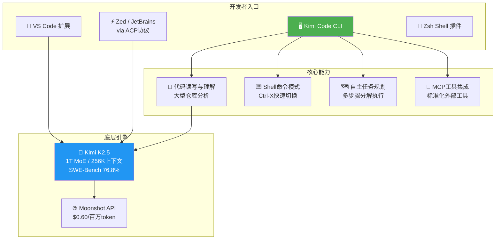

# 🖥️ Kimi Code CLI: Next-Gen AI Code Agent

> 📊 难度：⭐⭐ | ⏱️ 阅读：10分钟 | 📅 2026年1月 | 🏷️ AI编程, CLI工具, MCP, 月之暗面

**原标题:** Kimi Code - Next-Gen AI Code Agent | Automated Programming & CLI
**中文标题:** Kimi Code CLI：新一代AI编程智能体——终端中的自主开发伙伴

## 📝 一句话摘要

月之暗面推出 Kimi Code CLI，一款基于 Kimi K2.5 模型的终端 AI 编程智能体，支持代码读写、Shell 执行、MCP 工具集成与多 IDE 联动，以 Apache 2.0 开源协议发布，已获 7,300+ GitHub Star。

---

## 🏗️ 产品架构

---

## 📖 核心内容

### 🎯 产品定位与愿景

Kimi Code CLI 是月之暗面面向开发者推出的 AI 编程智能体产品。与传统的代码补全工具不同，Kimi Code 定位为**终端中的自主开发伙伴**——它不仅能读写代码，还能执行 Shell 命令、自主规划多步任务，并在执行过程中根据环境反馈动态调整策略。

产品的核心理念是"一次订阅，全端编程"（One Subscription, Write Across All Ends）。

### 🛠️ 核心能力

**1. 代码读写与理解**
深入理解大型代码仓库的结构，执行代码重构、Bug 修复和功能开发。底层由 Kimi K2.5 模型驱动，SWE-Bench Verified 76.8% 通过率。

**2. Shell 命令模式**
通过 `Ctrl-X` 快捷键在对话模式和 Shell 命令模式之间快速切换。

**3. 自主任务规划**
面对多步骤的开发需求，可以将任务分解为子目标，逐步执行并根据中间结果调整后续步骤。

**4. MCP 工具集成**
支持 Model Context Protocol（MCP），通过 `kimi mcp add/list/remove/auth` 命令管理外部工具。

**5. 多 IDE 集成**
- **VS Code**：通过专用扩展直接集成
- **Zed / JetBrains**：通过 Agent Client Protocol (ACP) 协议支持
- **Zsh Shell 插件**：深度集成终端体验

### 💰 商业模式

Kimi Code 采用会员订阅制。API 层面，Kimi K2.5 模型定价为每百万输入 Token $0.60，仅为 Claude 的十分之一。

---

## 🔑 技术要点

1. **终端原生 AI Agent**：以终端为核心运行环境，支持代码读写、Shell 执行和自主任务规划三位一体
2. **MCP 协议支持**：通过 Model Context Protocol 实现外部工具的标准化集成
3. **ACP 多 IDE 协议**：通过 Agent Client Protocol 实现跨 IDE 的统一 Agent 体验
4. **Kimi K2.5 驱动**：底层依托万亿参数 MoE 模型，256K 上下文窗口
5. **开源生态**：Apache 2.0 协议，Python 68.8% + TypeScript 29.6%，社区活跃

---

## 🧠 深度解读

### 🟢 通俗版

Kimi Code CLI 就像在你的终端里住了一个程序员搭档。你告诉它"帮我修复这个 Bug"，它会自己看代码、找问题、写修复、跑测试。而且不管你用 VS Code 还是 JetBrains，都是同一个助手。最关键的是，它的使用成本只有 Claude Code 的十分之一。

### 🔴 深入版

Kimi Code CLI 的推出标志着月之暗面从"模型提供商"向"开发者工具平台"的战略转型。

**生态卡位**：在 Claude Code、Cursor、Windsurf 等工具激烈竞争的当下，Kimi Code 以开源 + 极低成本的策略切入，瞄准对成本敏感但对代码质量有高要求的开发者群体。

**MCP 生态融入**：MCP 协议正在成为 AI Agent 工具连接的事实标准。Kimi Code 原生支持 MCP，意味着开发者可以将已有的 MCP 工具生态直接接入。

**从辅助到自主**：Shell 命令模式和自主任务规划能力，使 Kimi Code 从"被动回答问题"升级为"主动完成任务"。

**开源策略的深意**：以 Apache 2.0 开源 CLI 工具，通过 API 调用量实现商业化。"工具开源、算力付费"的模式，既降低了信任门槛，又构建了持续的收入来源。

---

## 💡 延伸思考

1. **AI 编程工具的终局形态是什么？** 是嵌入 IDE 的 Copilot 模式，还是终端原生的 Agent 模式？
2. **开源 CLI + 付费 API 的商业模式能否持续？** 需要足够大的开发者基数才能形成规模效应
3. **中国开发者工具出海的机会**：以十分之一的成本提供可比肩的代码生成能力，Kimi Code 在全球市场具备显著的价格竞争力

---

## 🔗 原文链接
- Kimi Code 官网: https://www.kimi.com/code
- GitHub 仓库: https://github.com/MoonshotAI/kimi-cli
- Moonshot AI 开放平台: https://platform.moonshot.ai/
