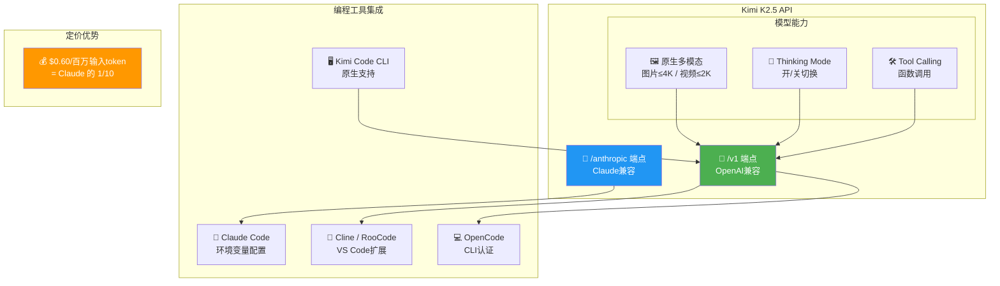

# 🔌 Kimi K2.5 API Platform: Developer Quickstart & Integration Guide

> 📊 难度：⭐⭐ | ⏱️ 阅读：10分钟 | 📅 2026年1月 | 🏷️ API, 开发者工具, 多模态, 月之暗面

**原标题:** Kimi K2.5 Quickstart / Using Kimi K2.5 Model in Programming Tools
**中文标题:** Kimi K2.5 API 平台：开发者快速接入与多工具集成指南

## 📝 一句话摘要

月之暗面为 Kimi K2.5 构建了完整的开发者平台生态，提供 OpenAI 兼容 API、256K 上下文窗口、原生多模态支持和思维链推理模式，并可一键接入 Claude Code、Cline、RooCode、OpenCode 等主流编程工具。

---

## 🏗️ 集成生态

---

## 📖 核心内容

### 🎯 API 设计哲学：OpenAI 兼容性

Kimi K2.5 API 采用了与 OpenAI 完全兼容的接口设计，端点为 `https://api.moonshot.ai/v1`。开发者可以直接使用 OpenAI SDK 接入，只需更换 base_url 和 API key 即可切换到 Kimi K2.5。

### 🧠 模型能力

**原生多模态输入**
- 图片格式：PNG、JPEG、WebP、GIF（分辨率 ≤ 4K）
- 视频格式：MP4、MPEG、MOV、AVI、WebM（分辨率 ≤ 2K）

**思维链推理模式（Thinking Mode）**
- `{"type": "enabled"}`：开启思维链，适合复杂推理任务
- `{"type": "disabled"}`：关闭思维链，适合快速响应场景

**Tool Calling**
支持工具调用功能，思维链模式下 `tool_choice` 仅接受 "auto" 或 "none"。

### 🔧 多编程工具集成

**Claude Code 集成**：通过 `https://api.moonshot.ai/anthropic` 端点直接在 Claude Code 中使用 Kimi K2.5。

**Cline / RooCode**：在 VS Code 扩展中选择 Moonshot 作为 API 提供商即可使用。

**OpenCode**：通过 `opencode auth login` 选择 Moonshot AI 认证。

### 💰 定价

输入 Token 每百万 $0.60——相比 Claude 等竞品具有 10 倍成本优势。

---

## 🔑 技术要点

1. **OpenAI 兼容 API**：零迁移成本，一行代码切换
2. **原生多模态**：图片和视频直接输入，动态计费
3. **双模式推理**：Thinking Mode 开/关控制推理深度
4. **跨工具兼容**：官方支持 Claude Code、Cline、RooCode、OpenCode 四大主流编程工具
5. **Anthropic 协议兼容**：通过 `/anthropic` 端点实现 Claude Code 原生接入

---

## 🧠 深度解读

### 🟢 通俗版

如果你已经在用 Claude Code 或 Cursor 写代码，不需要换工具——只需要改一个网址，就能把底层模型从 Claude 换成 Kimi K2.5，而且费用只有原来的十分之一。就像换了一个更便宜的电话运营商，但电话还是同一部。

### 🔴 深入版

Kimi K2.5 API 平台的设计逻辑揭示了月之暗面的商业战略核心：**用 API 生态实现万亿参数模型的商业闭环**。

**兼容性即护城河**：同时兼容 OpenAI 和 Anthropic 两套 API 协议，意味着几乎所有主流 AI 应用都可以无缝切换到 Kimi K2.5。这是一种"降维兼容"策略——你不需要学习新的 API，只需要改一个 URL。

**"寄生式"工具生态**：不自建 IDE，而是让 Kimi K2.5 作为后端模型嵌入 Claude Code、Cursor 等已有工具链中。避免了与成熟工具的正面竞争，最大化了模型的分发渠道。

**Thinking Mode 的产品化**：将思维链推理从学术概念变为一个 API 参数开关，让开发者可以在推理深度和响应速度之间灵活选择。

---

## 💡 延伸思考

1. **API 兼容性的极限在哪里？** 同时兼容两家协议需要跟随两家的 API 演进，维护成本可能显著上升
2. **"模型即服务" vs "工具即服务"**：月之暗面选择了前者，与 Anthropic（Claude Code）和 OpenAI（Codex）的路线形成对比
3. **定价策略的可持续性**：10 倍的成本优势能否在万亿参数 MoE 模型上持续？

---

## 🔗 原文链接
- Kimi K2.5 快速开始: https://platform.moonshot.ai/docs/guide/kimi-k2-5-quickstart
- 编程工具集成指南: https://platform.moonshot.ai/docs/guide/agent-support
- Moonshot AI 开放平台: https://platform.moonshot.ai/
