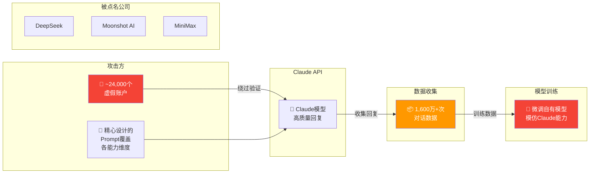

# 🛡️ Detecting and Preventing Distillation Attacks

> 📊 难度：⭐⭐⭐ | ⏱️ 阅读：10分钟 | 📅 2025年底 | 🏷️ AI安全, 蒸馏攻击, 知识产权, Anthropic

**原标题:** Detecting and Preventing Distillation Attacks
**中文标题:** 检测与防御蒸馏攻击——Anthropic 披露 Moonshot AI 等公司的大规模模型窃取行为

## 📝 一句话摘要

Anthropic 于 2025 年末公开披露，DeepSeek、Moonshot AI 和 MiniMax 三家中国 AI 实验室通过约 24,000 个虚假账户、超过 1,600 万次对话，对 Claude 实施了工业级别的蒸馏攻击（即利用大模型输出来训练自己的小模型），构成严重的知识产权侵害。

---

## 🏗️ 蒸馏攻击流程

---

## 📖 核心内容

### ⚠️ 事件背景

2025 年底，Anthropic 发布了一篇名为《Detecting and Preventing Distillation Attacks》的安全报告，揭露了三家中国 AI 公司对 Claude 模型进行系统性蒸馏攻击的调查结果。这是 AI 行业首次有公司公开、实名披露此类攻击行为。

### 🔍 蒸馏攻击的技术本质

"模型蒸馏"原本是一种合法的机器学习技术。但当这种技术被用于**未经授权地复制商业模型的能力**时，就变成了一种攻击行为。

攻击的基本流程是：
1. 创建大量虚假账户，绕过身份验证和地域限制
2. 向 Claude 发送精心设计的提示词，覆盖各种能力维度
3. 收集 Claude 的高质量回复作为训练数据
4. 用这些数据微调自己的模型

### 📊 攻击规模

- **参与机构**：DeepSeek、Moonshot AI（月之暗面）、MiniMax
- **虚假账户**：约 24,000 个
- **对话总量**：超过 1,600 万次交互
- **违规性质**：违反服务条款和地域访问限制

### 🛡️ Anthropic 的应对措施

- 异常使用模式的自动检测系统
- 基于账户行为分析的欺诈检测
- API 使用限制和速率控制的加强
- 与法律团队合作追究违规方的责任

---

## 🔑 技术要点

1. **蒸馏攻击的工业化**：攻击规模（24,000 账户、1,600 万次对话）远超一般理解
2. **数据合规性挑战**：训练数据来源合规性成为大模型公司面临的核心法律与伦理风险
3. **检测技术的难度**：区分正常高频用户和系统性蒸馏攻击需要复杂的行为分析模型
4. **地缘政治维度**：三家被点名公司均来自中国，增加了行业的地缘政治张力
5. **开源与闭源的张力**：蒸馏攻击的存在为闭源模型提供了额外的合理性论据

---

## 🧠 深度解读

### 🟢 通俗版

想象一个学生偷偷录下了一位名师的所有课程，然后用这些录音来训练自己的AI助教。虽然这个学生的AI助教可能教得很好，但他没有经过名师的同意，也没有付费——这就是蒸馏攻击的本质。

Anthropic 发现有三家中国AI公司用了大约 24,000 个假账户，和 Claude 进行了 1,600 万次对话，目的就是收集Claude的高质量回答来训练自己的模型。

### 🔴 深入版

这一事件的深远影响超出了单纯的技术安全范畴：

**信任危机**：对于 Moonshot AI 而言，在积极推进开源战略（K2 以 MIT 协议开源）的同时被指控蒸馏攻击，形成了尖锐的矛盾。开源社区的信任建立在透明和诚信之上，这一事件可能动摇部分开发者对 Kimi 模型训练过程透明度的信心。

**行业规范的缺失**：目前，AI 行业对于"什么程度的 API 使用构成蒸馏攻击"缺乏明确的行业标准。研究者可能出于学术目的大量调用 API，企业可能出于产品评测需要批量调用——这与恶意蒸馏之间的界限并不总是清晰的。

**技术军备竞赛的阴暗面**：蒸馏攻击折射出一种"不惜代价追赶领先者"的心态。短期内可能加速模型能力的提升，但长期来看会损害整个生态系统的健康发展。

**防御与开放的悖论**：加强蒸馏检测和防御会增加合法用户的使用摩擦，过于严格的限制可能误伤正常研究。

---

## 💡 延伸思考

1. **蒸馏攻击应该被如何定性？** 是知识产权侵权、违约行为，还是应该在 AI 专项法律中单独定义？
2. **这对中国 AI 公司的国际声誉意味着什么？** 国际社会可能对所有中国 AI 公司的训练数据合规性产生更广泛的质疑
3. **模型能力的可溯源性**：未来是否可以通过技术手段（如水印、指纹）来检测一个模型是否包含被蒸馏的知识？

---

## 🔗 原文链接
- Anthropic 安全报告: https://www.anthropic.com/news/detecting-and-preventing-distillation-attacks
