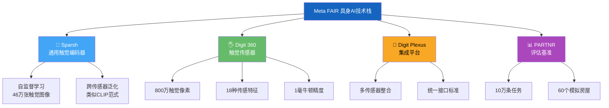

> 📊 难度：⭐⭐⭐⭐ | ⏱️ 阅读：14分钟 | 📅 2024年10月31日 | 🏷️ 具身AI, 触觉感知, 机器人, 开源硬件

# 🤖 Advancing Embodied AI — 推进具身AI

> **原标题**: Advancing Embodied AI Through Progress in Touch Perception, Dexterity, and Human-Robot Interaction
> **中文标题**: Meta FAIR具身AI前沿：触觉感知、灵巧操作与人机协作的开源突破
> **发布日期**: 2024年10月31日
> **原文链接**: https://ai.meta.com/blog/fair-robotics-open-source/

## 📝 一句话摘要

Meta FAIR发布一系列具身AI研究成果，包括通用触觉编码器Sparsh、具有18种以上传感特征的Digit 360触觉传感器、硬件集成平台Digit Plexus，以及包含10万条任务的人机协作基准PARTNR，将触觉感知和机器人研究推向新高度并全部开源。

---

## 📖 核心内容

### 🖐️ 一、Meta Sparsh：通用触觉表示框架

Sparsh被定义为"首个通用的基于视觉的触觉感知编码器"。其核心创新在于：

**🔄 自监督学习范式**
- 不需要力测量等标注训练数据
- 跨多种基于视觉的触觉传感器通用
- 在超过46万张触觉图像上训练

**📊 性能表现**
- 在标准基准上平均超过任务特定模型95%以上
- 实现跨传感器、跨任务的泛化能力
- 为机器人学和AI研究提供可扩展的触觉理解基础

**💡 技术意义**
Sparsh之于触觉感知，类似于CLIP之于视觉-语言理解——提供了一个通用的表示基础，使下游任务无需从零训练专用模型。这是触觉AI领域从"每个任务一个模型"向"基础模型+微调"范式转变的标志性工作。

### 🖐️ 二、Meta Digit 360：革命性触觉传感器

Digit 360是人工触觉感知的一次硬件突破：

**📐 传感规格**
- 超过**18种传感特征**，捕获振动、热感、化学信号等多模态数据
- 超过**800万个触觉像素(taxels)**，捕获全方位形变
- 可检测低至**1毫牛顿**的微小力量
- 内置设备端AI加速芯片，支持本地处理

**🧬 仿生设计**
灵感来源于人体的反射弧(reflex arcs)——类似于人类手指在触碰热物体时不经过大脑就能触发的缩手反射，Digit 360支持在传感器层面进行快速的本地信号处理和决策。

**🏭 产业化路径**
- **GelSight Inc**将负责Digit 360的制造和分销
- 目标可用时间：2025年
- GelSight CEO强调双方共同愿景："我们希望鼓励研究者和开发者拥抱这一技术"

### 🔌 三、Meta Digit Plexus：硬件软件集成平台

Digit Plexus是一个标准化平台，解决了机器人手上多传感器集成的工程挑战：

- 将多个触觉传感器整合到单个机器人手上
- 通过统一电缆连接实现无缝数据采集和控制
- 标准化的硬件接口降低了不同传感器组合的集成成本

**🤝 产业合作**
- **Wonik Robotics**正在开发集成了Digit Plexus平台触觉传感器的Allegro Hand
- 计划2025年推出

### 📊 四、PARTNR基准：人机协作的大规模评估

PARTNR(Planning And Reasoning Tasks in humaN-Robot collaboration)是迄今为止同类最大的基准：

**📏 规模**
- 10万条自然语言任务
- 60个模拟房屋
- 5800+个独特物体
- 针对基于LLM的机器人规划的评估框架

**🔍 关键发现**
"最先进的基于LLM的规划器在协调、任务追踪和故障恢复方面表现挣扎。"

这一发现揭示了一个重要差距：虽然LLM在语言理解和代码生成方面取得了惊人进展，但在需要持续物理交互、多步协调和实时故障处理的具身场景中，它们仍然远未达到实用水平。

### 🌍 五、全面开源

所有代码、硬件设计和模型通过GitHub和Hugging Face公开发布，包括：
- Sparsh的模型权重和训练代码
- Digit 360的完整硬件设计文档
- Digit Plexus的集成规范
- PARTNR的完整基准数据集和评估代码

---

## 🔧 技术要点

1. **通用触觉编码器**：Sparsh通过自监督学习实现跨传感器泛化，类比CV领域的基础模型范式革新触觉AI
2. **超高精度触觉硬件**：Digit 360的800万taxels和1毫牛顿精度接近甚至超越人类指尖的感知能力
3. **仿生反射弧设计**：设备端AI加速实现本地快速反应，模拟人类脊髓反射弧的低延迟响应机制
4. **LLM具身化的瓶颈**：PARTNR基准揭示当前LLM在协调、追踪和故障恢复等具身任务上的系统性不足
5. **开源硬件先例**：同时开源软件模型和硬件设计，为机器人研究社区提供完整的可复现研究平台

## 🧩 深度解读

### 🟢 通俗版

想象你的手指有多灵敏——你能感受到丝绸和砂纸的区别、能判断杯子里的水是冷还是热、能察觉手机在口袋里的微弱震动。现在 Meta 造了一个"超级手指"（Digit 360），它比你的手指还敏感 —— 有 800 万个感应点（你的手指大约有 2000 个），能感受到你感受不到的微小力量。然后他们还训练了一个"触觉翻译官"（Sparsh），它可以把任何触觉传感器的信号都翻译成 AI 能理解的语言。最酷的是，他们把所有这些设计图纸都免费公开了，任何人都可以自己造一个。

### 🔴 深入版

这批发布代表了Meta FAIR在具身AI领域的系统性布局——从底层硬件(Digit 360)到集成平台(Digit Plexus)到感知模型(Sparsh)再到评估基准(PARTNR)，构建了一条完整的触觉感知研究链。

**Sparsh的基础模型范式特别值得关注**。在计算机视觉领域，CLIP和DINOv2等基础模型彻底改变了下游任务的开发方式——不再需要为每个任务训练专用模型。Sparsh将同样的思路带入触觉感知，使研究者可以在通用表示之上快速开发各种触觉应用（材质识别、力估计、滑动检测等）。46万张触觉图像虽然远少于视觉基础模型的训练数据量，但在触觉数据极度稀缺的背景下已经是一个突破性的规模。

**PARTNR的发现对具身AI的期望值是一记冷水**。在ChatGPT时代，人们容易高估LLM在机器人领域的能力。PARTNR的评估表明，即使是最先进的LLM规划器也难以处理人机协作中的基本挑战：多步协调、状态追踪和故障恢复。这意味着从语言AI到具身AI的距离比很多人想象的要远——需要的不仅是更大的语言模型，而是全新的规划和推理范式。

**全栈开源策略是Meta具身AI布局的深远之处**。通过开源硬件设计，Meta实际上在培育一个以其技术标准为核心的机器人研究生态。当学术界广泛使用Digit 360和Sparsh时，Meta的技术路线就成了事实标准。

## 💭 延伸思考

1. **触觉数据的规模化挑战**：Sparsh在46万张图像上训练已经超越了专用模型，但与视觉基础模型的数十亿级数据相比仍然很小。触觉数据的采集受限于物理交互的速度，如何解决这一数据瓶颈？合成触觉数据或仿真触觉数据是否可行？
2. **感知-行动闭环的缺失**：这批发布聚焦于感知(触觉)和评估(PARTNR)，但从感知到控制(action)的闭环仍然缺失。具身AI的真正突破需要将触觉感知、视觉感知和运动控制统一在一个端到端的框架中。
3. **开源硬件的可持续性**：软件开源有成熟的社区协作模式(GitHub PR/Issue)，但硬件开源面临制造、供应链和质量控制等额外挑战。GelSight的商业化制造能否保证研究者获得一致质量的硬件？社区改进的硬件设计如何回馈到主线版本？
