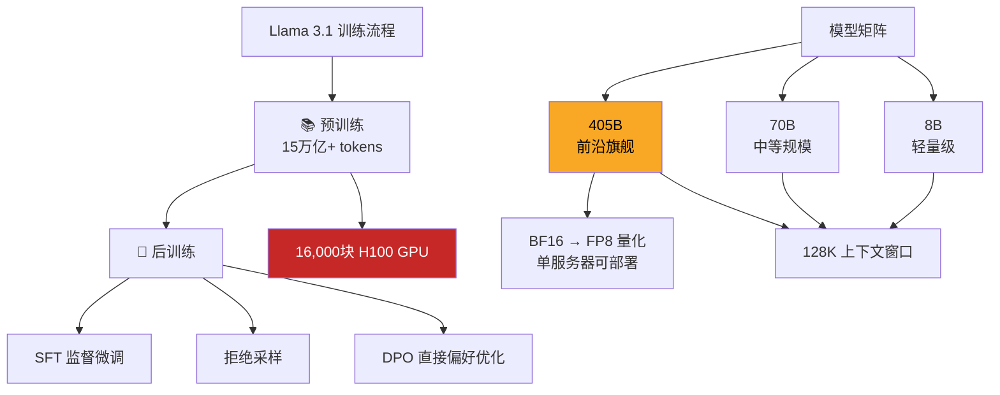

> 📊 难度：⭐⭐⭐ | ⏱️ 阅读：12分钟 | 📅 2024年7月23日 | 🏷️ Llama 3.1, 405B, 开源AI, 前沿模型

# 🦙 Introducing Llama 3.1: Our most capable models to date
# 发布Llama 3.1：迄今为止最强大的开源模型

## 📝 一句话摘要

Meta发布了Llama 3.1系列模型，其中405B参数的旗舰模型成为首个可与GPT-4、Claude 3.5 Sonnet等闭源模型媲美的开源前沿大模型，标志着开源AI正式进入前沿竞技场。

---

## 📖 核心内容

### 🏆 开源AI的里程碑时刻

2024年7月23日，Meta正式发布了Llama 3.1系列模型，包含8B、70B和405B三个规格。其中，405B参数的旗舰模型是一个具有划时代意义的里程碑——它是首个公开可用的前沿级开源大模型，在通用知识、可控性、数学、工具使用和多语言翻译等方面均达到了顶级水平。

Meta坚信开源是AI发展的正确路径。正如Linux成为现代计算的基石，Llama也有望成为AI时代的基础架构。开源不仅能让全球更多人受益于AI技术，还能防止权力过度集中于少数几家公司手中。

### 🏗️ 技术架构与训练

Llama 3.1 405B在技术路线选择上颇具匠心：

**架构选择**：Meta并未追随混合专家模型（MoE）的潮流，而是采用了标准的纯解码器Transformer架构，仅做了少量适配调整。这一选择的核心考量是最大化训练稳定性——在如此大规模的训练中，稳定性比理论效率更为关键。

**训练规模**：模型在超过15万亿个token上完成预训练，动用了超过16,000块H100 GPU。这使得405B成为首个在如此规模上训练的Llama模型。

**量化优化**：为了降低部署门槛，Meta将模型从16位（BF16）量化至8位（FP8）数值格式，使得模型能够在单台服务器上运行，大幅降低了推理成本。

**后训练流程**：采用了多轮迭代的后训练方法，结合监督微调（SFT）、拒绝采样和直接偏好优化（DPO）。团队还通过合成数据生成来扩展微调数据集，同时利用质量过滤技术确保数据质量。

### ⚡ 核心能力升级

**上下文长度**：所有三个模型规格均支持128K token的上下文窗口，使其能够处理长文档、复杂对话和多步推理任务。

**多语言支持**：扩展至支持8种语言，多语言性能显著提升。

**工具使用**：具备先进的工具使用和函数调用能力，支持构建复杂的智能体应用。

**推理与数学**：在数学推理、代码生成和通用知识问答等方面表现出色。

### 📊 基准测试表现

405B模型在超过150个基准数据集上展现了与GPT-4、GPT-4o和Claude 3.5 Sonnet相当的竞争力。8B和70B的升级版本也在同类开源和闭源模型中表现优异。

### 🌐 开源生态建设

除了基础模型本身，Meta还同步发布了一整套工具和组件：

- **🛡️ Llama Guard 3**：多语言安全分类器，用于输入输出内容审核
- **🔒 Prompt Guard**：提示注入过滤工具，防御恶意提示攻击
- **📦 参考系统实现**：开源的参考实现和示例应用
- **📐 Llama Stack**：标准化接口，统一工具链组件和智能体应用的开发范式

### 📜 许可证变革

Meta对许可证进行了重要修改：开发者现在可以使用Llama模型的输出（包括405B）来改进其他模型。这一变化极大地拓宽了Llama的使用场景，使其真正成为AI生态的基础设施。

模型可通过llama.meta.com、Hugging Face以及25个以上的合作平台获取，包括AWS、NVIDIA和Google Cloud。

---

## 🔧 技术要点

1. **纯解码器Transformer架构**：放弃MoE路线，选择标准架构以确保大规模训练的稳定性，体现了工程实用主义
2. **15万亿token + 16,000块H100**：训练规模达到前所未有的水平，使开源模型首次真正触及前沿能力边界
3. **FP8量化部署**：从BF16到FP8的量化使单服务器推理成为可能，显著降低了部署门槛
4. **128K上下文窗口**：三个规格统一支持长上下文，为智能体和复杂应用场景奠定基础
5. **开放输出许可**：允许使用模型输出训练其他模型，这在商业大模型中极为罕见，加速了整个开源生态的发展

---

## 🧩 深度解读

### 🟢 通俗版

以前，最好的 AI 模型就像是高级私立学校——只有付得起学费的人才能用。Llama 3.1 405B 就像是一所免费的顶级公立学校突然开张了，教学质量和私立学校一样好。而且这所学校还特别开明：不仅免费教你知识，还允许你把学到的东西去教别人（开放输出许可）。为了让这所学校能在小教室里运行（而不是只能在豪华校区），Meta 还把"教科书"从大字版压缩成了口袋版（FP8量化），任何人用一台服务器就能开办分校。

### 🔴 深入版

Llama 3.1 405B的发布是开源AI发展史上的一个分水岭事件。在此之前，开源模型与闭源前沿模型之间存在着不可忽视的能力差距；而Llama 3.1 405B首次证明，开源模型完全可以达到闭源模型的水平。

Meta选择标准Transformer架构而非MoE的决策值得深思。虽然MoE在理论上具有更高的计算效率，但在16,000块GPU的超大规模训练中，训练稳定性远比理论效率重要。这种务实的工程选择体现了Meta在大规模训练方面积累的深厚经验。

更深远的影响在于许可证的变革。允许使用Llama输出来训练其他模型，这意味着Llama不仅是一个模型，更是整个开源AI生态的"种子"。小型公司和研究机构可以利用Llama 405B的输出来蒸馏、微调自己的专用模型，极大地降低了AI能力的获取门槛。

从商业战略角度看，Meta的开源策略也极具远见：通过让Llama成为AI基础设施的默认选择，Meta确保了自己在AI生态中的核心地位，同时削弱了依赖闭源模型的竞争对手的护城河。

---

## 💭 延伸思考

1. 当开源模型达到前沿水平后，闭源模型的商业壁垒将如何变化？API定价战是否会加速？
2. 允许模型输出用于训练的开放许可，是否会催生一个"模型蒸馏"的产业生态？
3. 16,000块H100的训练资源门槛意味着，虽然模型开源了，但训练能力仍高度集中。如何理解这种"使用开放、训练集中"的新范式？
4. 标准Transformer vs MoE的路线之争，在下一代模型中会如何演变？

---

## 🔗 原文链接

[Introducing Llama 3.1: Our most capable models to date](https://ai.meta.com/blog/meta-llama-3-1/)

发布日期：2024年7月23日
