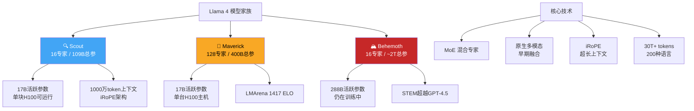

> 📊 难度：⭐⭐⭐⭐ | ⏱️ 阅读：14分钟 | 📅 2025年4月5日 | 🏷️ Llama 4, MoE, 多模态, 开源AI

# 🦙 The Llama 4 Herd — Llama 4模型家族

> **原标题**: The Llama 4 Herd: The Beginning of a New Era of Natively Multimodal AI Innovation
> **中文标题**: Llama 4模型家族：原生多模态AI创新新纪元的开端
> **发布日期**: 2025年4月5日
> **原文链接**: https://ai.meta.com/blog/llama-4-multimodal-intelligence/

## 📝 一句话摘要

Meta发布Llama 4模型家族，推出Scout(16专家/109B总参数)和Maverick(128专家/400B总参数)两款开放权重的原生多模态混合专家模型，以及仍在训练中的Behemoth(2万亿参数)教师模型，标志着开源AI正式进入原生多模态MoE时代。

---

## 📖 核心内容

### 🏗️ 一、模型矩阵

#### 🔍 Llama 4 Scout
- **架构**：170亿活跃参数，16个专家，总参数109B
- **上下文窗口**：1000万token——业界领先
- **硬件需求**：Int4量化后可在单块NVIDIA H100 GPU上运行
- **性能对标**：在各项基准上超越Gemma 3、Gemini 2.0 Flash-Lite和Mistral 3.1

#### 🚀 Llama 4 Maverick
- **架构**：170亿活跃参数，128个专家，总参数400B
- **部署**：可在单台H100主机上运行
- **性能对标**：击败GPT-4o和Gemini 2.0 Flash；在推理能力上与DeepSeek v3竞争
- **竞技场评分**：LMArena达到1417 ELO

#### 🏔️ Llama 4 Behemoth（预览）
- **架构**：2880亿活跃参数，16个专家，总参数约2万亿
- **状态**：仍在训练中，作为小型模型的教师模型
- **基准表现**：在STEM任务上超越GPT-4.5、Claude Sonnet 3.7和Gemini 2.0 Pro

### ⚙️ 二、核心技术创新

#### 🔀 混合专家架构(Mixture of Experts, MoE)

Llama 4是Meta首个采用MoE架构的模型家族。核心优势在于每个token只激活总参数的一小部分，同时提升训练和推理效率。Scout每token激活17B/109B参数(约15.6%)，Maverick每token激活17B/400B参数(约4.25%)，实现了参数量与计算量的解耦。

#### 🖼️ 原生多模态(Native Multimodality)

采用**早期融合(Early Fusion)**架构，在预训练阶段就将文本和视觉token整合到统一的模型骨架中。这与后期将视觉编码器"嫁接"到语言模型上的方法有本质区别——原生多模态意味着模型从一开始就学会了跨模态的统一表示。

训练支持最多48张图片输入，后训练阶段验证了8张图片输入的场景。支持"图像定位(Image Grounding)"功能，实现精确的视觉问答。

#### 📏 超长上下文：iRoPE架构

Llama 4 Scout实现1000万token上下文窗口的关键技术是**iRoPE架构**，包含：
- 交错注意力层(Interleaved Attention Layers)
- 推理时温度缩放(Inference-time Temperature Scaling)
- 实现长度泛化(Length Generalization)而非简单的位置编码外推

### 📚 三、训练规模与数据

- **预训练数据**：超过30万亿token——是Llama 3混合训练数据的2倍
- **数据类型**：涵盖文本、图片和视频数据
- **多语言覆盖**：200种语言，其中超过100种语言各有超过10亿token——比Llama 3增加10倍的多语言数据

### 🔬 四、后训练方法论

Meta对后训练方法进行了显著改进：

1. **激进数据过滤**：在监督微调(SFT)前移除约50%的"简单"数据
2. **持续在线强化学习**：配合自适应难度过滤
3. **轻量级直接偏好优化(DPO)**：处理边缘案例
4. **Behemoth特殊处理**：剪枝95%的SFT数据

核心理念是"激进的数据过滤防止模型在强化学习阶段被过度约束"——这体现了Meta对训练数据质量重于数量的认知转变。

### 🛡️ 五、安全与偏见缓解

- **争议话题拒绝率**：从Llama 3.3的7%降至低于2%
- **不平等回复拒绝比例**：降至低于1%
- **政治倾向**：与Grok相当，仅为Llama 3.3的一半
- **安全工具套件**：Llama Guard、Prompt Guard、CyberSecEval

### 🌐 六、开放获取

Scout和Maverick可从llama.com和Hugging Face下载，并将集成到主流云平台。搭载这些模型的Meta AI可在WhatsApp、Messenger、Instagram Direct和meta.ai上使用。

---

## 🔧 技术要点

1. **MoE效率革命**：Maverick仅以4.25%的参数激活率达到与密集模型竞争的性能，将参数量与计算量彻底解耦
2. **原生多模态早期融合**：在预训练阶段统一文本和视觉表示，而非后期嫁接，实现更深层的跨模态理解
3. **iRoPE超长上下文**：通过交错注意力和温度缩放实现1000万token窗口，是当时开源模型中最长的上下文支持
4. **激进数据过滤策略**：SFT前移除50%简单数据、Behemoth剪枝95%SFT数据，体现质量优先的训练哲学
5. **开放权重MoE先例**：Llama 4是首个公开的大规模MoE多模态模型家族，为开源社区提供了此前仅闭源模型才有的架构

## 🧩 深度解读

### 🟢 通俗版

以前的 AI 模型就像一个全能但笨重的"万能工人"——做什么事都要出动全部人马。Llama 4 引入了"专家团队"机制（MoE）：400B 参数里有 128 个"专家"，但每次只派出最合适的几位来处理你的请求，只用了总人力的 4%。这就像一个医院，虽然有 128 个科室、总共几百个医生，但你看感冒只需要去内科挂号，不用所有医生都出动。同时，Llama 4 从出生就会"看图说话"（原生多模态），而不是先学会说话再学会看图——这让它对图片的理解比"后天学习"的模型更深入。

### 🔴 深入版

Llama 4的发布标志着开源AI的一次范式跃迁——从"追赶闭源模型的性能"转变为"在架构和能力上引领创新"。

**MoE的民主化意义巨大**。此前MoE架构主要出现在闭源模型(如Google的Switch Transformer、Mixtral)中。Llama 4将2万亿参数规模的MoE架构完全开放，使学术界和小型公司首次能够研究和改进这一关键架构。Scout在单块H100上运行的事实更是将"大模型"的硬件门槛大幅降低。

**1000万token上下文窗口是一个被低估的突破**。大多数讨论聚焦于MoE和多模态，但iRoPE架构实现的超长上下文可能是Llama 4最具实用价值的技术创新。能够处理整本书、完整代码仓库或长视频的模型，在实际应用中的价值远超基准分数的提升。

**后训练的"少即是多"哲学值得关注**。移除50%简单数据、Behemoth剪枝95%SFT数据——这与直觉上"数据越多越好"的信念相悖。Meta的实践表明，在强化学习时代，过度约束模型可能比约束不足更有害。

## 💭 延伸思考

1. **MoE的部署挑战**：虽然每token只激活少量参数，但所有专家的权重仍需加载到内存中。400B总参数的Maverick在单主机上运行意味着需要大量内存。开源社区如何在消费级硬件上有效部署MoE模型？
2. **原生多模态vs后期融合**：Meta押注早期融合架构，而许多其他模型采用后期融合。当视觉和语言的训练数据分布和质量差异很大时，早期融合是否会导致一种模态拖累另一种？
3. **开源AI的商业悖论**：Meta将数十亿美元训练成本的模型免费开放，其商业逻辑是什么？如果开源模型足够好，第三方公司为什么还要使用Meta的平台？开源AI是否正在重塑AI的商业格局？
