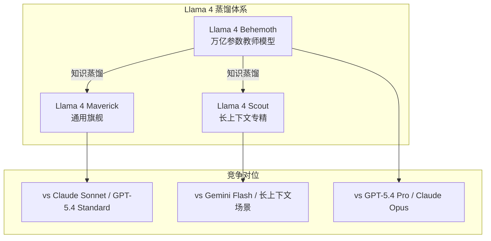

# Llama 4 Scout & Maverick：Meta 的原生多模态开源新时代

> **原标题：** The Llama 4 Herd: The Beginning of a New Era of Natively Multimodal AI Innovation
> **发布日期：** 2026年3月
> **原文链接：** https://ai.meta.com/blog/llama-4-multimodal-intelligence/

---

## 一句话摘要

Meta 发布 Llama 4 Scout 和 Llama 4 Maverick——首批原生多模态的开放权重模型，采用 MoE 架构，Scout 提供超长上下文支持，Maverick 定位为通用旗舰，同时预览了万亿参数级别的 Llama 4 Behemoth 教师模型。

---

## 完整核心内容翻译

### Llama 4 模型家族

| 模型 | 定位 | 架构 | 状态 |
|------|------|------|------|
| **Llama 4 Scout** | 长上下文专精 | 原生多模态 MoE | 已发布 |
| **Llama 4 Maverick** | 通用旗舰 | 原生多模态 MoE | 已发布 |
| **Llama 4 Behemoth** | 教师模型 | 万亿参数级 | 预览中 |

### 关键突破

1. **首个原生多模态开放权重模型：** Llama 4 从预训练阶段就整合了多模态能力，不再是后期嫁接视觉编码器
2. **首个 MoE 架构的 Llama：** 从密集（dense）模型转向 MoE 架构，大幅提升参数效率
3. **超长上下文：** Scout 提供前所未有的上下文长度支持

### 产品集成

Llama 4 已被部署到 Meta 的消费级产品中：
- **WhatsApp**
- **Messenger**
- **Instagram Direct**
- **Meta.AI 网站**

### 开放获取

- Scout 和 Maverick 可在 **Hugging Face** 下载
- 将通过合作伙伴渠道陆续上线
- 延续 Llama 的开放权重策略

### Behemoth 教师模型

Llama 4 Behemoth 被描述为"世界上最聪明的 LLM 之一"。它的核心角色是作为**教师模型**——通过知识蒸馏将其能力传递给 Scout 和 Maverick 等更小、更可部署的模型。

### LlamaCon 与生态建设

- **LlamaCon：** 定于 4 月 29 日举行，这是 Meta 首个 Llama 主题大会
- **Llama Impact Grants 第二批：** 10 个国际获奖者，总计超过 150 万美元，资助使用 Llama 推动变革性影响的项目

---

## 技术要点

1. **从 Dense 到 MoE 的架构转型：** Llama 4 是 Llama 系列首次采用 MoE 架构，这意味着 Meta 认为 MoE 的参数效率优势已经超过了其训练复杂度的代价。MoE 允许模型拥有更多总参数（知识容量），同时保持较低的推理成本。
2. **原生多模态预训练：** 与 Llama 3.2 的视觉模型不同，Llama 4 从第一个 token 开始就在多模态数据上训练。这应该带来更自然的跨模态理解——例如理解图片中的文字含义，而非仅仅识别图片内容。
3. **教师-学生蒸馏范式：** Behemoth 作为教师模型的定位非常明确——它可能永远不会被直接部署，其价值在于通过蒸馏提升 Scout 和 Maverick 的能力。这与 Google 使用大型 Gemini Ultra 蒸馏出 Flash-Lite 的策略一致。
4. **消费级产品快速集成：** 新模型直接部署到 WhatsApp/Messenger/Instagram，展示了 Meta 将 AI 模型与 30 亿用户级产品深度绑定的能力。
5. **开放权重的竞争壁垒：** 在 OpenAI 和 Google 走闭源路线的同时，Meta 持续开放权重，试图通过构建最大的开源 AI 生态来建立不同维度的竞争壁垒。

---

## 深度解读

### 🟢 通俗版（非专业读者）

Meta（Facebook 的母公司）发布了新一代 AI 模型 Llama 4，有三个版本：Scout 像一个拥有超强记忆力的助手，Maverick 是全能型选手，Behemoth 则是一个超级大脑——它自己不直接干活，而是"教导"前两个模型，让它们变得更聪明。

最特别的是，这些模型天生就能同时理解文字和图片，而且 Meta 把它们免费开放给所有人使用。你在 WhatsApp 和 Instagram 上已经可以直接用到它们了。

**为什么重要：** 这是最大的免费开源 AI 模型之一。当大公司把最强的 AI 免费开放，所有开发者和小公司都能用上最先进的技术，这会加速整个 AI 行业的发展。

### 🔴 深入版（有算法基础的读者）

Llama 4 的发布标志着开源 AI 模型在多个维度上追赶闭源前沿：

**MoE 转型的深层含义：** Llama 3 系列的 405B Dense 模型需要约 800GB 显存才能推理，部署成本极高。MoE 架构让 Llama 4 在总参数大幅增加的同时，推理时仅激活一小部分参数，大幅降低部署门槛。这对开源社区尤为重要——更多人能用消费级硬件运行 Llama 4。

**多模态开源的生态价值：** 此前开源社区的多模态方案（LLaVA、Fuyu 等）都是"后拼接"方案。Llama 4 提供了首个原生多模态的开放权重基础，将催生大量下游多模态应用——医学影像分析、自动驾驶辅助、工业检测等领域的开发者现在有了免费的强大基础模型。

**Meta 的数据飞轮：** 将 Llama 4 部署到 WhatsApp/Messenger/Instagram 的真正价值不仅是用户体验提升，更是获取海量真实用户交互数据。这些数据将用于训练 Llama 5，形成"模型→产品→数据→更好的模型"的飞轮效应。

---

## 延伸思考

1. **开源 vs 闭源的终局：** 如果开源模型持续追赶闭源模型，OpenAI 和 Anthropic 的商业模式是否面临根本性挑战？还是闭源模型会在某些维度上始终保持领先？
2. **Behemoth 的部署前景：** 作为教师模型的 Behemoth 可能永远不会公开权重。Meta 如何平衡"开放"理念与保护其最大模型的战略价值？
3. **30 亿用户的 AI 实验：** 将最新 AI 模型直接部署给全球 30 亿用户，安全性如何保障？如果模型出现幻觉或有害输出，影响面将远超任何 API 服务。

---

> 📎 原文链接：https://ai.meta.com/blog/llama-4-multimodal-intelligence/
