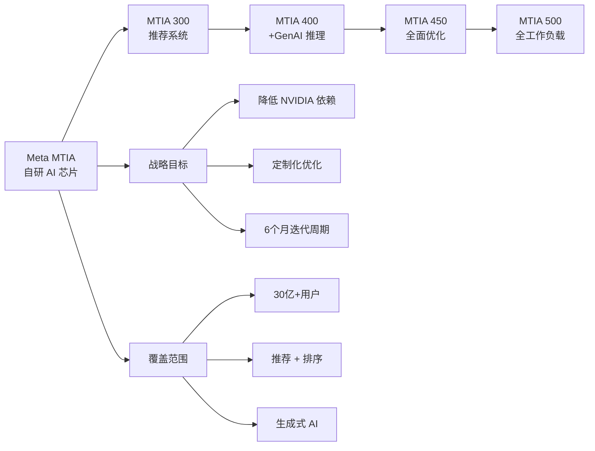

# Four MTIA Chips in Two Years: Scaling AI for Billions

**原标题:** Four MTIA Chips in Two Years: Scaling AI Experiences for Billions
**中文标题:** 两年四代 MTIA 芯片：Meta 自研 AI 芯片的加速之路
**作者:** Meta AI | **发布日期:** 2026年3月11日
**原文链接:** [https://ai.meta.com/blog/meta-mtia-scale-ai-chips-for-billions/](https://ai.meta.com/blog/meta-mtia-scale-ai-chips-for-billions/)

---

## 一句话摘要

Meta 公布了自研 AI 芯片 MTIA 的加速路线图——两年内推出四代芯片（MTIA 300/400/450/500），以每六个月一代的速度迭代，从推荐系统扩展到生成式 AI 推理，战略性地减少对 NVIDIA 的依赖。

---

## 🟢 通俗解读

### 为什么 Meta 要自己造芯片？

Meta 每天要为 30 多亿用户提供 AI 服务——从 Facebook 的信息流推荐、Instagram 的内容排序到 WhatsApp 的消息过滤。这些全部需要 AI 芯片来运算。

目前，绝大多数 AI 芯片来自 NVIDIA，但 NVIDIA 的芯片供不应求且价格高昂。Meta 选择自研芯片，就像苹果从 Intel 转向自研 M 系列芯片一样——**定制化 + 供应链自主**。

### 四代芯片，做什么？

- **MTIA 300**：已经在生产中使用，专注于推荐和排序（"你可能喜欢的内容"）
- **MTIA 400**：2026年稍后部署，开始支持生成式 AI 推理
- **MTIA 450**：2027年部署，进一步优化
- **MTIA 500**：2027年部署，全面覆盖所有 AI 工作负载

### 为什么这么快？

传统芯片行业通常每 1-2 年才推出一代新芯片。Meta 做到每 6 个月一代，靠的是"模块化设计"——核心架构保持不变，每次迭代只优化关键部分。就像乐高积木一样，不用每次从零开始搭建。

### 对普通用户的影响

短期内不会有直接感知。但长期来看，自研芯片意味着 Meta 能以更低成本提供更好的 AI 体验——更精准的推荐、更快的 AI 生成、更智能的交互。

---

## 🔴 技术深入

### MTIA 芯片路线图

```
MTIA 300 ──→ MTIA 400 ──→ MTIA 450 ──→ MTIA 500
 2026 H1      2026 H2      2027 H1      2027 H2
 推荐/排序    +GenAI推理    全面优化     全工作负载
```

### 工作负载覆盖的演进

| 芯片代际 | 推荐训练 | 推荐推理 | GenAI 推理 | GenAI 训练 |
|---------|---------|---------|-----------|-----------|
| MTIA 300 | ✅ | ✅ | ❌ | ❌ |
| MTIA 400 | ✅ | ✅ | ✅ | ❌ |
| MTIA 450 | ✅ | ✅ | ✅ | 部分 |
| MTIA 500 | ✅ | ✅ | ✅ | ✅ |

### 技术架构特点

**模块化复用设计**：MTIA 系列采用模块化架构，核心计算单元在代际之间保持兼容。这使得：
- 软件栈可以跨代复用
- 开发团队不需要为每代芯片重写驱动和编译器
- 验证和测试工作量大幅减少

**定制化优化**：与 NVIDIA 的通用 GPU 不同，MTIA 针对 Meta 的特定工作负载进行深度优化：
- 推荐系统的稀疏特征处理
- 大模型推理的注意力机制加速
- 嵌入表（Embedding Table）的高效内存访问

### 对 NVIDIA 依赖的战略影响

Meta 的 MTIA 战略与其大规模 NVIDIA 采购并行推进：
- **短期**：NVIDIA GPU 仍然是训练大模型的主力
- **中期**：MTIA 逐步接管推理工作负载，释放 NVIDIA GPU 用于训练
- **长期**：MTIA 覆盖全部工作负载，NVIDIA 依赖显著降低

### 行业对比：自研芯片竞赛

| 公司 | 自研芯片 | 主要用途 | 部署规模 |
|------|---------|---------|---------|
| Google | TPU v6 | 训练 + 推理 | 大规模 |
| Amazon | Trainium 3 | 训练 | 大规模 |
| Meta | MTIA | 推理→全栈 | 扩展中 |
| Microsoft | Maia | 推理 | 早期 |
| Apple | M 系列 | 端侧推理 | 大规模 |

Meta 的差异化在于其**迭代速度**——六个月一代远超行业平均水平。

---

## 延伸思考

1. **芯片自研的成本效益**：自研芯片的前期投入巨大。Meta 的用户规模（30亿+）能否摊薄成本，使自研芯片比采购 NVIDIA 更经济？
2. **软件生态的挑战**：NVIDIA 的 CUDA 生态是其最大的护城河。Meta 如何构建足够完善的软件栈来支持自研芯片？
3. **供应链地缘政治**：芯片制造仍然集中在台积电。自研芯片设计不等于自研制造——Meta 是否需要考虑制造端的多元化？
4. **开源硬件的可能性**：Meta 在 AI 软件上选择了开源路线（Llama、SAM 等）。它是否会考虑开放 MTIA 的某些设计？

---



*本文为 Meta AI 官方博客文章的深度中文解读。*
