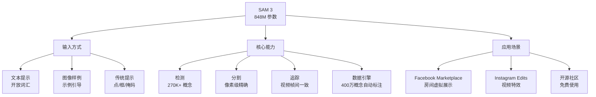

# Meta SAM 3: Segment Anything with Concepts

**原标题:** Introducing Meta Segment Anything Model 3 and Segment Anything Playground
**中文标题:** Meta SAM 3：用概念分割万物
**作者:** Meta AI (FAIR) | **发布日期:** 2025年11月20日
**原文链接:** [https://ai.meta.com/blog/segment-anything-model-3/](https://ai.meta.com/blog/segment-anything-model-3/)

---

## 一句话摘要

Meta 发布 SAM 3（Segment Anything Model 3），首次支持文本提示和图像样例的开放词汇检测与分割，能识别 270K+ 种视觉概念，在图像和视频中实现"万物可分割"的愿景——并以开源方式发布。

---

## 🟢 通俗解读

### 从"点哪割哪"到"说哪割哪"

SAM 1 和 SAM 2 的用法是：你在图片上点一个点或画一个框，AI 就能精确地把那个物体"抠"出来。但你必须先告诉它"在这里"。

SAM 3 的革命性变化是：**你可以直接用文字告诉它要什么**。比如说"找出图片里所有的猫"、"标记视频中每一辆红色的车"——它就能自动找到并精确分割。

### 能认识多少东西？

SAM 3 能识别超过 **27万种**不同的视觉概念。这远不只是"猫狗汽车"这些常见物体——从特定品种的花、特定型号的工具到各种罕见的物品，它都能认识。这比现有的任何系统多出 50 倍以上。

### 它在哪里被用了？

- **Facebook Marketplace**：新的"在房间中查看"功能——你看中了一盏灯，SAM 3 能把它"放"进你房间的照片里
- **Instagram Edits**：创作者可以在视频中选择特定的人或物体来添加特效
- 更多应用还在开发中

### 开源意味着什么？

Meta 以开源方式发布了 SAM 3，包括模型权重和代码。这意味着任何开发者都可以免费使用这项技术，构建自己的应用。

---

## 🔴 技术深入

### SAM 系列的技术演进

| 维度 | SAM 1 | SAM 2 | SAM 3 |
|------|-------|-------|-------|
| 输入提示 | 点/框/掩码 | 点/框/掩码 | **文本/样例/点/框** |
| 媒体类型 | 图像 | 图像 + 视频 | **图像 + 视频** |
| 词汇范围 | 无（指示式） | 无（指示式） | **开放词汇 270K+** |
| 参数量 | 636M | 多种规模 | **848M** |
| 核心突破 | 零样本分割 | 视频追踪 | **概念理解** |

### 关键技术创新

**1. 开放词汇概念分割（Open-Vocabulary Concept Segmentation）**

SAM 3 的核心突破是从"指示式分割"跳跃到"概念式分割"。模型不再需要用户指定精确位置，而是理解"概念"——一个短文本名词短语——并在图像或视频中找到所有该概念的实例。

**2. 创新数据引擎**

SAM 3 的训练依赖于一个创新的自动标注数据引擎，该引擎自动标注了超过 **400万种独特概念**，创造了迄今为止最大的高质量开放词汇分割数据集。

**3. SA-CO 基准测试**

Meta 同时发布了 SA-CO（Segment Anything with Concepts）基准测试：
- **270K+ 独特概念**，比现有基准多 50 倍
- SAM 3 达到人类表现的 **75-80%**
- 在图像和视频的可提示概念分割中，SAM 3 将现有系统的准确率**翻倍**

**4. 多模态提示融合**

SAM 3 能同时处理文本提示和视觉样例提示，并将它们融合为统一的概念表示。这种多模态融合使得用户可以用最自然的方式描述他们想要分割的内容。

### 与竞品的对比

SAM 3 在开放词汇分割领域的主要竞争对手包括：
- **Grounding DINO**：文本引导的目标检测，但不做像素级分割
- **CLIP + SAM 2 组合**：两阶段方法，效率较低
- **OVSeg / OpenSeg**：开放词汇分割但概念覆盖有限

SAM 3 的优势在于将检测、分割和追踪统一在一个端到端模型中，同时支持前所未有的概念覆盖范围。

---

## 延伸思考

1. **视觉理解的通用性**：27万种概念是否足以覆盖"所有"视觉概念？长尾分布中的罕见概念如何处理？
2. **从分割到理解**：SAM 3 能找到"所有的猫"，但它是否真正"理解"了什么是猫？分割能力和语义理解之间的关系是什么？
3. **AR/VR 应用**：实时的开放词汇分割对 AR 眼镜（如 Meta 的 Ray-Ban Meta）意味着什么？是否能实现"看到什么就认识什么"的交互？
4. **隐私考量**：一个能在视频中自动识别和追踪任何概念（包括特定人物）的模型，在隐私方面引发什么样的担忧？

---

*本文为 Meta AI 官方博客文章的深度中文解读。*
