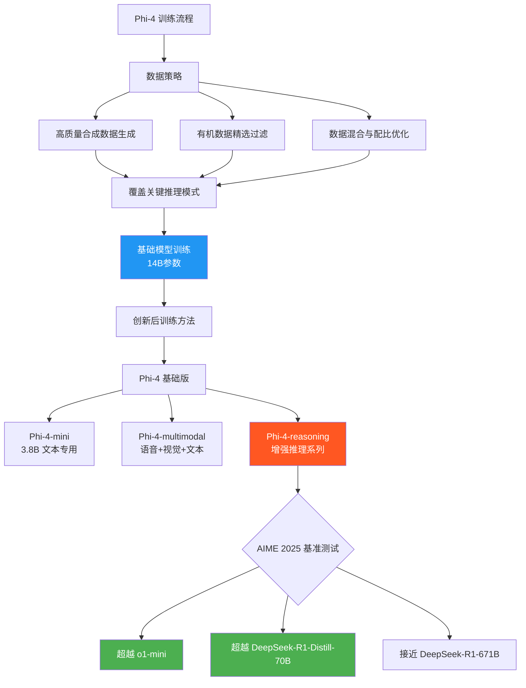

> 📊 难度：⭐⭐⭐ | ⏱️ 阅读：14分钟 | 📅 2024年12月12日 | 🏷️ 小语言模型, 数学推理, 合成数据

# Introducing Phi-4: Microsoft's Newest Small Language Model
# Phi-4：微软小语言模型的大突破——14B参数挑战数学推理天花板

## 一句话摘要

微软发布140亿参数的Phi-4小语言模型（SLM），通过高质量合成数据和创新的后训练方法，在数学推理任务上超越了同规模甚至更大规模的模型，标志着"小而精"路线的重要里程碑。

---

## 核心内容

### Phi系列的演进

Phi系列代表了微软在**小语言模型（Small Language Models, SLMs）**领域的持续探索。核心理念是：通过精心策划的训练数据和方法创新，让参数量远小于GPT-4/Gemini的模型在特定任务上达到甚至超越大模型的性能。

| 模型 | 参数量 | 发布时间 | 核心特点 |
|------|--------|----------|----------|
| Phi-1 | 1.3B | 2023年6月 | 代码生成 |
| Phi-2 | 2.7B | 2023年12月 | 通用推理 |
| Phi-3 | 3.8B/14B | 2024年4月 | 多尺寸，长上下文 |
| **Phi-4** | **14B** | **2024年12月** | **数学推理王者** |

### Phi-4的核心突破

**训练数据质量 > 数据数量**

Phi-4的成功关键在于**数据策略**的三重创新：

1. **高质量合成数据**：不是简单地用AI生成训练数据，而是精心设计合成数据的生成策略，确保覆盖关键推理模式
2. **有机数据精选**：从网络数据中严格筛选高质量的自然语言文本，移除噪声和低质量内容
3. **后训练创新**：在基础训练完成后，通过创新的微调方法进一步提升推理能力

### 数学推理性能

Phi-4在数学竞赛题目上的表现令人瞩目：

- **超越Gemini Pro 1.5**：在美国数学竞赛（AMC）问题上取得更高分数
- **竞争力强**：14B参数的模型与数百亿甚至数千亿参数的模型正面竞争

### Phi-4模型家族扩展（2025年）

2025年初，微软进一步扩展了Phi-4家族：

**Phi-4-mini（38亿参数）**
- 文本专用轻量模型
- 支持128K token长上下文
- 专为速度和效率优化

**Phi-4-multimodal（多模态）**
- 同时处理语音、视觉和文本
- 开启多模态小模型新范式
- 适用于需要多感知输入的应用场景

**Phi-4-reasoning系列**
- Phi-4-reasoning：基础推理模型
- Phi-4-reasoning-plus：增强版
- Phi-4-mini-reasoning：轻量推理版
- 在AIME 2025测试中，性能超越OpenAI o1-mini和DeepSeek-R1-Distill-Llama-70B
- 部分基准甚至超越671B参数的完整DeepSeek-R1模型

### 负责任AI与部署

微软通过Azure AI Foundry提供完整的安全工具链：

- **提示防护（Prompt Shields）**：检测和阻止恶意提示
- **受保护材料检测**：防止生成版权内容
- **事实一致性检测（Groundedness Detection）**：减少幻觉
- 统一API接口，便于集成

---

## 技术要点

1. **合成数据工程**是Phi-4成功的核心——证明了"数据质量>数据数量>模型参数量"的训练范式
2. **14B参数规模**是效率与能力的甜蜜点——可在单GPU上运行，同时保持强大的推理能力
3. **128K上下文窗口**（Phi-4-mini）表明小模型也可以处理长文档和复杂对话
4. **推理版变体**的发布暗示"链式思考推理"可以独立于模型规模进行优化
5. **超越671B模型**（DeepSeek-R1）的结果挑战了"规模即一切"的主流假设

---

## 解读

### 🟢 通俗版解读

在AI界，大家通常认为"模型越大越聪明"，就像认为"书读得越多的人越聪明"。

但微软的Phi-4证明了另一个道理：**不在于读了多少书，而在于读了什么书、怎么读的。**

Phi-4就像一个虽然只上了普通大学（14B参数，相对较小），但因为课程质量极高（合成数据精心设计）、学习方法科学（后训练创新），所以在数学竞赛中能打败名校博士生（数百亿参数的大模型）。

更厉害的是，它的后续版本（Phi-4-reasoning）甚至在某些考试中超过了"全校第一"（DeepSeek-R1，671B参数），而自己只有"14个同学的小班级"（14B参数）。

这对普通开发者意味着：你可能不需要花大钱调用超大模型，一个精心训练的小模型就能满足大部分需求。

### 🔴 深入版解读

**合成数据范式的成熟**：Phi-4验证了"合成数据+精选有机数据"的训练范式在推理任务上的有效性。关键洞察是：合成数据不仅仅是数据增强——它可以被设计为覆盖特定的推理模式和技能，相当于为模型构建了一套定制化的"教学课程"。

**小模型的边界在哪里**：Phi-4在数学推理上表现出色，但这是否意味着小模型在所有任务上都能接近大模型？答案很可能是否定的。数学推理是一个相对结构化的领域，适合通过精选数据进行深度训练。在需要广泛世界知识的开放领域任务中，参数量的限制可能更加明显。

**推理版模型的架构启示**：Phi-4-reasoning系列的成功暗示，推理能力可以通过专门的训练策略（如Chain-of-Thought蒸馏、过程奖励模型等）来独立优化，与基础模型的知识容量相对解耦。这支持了"推理=搜索"的假设——推理能力更多取决于搜索策略而非知识库大小。

**部署经济学**：14B模型可在单张消费级GPU上运行，这对企业部署具有重大意义。相比调用大模型API，本地部署Phi-4可以显著降低长期成本，同时解决数据隐私问题。

---

## 流程图

---

## 延伸思考

1. **大模型是否被过度投资？**：Phi-4的结果是否意味着行业应该重新评估对超大模型的投入？
2. **合成数据的天花板**：随着合成数据训练的普及，是否会出现"模型塌缩"（model collapse）——模型训练在自生成的数据上导致多样性下降？
3. **边缘部署革命**：14B模型能在手机或IoT设备上运行吗？这会如何改变AI的应用场景？
4. **开源生态影响**：Phi-4在Hugging Face上开源，这对Meta Llama、Mistral等开源竞争者意味着什么？

---

## 原文链接

- [Introducing Phi-4 | Microsoft Tech Community](https://techcommunity.microsoft.com/blog/azure-ai-foundry-blog/introducing-phi-4-microsoft%E2%80%99s-newest-small-language-model-specializing-in-comple/4357090)
- [Phi-4 on Hugging Face](https://huggingface.co/microsoft/phi-4)
- [Phi系列一周年回顾 | Azure Blog](https://azure.microsoft.com/en-us/blog/one-year-of-phi-small-language-models-making-big-leaps-in-ai/)
