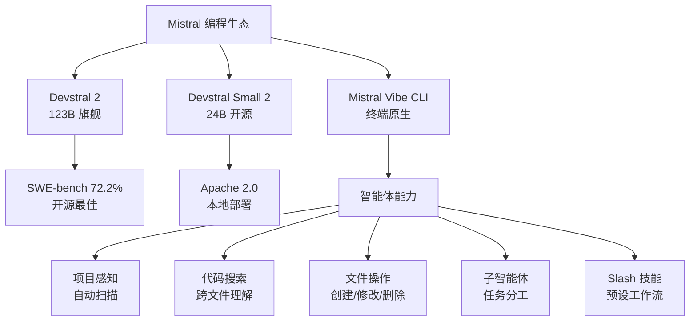

# Devstral 2 and Mistral Vibe CLI

**原标题:** Introducing: Devstral 2 and Mistral Vibe CLI
**中文标题:** Devstral 2 与 Mistral Vibe CLI：终端原生的 AI 编程智能体
**作者:** Mistral AI | **发布日期:** 2025年12月9日
**原文链接:** [https://mistral.ai/news/devstral-2-vibe-cli](https://mistral.ai/news/devstral-2-vibe-cli)

---

## 一句话摘要

Mistral AI 发布新一代编程模型 Devstral 2（123B）及其精简版 Devstral Small 2（24B），配套推出终端原生编程助手 Mistral Vibe CLI——在 SWE-bench Verified 上达到 72.2%，以开源方式直接挑战 GitHub Copilot 和 Claude Code。

---

## 🟢 通俗解读

### 欧洲的 AI 编程反击

在 AI 编程工具领域，美国公司占据了主导地位——GitHub Copilot、Cursor、Claude Code。Mistral 作为欧洲最有影响力的 AI 公司，推出了自己的全套编程解决方案。

### Devstral 2 是什么？

Devstral 2 是一个专门为编程优化的 AI 模型，有两个版本：
- **Devstral 2**（123B 参数）：旗舰版，SWE-bench 得分 72.2%
- **Devstral Small 2**（24B 参数）：轻量版，Apache 2.0 开源，适合本地部署

### Mistral Vibe CLI 是什么？

Vibe CLI 是一个在终端里运行的 AI 编程助手。你用自然语言告诉它要做什么，它就能：
- 浏览和理解你的整个代码库
- 搜索代码并找到相关文件
- 修改、创建、删除文件
- 执行终端命令
- 管理 Git 版本控制
- 自动扫描项目结构和 Git 状态

### 和 Claude Code 的区别

| 特性 | Mistral Vibe | Claude Code |
|------|-------------|-------------|
| 底层模型 | Devstral 2 | Claude Opus/Sonnet |
| 开源 | 是 | 否 |
| 价格 | Le Chat Pro $14.99/月 | 按 token 计费 |
| 子智能体 | 支持自定义 | 有限 |
| 技能系统 | Slash 命令预设工作流 | CLAUDE.md |

### Vibe 2.0 的升级

2026年1月，Mistral 发布了 Vibe 2.0，新增了：
- **自定义子智能体**：为特定任务创建专用的小助手
- **多选项澄清**：遇到模糊指令时，主动提供选项让你选择
- **Slash 命令技能**：预配置的工作流快捷方式

---

## 🔴 技术深入

### Devstral 2 架构与性能

**Devstral 2（旗舰版）**
- 参数量：123B（可能采用 MoE 架构）
- 上下文窗口：256K tokens
- SWE-bench Verified：72.2%
- 定位：最先进的代码智能体

**Devstral Small 2**
- 参数量：24B（密集架构）
- 上下文窗口：256K tokens
- 许可证：Apache 2.0
- 定位：可本地部署的高效编程助手

### 256K 上下文窗口的工程意义

256K tokens 大约对应 50 万行代码——对于大多数单个项目来说足以将整个代码库加载到上下文中。这对代码智能体尤其重要：
- 不需要频繁的 RAG 检索
- 可以理解跨文件的依赖关系
- 支持大规模重构任务

### Vibe CLI 的智能体架构

```
用户输入（自然语言）
        ↓
┌──────────────────────────┐
│   Mistral Vibe CLI        │
│   ├─ 项目扫描器            │
│   │  └─ 文件结构 + Git     │
│   ├─ 代码搜索引擎          │
│   ├─ 文件操作工具           │
│   ├─ 命令执行器            │
│   ├─ 子智能体系统           │
│   └─ 技能（Slash 命令）     │
└──────────────────────────┘
        ↓
Devstral 2（推理引擎）
        ↓
代码修改 / 命令执行
```

### Agent Communication Protocol (ACP)

Vibe CLI 通过 Agent Communication Protocol 与 IDE 集成，这是一个标准化的协议，允许终端智能体与编辑器之间双向通信。这类似于 Anthropic 的 MCP（Model Context Protocol），但专注于编码工作流。

### 与竞品的基准对比

在 SWE-bench Verified 上：
- Claude Opus 4.6 + Claude Code：~75%（估计）
- Devstral 2 + Vibe CLI：72.2%
- GPT-5.4 + Codex：~70%（估计）
- 开源最佳：Devstral 2 领先

Devstral 2 是目前开源编程模型中 SWE-bench 得分最高的。

---

## 延伸思考

1. **编程工具的碎片化**：Claude Code、Cursor、Copilot、Vibe CLI——开发者是否会面临"工具疲劳"？最终会收敛到一两个赢家，还是保持多元竞争？
2. **开源 vs 闭源编程模型**：Devstral Small 2 的开源发布是否会催生更多基于本地部署的编程助手？企业对代码隐私的担忧是否会推动开源模型的采用？
3. **欧洲 AI 的竞争力**：Mistral 的 Vibe CLI 是否标志着欧洲 AI 在应用层的竞争力开始提升？还是说仍然落后于美国公司？

---



*本文为 Mistral AI 官方博客文章的深度中文解读。*
