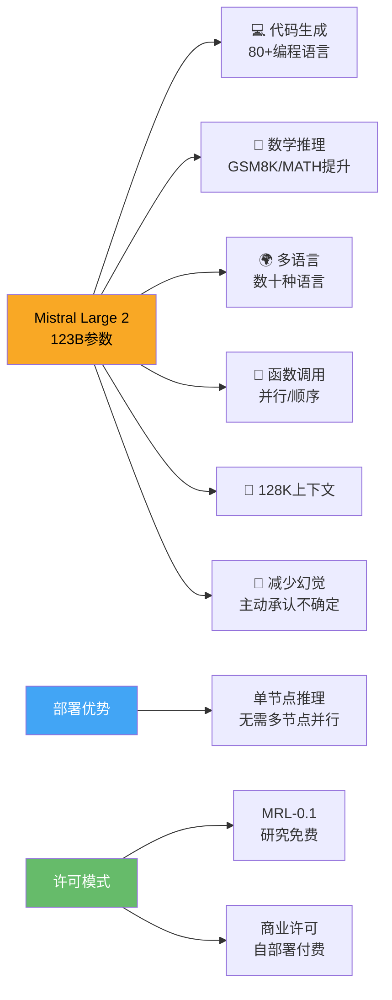

> 📊 难度：⭐⭐⭐ | ⏱️ 阅读：10分钟 | 📅 2024年7月24日 | 🏷️ Mistral Large 2, 开放权重, 欧洲AI, 前沿模型

# 🇪🇺 Large Enough — Mistral Large 2
# 足够大——Mistral Large 2：欧洲AI的前沿之作

## 📝 一句话摘要

Mistral AI发布1230亿参数的旗舰模型Mistral Large 2，在代码生成、数学推理和多语言能力上大幅提升，以开放权重的方式与GPT-4o和Claude 3 Opus在前沿模型领域展开正面竞争。

---

## 📖 核心内容

### 🌍 欧洲AI的前沿突破

2024年7月24日，法国AI公司Mistral AI发布了其旗舰模型Mistral Large 2（代号mistral-large-2407），这是一款拥有1230亿参数的大语言模型。Mistral Large 2的发布标志着欧洲AI力量在前沿模型领域的重要突破——它在性能/成本帕累托前沿上设定了开放模型的新标杆。

文章标题"Large Enough"（足够大）本身就传达了一个重要信息：在当时动辄数百亿甚至上千亿参数的军备竞赛中，Mistral选择了一个务实的规模，并通过架构和训练优化来最大化这一规模下的性能。

### 📐 技术规格

**模型参数**：1230亿参数，专为单节点推理设计。这意味着企业可以在一台服务器上部署这一前沿级模型，而不需要多节点并行推理的复杂架构。

**上下文窗口**：128K token，能够处理长文档、大型代码库和复杂的多轮对话。

**多语言支持**：支持数十种语言，包括法语、德语、西班牙语、意大利语、葡萄牙语、阿拉伯语、印地语、俄语、中文、日语和韩语。

**编程语言**：支持超过80种编程语言，包括Python、Java、C、C++、JavaScript和Bash。

### 📊 基准测试表现

**🧠 通用能力**：
- MMLU准确率：84.0%（预训练版本）
- 在MT-Bench、Wild Bench和Arena Hard等指令遵循基准上显著提升

**💻 代码生成**：
- 表现与GPT-4o、Claude 3 Opus和Llama 3 405B相当
- 相比前代Mistral Large有大幅提升

**🔢 数学推理**：
- 在GSM8K和MATH基准上改进显著
- 模型经过专门训练以减少幻觉
- 当无法找到答案或信息不足时，模型会主动承认

### ⚡ 核心能力提升

**📋 指令遵循**：Mistral特别强调了"简洁性"的改进。相比前代模型，Mistral Large 2的输出更加精炼务实，这对商业应用至关重要——企业用户需要的是直接有用的答案，而非冗长的铺垫。

**🔧 函数调用**：增强的函数调用能力支持并行和顺序函数调用，使得构建复杂的业务应用成为可能。这一能力对智能体和自动化工作流至关重要。

**🎯 减少幻觉**：模型经过专门训练，在不确定答案时会主动表示"不知道"。这种"知之为知之，不知为不知"的能力在企业场景中尤为重要。

### 📜 许可与可用性

Mistral Large 2提供双重许可：
- **🔬 Mistral研究许可（MRL-0.1）**：适用于研究和非商业用途
- **💼 Mistral商业许可**：商业自部署需要

**获取渠道**：
- la Plateforme API（模型名：mistral-large-2407）
- HuggingFace权重下载
- Google Cloud Platform（Vertex AI）
- Azure AI Studio
- Amazon Bedrock
- IBM watsonx.ai

**微调支持**：la Plateforme现在支持对Mistral Large、Mistral Nemo和Codestral进行微调。

---

## 🔧 技术要点

1. **1230亿参数单节点推理**：在参数规模和部署便利性之间取得了精妙平衡，无需多节点即可运行前沿模型
2. **128K上下文 + 80+编程语言**：长上下文与广泛的语言支持使其成为代码助手和企业应用的理想选择
3. **并行/顺序函数调用**：增强的工具使用能力为智能体应用提供了强大的基础能力
4. **主动承认不确定性**：专门训练模型在信息不足时拒绝回答，减少商业场景中幻觉的危害
5. **双重许可模式**：研究+商业的灵活许可设计，平衡了开源社区的自由使用需求和商业可持续性

---

## 🧩 深度解读

### 🟢 通俗版

在 AI 世界的"参数军备竞赛"中，大家都在比谁的模型更大——就像汽车厂商比谁的发动机排量更大。Mistral 说了一句意味深长的话："够大就好"（Large Enough）。他们的 1230 亿参数模型就像一台经过精心调校的小排量涡轮增压车——不是最大的，但在同价位（单台服务器就能跑）的条件下跑得最快。而且这台车还特别"诚实"：当它不确定路怎么走时，会直接说"我不知道"，而不是胡乱指路（减少幻觉）。

### 🔴 深入版

Mistral Large 2的发布体现了Mistral AI独特的竞争策略：不是最大的，但要在给定规模下做到最好。

1230亿参数的选择意味深长。在Meta推出405B、GPT-4据传超过1万亿参数的背景下，Mistral选择了一个可以在单节点上推理的规模。这背后的商业逻辑很清晰：对于大多数企业客户来说，部署的便利性和推理成本比纸面上的参数规模更重要。

"Large Enough"这个标题本身就是对AI军备竞赛的一种温和反驳——不是越大越好，而是"够大就好"。这种务实的工程哲学是Mistral区别于其他AI公司的核心特质。

在商业模式上，Mistral的双重许可设计（研究免费+商业付费）是对Meta完全开源路线和OpenAI完全闭源路线的折中。这种模式既维护了开源社区的研究自由，又确保了商业可持续性。

Mistral作为欧洲AI的代表力量，其成功对全球AI格局具有重要意义。它证明了前沿AI研发并非只能发生在硅谷，也为欧洲AI产业政策（如EU AI Act）的制定提供了一个本土参照点。

---

## 💭 延伸思考

1. "足够大"的哲学在未来的模型发展中是否会成为主流？还是说参数规模的扩展仍然是不可逆的趋势？
2. 单节点推理的约束如何影响模型架构的设计选择？这是否会催生新的架构创新？
3. Mistral的双重许可模式是否可持续？当竞争对手（如Meta）提供更宽松的完全开源许可时，商业许可的吸引力如何维持？
4. 欧洲AI公司在数据主权和隐私法规方面的天然优势，能否转化为企业市场的竞争力？

---

## 🔗 原文链接

[Large Enough — Mistral Large 2](https://mistral.ai/news/mistral-large-2407)

发布日期：2024年7月24日
