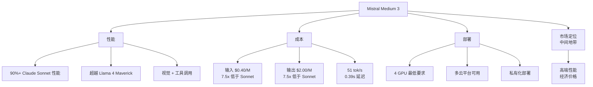

# Mistral Medium 3: Medium is the New Large

**原标题:** Medium is the new large
**中文标题:** Mistral Medium 3：中等即是大型
**作者:** Mistral AI | **发布日期:** 2025年5月7日
**原文链接:** [https://mistral.ai/news/mistral-medium-3](https://mistral.ai/news/mistral-medium-3)

---

## 一句话摘要

Mistral AI 发布 Mistral Medium 3，在基准测试中达到 Claude Sonnet 3.7 的 90%+ 性能水平，同时成本大幅降低——以 $0.40/M 输入 token、$2.00/M 输出 token 的定价挑战行业定价标准，支持 131K 上下文窗口和视觉理解。

---

## 🟢 通俗解读

### "中等"为什么能替代"大型"？

在 AI 模型的世界里，一直有一个默认假设：越大越好。但 Mistral 用 Medium 3 证明了：**通过更好的训练方法，中等规模的模型可以达到大型模型的绝大部分性能**。

### 性能怎么样？

- 达到 Claude Sonnet 3.7 的 **90%+ 性能**
- 超越了 Llama 4 Maverick（Meta 的开源旗舰）
- 超越了 Cohere Command A（企业级模型）
- 支持图片理解和工具调用

### 价格优势

| 模型 | 输入价格 | 输出价格 |
|------|---------|---------|
| Mistral Medium 3 | $0.40/M | $2.00/M |
| Claude Sonnet 3.7 | $3.00/M | $15.00/M |
| 差距 | **7.5x 便宜** | **7.5x 便宜** |

90% 的性能，七分之一的价格——对于大量企业应用来说，这是一个非常有吸引力的选择。

### 适合谁用？

- 需要高质量 AI 但预算有限的企业
- 大规模 API 调用场景（聊天机器人、内容审核、数据处理）
- 对延迟敏感的应用（中位延迟仅 0.39 秒）
- 需要在自有基础设施上部署的场景（4 块 GPU 即可运行）

---

## 🔴 技术深入

### 技术规格

| 指标 | 数值 |
|------|------|
| 上下文窗口 | 131K tokens |
| 输出速度 | 51 tokens/秒 |
| 中位延迟 | 0.39 秒 |
| 能力 | 视觉 + 工具调用 |
| 最低部署 | 4 GPU |

### "Medium is the New Large"的技术逻辑

Mistral Medium 3 的性能接近大型模型的原因可能包括：

1. **高质量训练数据**：数据质量 > 数据数量的趋势正在被验证
2. **蒸馏技术**：可能使用了更大模型（Mistral Large 3）的知识蒸馏
3. **训练效率优化**：更好的学习率调度、数据混合策略等
4. **推理时计算优化**：在推理阶段投入更多计算来弥补参数量的不足

### 与 Mistral 3 家族的关系

Mistral 3 家族形成了完整的产品矩阵：

```
Mistral Large 3  — 675B 总参 / 41B 活跃 (MoE) — 旗舰
Mistral Medium 3 — 中等规模              — 性价比最优
Mistral 3 14B    — 14B (密集)            — 边缘设备
Mistral 3 8B     — 8B (密集)             — 移动端
Mistral 3 3B     — 3B (密集)             — IoT/嵌入式
```

### 部署灵活性

Mistral Medium 3 的 4 GPU 最低部署要求意味着：
- 单台配备 4x A100 或 H100 的服务器即可运行
- 企业无需构建大规模 GPU 集群
- 可在主流云平台（AWS、Azure、GCP）的标准实例上部署
- 适合对数据隐私有要求的企业进行私有化部署

### 市场定位分析

Mistral Medium 3 瞄准了一个被忽视的市场空间：

- **高端**（GPT-5.4、Claude Opus）：追求极致性能，不在乎成本
- **→ 中间地带 ←**（Mistral Medium 3）：90% 的性能 + 合理的成本
- **低端**（开源小模型）：成本最低但性能有限

这个"中间地带"恰好是大多数企业的实际需求所在。

---

## 延伸思考

1. **模型效率的天花板**：Mistral Medium 3 达到了大型模型 90% 的性能。那最后的 10% 差距是否值得 7.5 倍的价格？对于大多数应用来说，答案可能是"不值得"。
2. **定价战的开始**：Mistral 的激进定价可能引发行业连锁反应。Anthropic 和 OpenAI 是否会推出类似价位的中型模型来应对？
3. **欧洲 AI 的差异化路线**：相比美国公司追求"最强最大"，Mistral 选择了"性价比"路线。这是否更符合欧洲企业客户的务实需求？

---



*本文为 Mistral AI 官方博客文章的深度中文解读。*
