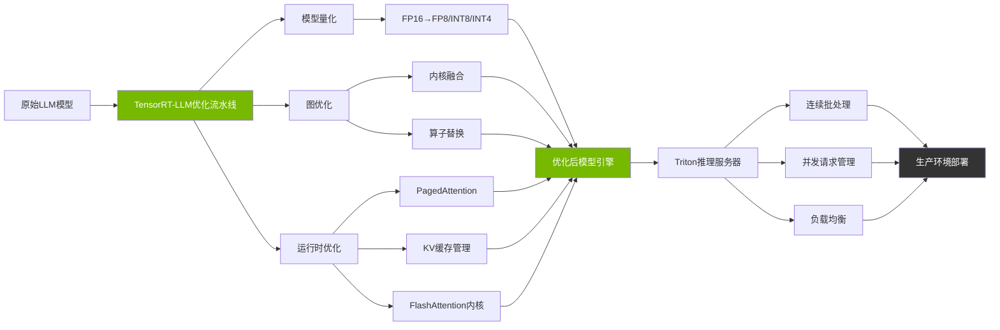

> 📊 难度：⭐⭐⭐⭐⭐ | ⏱️ 阅读：16分钟 | 📅 2023年10月19日（持续更新至2024年） | 🏷️ 推理优化, GPU加速, 模型部署

# Optimizing Inference on LLMs with TensorRT-LLM
# TensorRT-LLM：大模型推理加速的工业级引擎

## 一句话摘要

NVIDIA开源TensorRT-LLM推理加速库，通过内核融合、量化、PagedAttention、KV缓存、连续批处理和FlashAttention等技术组合，在NVIDIA GPU上实现大语言模型推理性能的数倍提升。

---

## 核心内容

### 为什么需要TensorRT-LLM？

大语言模型的训练和推理是两个截然不同的挑战。训练是"一次性"的高投入任务，而推理是"持续性"的高频操作。随着LLM被大规模部署，**推理成本**成为制约商业化的核心瓶颈：

- 模型参数量大（数十亿到数千亿），内存占用高
- 自回归生成机制导致延迟累积
- 并发用户请求需要高效的批处理
- Token生成速度直接影响用户体验

TensorRT-LLM就是NVIDIA对这些挑战的系统性解答。

### 六大核心优化技术

**1. 内核融合（Kernel Fusion）**
- 将多个GPU运算操作合并为单个内核
- 减少GPU内存读写次数和内核启动开销
- 相当于把"去超市买菜→回家→去超市买肉→回家→去超市买水果→回家"变成"一次去超市买齐所有东西"

**2. 量化（Quantization）**
- 将模型参数从高精度（FP32/FP16）转换为低精度（INT8/INT4/FP8）
- 减少内存占用，加速计算
- 在Hopper架构GPU上支持FP8量化
- 通常仅有微小的精度损失

**3. PagedAttention（分页注意力）**
- 借鉴操作系统的虚拟内存管理思想
- 将KV缓存分割为固定大小的"页"
- 消除内存碎片，提高GPU内存利用率
- 允许更多并发请求共享GPU内存

**4. KV缓存（Key-Value Caching）**
- 缓存已计算的Key-Value对，避免重复计算
- 每生成一个新token时，只需计算新token的注意力，而非重新计算所有历史token
- 以空间换时间的经典策略

**5. 连续批处理（Continuous In-Flight Batching）**
- 传统批处理要等一批请求全部完成才能处理下一批
- 连续批处理允许单个请求完成后立即插入新请求
- 显著提高GPU利用率，降低平均等待时间

**6. FlashAttention**
- 融合的注意力内核实现
- 减少对高带宽内存（HBM）的读写
- 将注意力计算拆分为小块，在SRAM中完成
- 降低注意力计算的内存复杂度

### 支持的模型架构

TensorRT-LLM支持广泛的模型架构：

| 模型系列 | 说明 |
|----------|------|
| Llama 1/2/3 | Meta的开源模型系列 |
| ChatGLM | 清华大学的双语模型 |
| Falcon | TII的大型开源模型 |
| MPT | MosaicML的高效模型 |
| Baichuan | 百川智能的中文模型 |
| StarCoder | BigCode的代码生成模型 |
| GPT-J/NeoX | EleutherAI的开源模型 |

### 硬件支持

| GPU架构 | 特殊支持 |
|---------|---------|
| Ampere (A100等) | INT8量化 |
| Ada Lovelace (RTX 4090等) | INT8/INT4量化 |
| Hopper (H100等) | FP8量化，最优性能 |
| RTX/GeForce RTX | Windows beta支持 |

### 生态集成

TensorRT-LLM不是独立使用的——它与NVIDIA的整体AI基础设施深度集成：

- **NVIDIA NeMo**：端到端生成式AI框架（训练→微调→部署）
- **Triton Inference Server**：生产级推理服务器，提供连续批处理和分页KV缓存
- **NVIDIA TensorRT Model Optimizer**：训练后量化工具

### 性能数据

在H100 GPU上的量化优化效果：
- 批大小32：**1.81倍**推理加速
- 批大小1：**2.66倍**推理加速

---

## 技术要点

1. **六大优化技术的协同效应**——每项技术单独可带来20-50%的提升，组合使用可实现数倍加速
2. **PagedAttention**是解决LLM推理内存瓶颈的关键——借鉴OS内存管理，将KV缓存碎片化问题系统化解决
3. **连续批处理**将GPU利用率从传统批处理的40-60%提升到80%+，是降低单token成本的核心
4. **FP8量化**是Hopper架构的独特优势——在几乎无精度损失的情况下实现2倍以上加速
5. **开源策略**使TensorRT-LLM成为LLM推理的事实标准，与vLLM形成竞争格局

---

## 解读

### 🟢 通俗版解读

想象你经营一家快餐店。AI模型就是你的"菜单"（食谱和原料），推理就是"做菜和出餐"的过程。

TensorRT-LLM做的就是优化你的厨房效率：

1. **内核融合** = 把切菜、调味、翻炒合并到一个工位上完成，不用在不同工位间来回跑
2. **量化** = 用更小的锅来做同样的菜——小锅加热更快，菜的味道几乎一样
3. **PagedAttention** = 不再给每道菜预留一整张桌子，而是用灵活的托盘系统——按需分配空间
4. **KV缓存** = 常用的酱汁预先调好放在手边，不用每次从头调配
5. **连续批处理** = 不再等10份订单凑齐才一起做，而是做完一份就立刻接新订单
6. **FlashAttention** = 用更快的灶台，让热量直接到达锅底，减少浪费

结果：同样的厨房（GPU），出餐速度提高了2-3倍。

### 🔴 深入版解读

**LLM推理的计算特征分析**：LLM推理的性能瓶颈随场景变化。在小批量/长序列场景下，推理是**内存带宽受限（memory-bound）**的——瓶颈在于从HBM读取KV缓存；在大批量/短序列场景下，变成**计算受限（compute-bound）**的——瓶颈在于矩阵乘法的算力。TensorRT-LLM的优化组合针对这两种场景分别提供了解决方案。

**量化精度-性能权衡**：FP8量化在Hopper架构上几乎无损是因为H100的FP8 Tensor Core与FP16 Tensor Core在计算吞吐上有2倍差异，而FP8的数值范围（通过E4M3/E5M2编码）对LLM的权重分布来说已经足够。但INT4量化可能导致明显的精度下降，特别是在分布不均匀的attention层。GPTQ、AWQ等量化方法通过自适应量化策略来缓解这一问题。

**PagedAttention vs. 传统KV缓存**：传统实现为每个序列预分配连续的最大长度KV缓存空间，导致严重的内存碎片（典型浪费率60-80%）。PagedAttention将KV缓存分割为固定大小的块（block），使用块表（block table）进行映射，类似于操作系统的页表。这个看似简单的改变可以将同一GPU上的并发请求数提高2-4倍。

**与vLLM的竞争格局**：vLLM是另一个主流的LLM推理引擎，最早提出PagedAttention。TensorRT-LLM的优势在于对NVIDIA硬件的深度优化（特别是定制CUDA内核和对新架构特性的第一时间支持），而vLLM的优势在于更好的易用性和更广泛的社区支持。两者代表了"硬件专有优化"vs."通用性+社区"的竞争路线。

---

## 流程图

---

## 延伸思考

1. **推理成本 vs. 训练成本**：随着模型被广泛部署，推理成本将远超训练成本。推理优化的经济价值如何量化？
2. **硬件锁定风险**：TensorRT-LLM深度绑定NVIDIA GPU——这是否给用户带来了过高的供应商锁定风险？
3. **开源 vs. 闭源推理引擎**：vLLM、SGLang等开源替代方案的成熟是否会削弱TensorRT-LLM的竞争优势？
4. **边缘推理的未来**：随着量化技术的进步，大模型能否在边缘设备上实现实时推理？

---

## 原文链接

- [Optimizing Inference on LLMs with TensorRT-LLM | NVIDIA Blog](https://developer.nvidia.com/blog/optimizing-inference-on-llms-with-tensorrt-llm-now-publicly-available/)
- [TensorRT-LLM GitHub](https://github.com/NVIDIA/TensorRT-LLM)
- [Post-Training Quantization with NeMo | NVIDIA Blog](https://developer.nvidia.com/blog/post-training-quantization-of-llms-with-nvidia-nemo-and-nvidia-tensorrt-model-optimizer/)
