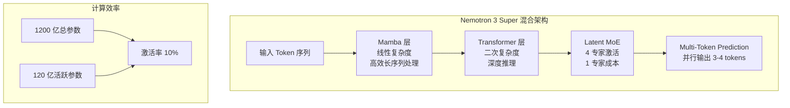

# NVIDIA Nemotron 3 Super：为智能体而生的混合 MoE 架构

> **原标题：** New NVIDIA Nemotron 3 Super Delivers 5x Higher Throughput for Agentic AI
> **发布日期：** 2026年3月11日（GTC 2026）
> **原文链接：** https://blogs.nvidia.com/blog/nemotron-3-super-agentic-ai/

---

## 一句话摘要

NVIDIA 在 GTC 2026 上发布 Nemotron 3 Super，一个 1,200 亿总参数、仅 120 亿活跃参数的混合 MoE 开源模型，融合 Mamba 和 Transformer 架构，提供 100 万 token 上下文窗口和 5 倍吞吐量提升，专为复杂智能体系统设计。

---

## 完整核心内容翻译

### 架构创新

Nemotron 3 Super 采用混合 MoE（Mixture of Experts）架构，融合三项关键技术：

| 技术 | 作用 | 效果 |
|------|------|------|
| **Mamba 层** | 记忆和计算效率 | 4 倍效率提升 |
| **Transformer 层** | 高级推理能力 | 保持推理质量 |
| **Latent MoE** | 稀疏激活专家 | 推理时仅激活 4 个专家，成本等同 1 个 |
| **多 Token 预测** | 并行预测多个 token | 3 倍推理速度 |

### 性能表现

- **吞吐量：** 比上一代 Nemotron Super 提升 **5 倍**
- **准确率：** 提升 **2 倍**
- **上下文窗口：** **100 万 token**
- **Blackwell 优化：** 在 NVFP4 精度下比 Hopper FP8 快 **4 倍**，无精度损失
- **PinchBench：** 得分 **85.6%**，同类开源模型最高

### 智能体优化

Nemotron 3 Super 专为智能体工作负载优化：

1. **100 万 token 上下文：** 智能体可以在内存中保持完整工作流状态，防止目标漂移
2. **高精度工具调用：** 准确导航自主函数调用
3. **复杂子任务处理：** 处理多步骤智能体推理链

### 部署渠道

- **云平台：** Google Cloud Vertex AI、Oracle Cloud、AWS Bedrock、Azure
- **NVIDIA 合作伙伴：** Coreweave、Crusoe、Nebius、Together AI
- **推理服务：** Fireworks AI、Modal、Baseten、Cloudflare
- **本地部署：** 作为 NVIDIA NIM 微服务
- **工作站：** DGX Spark、RTX PRO 工作站

### 开源许可

Nemotron 3 Super 以宽松许可证（permissive license）开放权重，支持商业使用。

---

## 技术要点

1. **Mamba + Transformer 混合架构：** 这是一种前沿的架构选择——Mamba（状态空间模型）擅长长序列高效处理，Transformer 擅长复杂推理。混合架构在保持推理能力的同时大幅降低长上下文处理成本。
2. **Latent MoE 的效率优势：** 激活 4 个专家但成本等同 1 个，意味着每个专家的表示经过了隐空间（latent space）压缩。这与 DeepSeek 的 Multi-head Latent Attention 思路类似——通过隐空间压缩减少计算开销。
3. **多 Token 预测（Multi-Token Prediction）：** 一次前向传播预测多个后续 token，是打破自回归解码瓶颈的关键技术。3 倍推理速度提升意味着模型可能同时预测 3-4 个 token。
4. **NVFP4 量化：** 4-bit 浮点量化在 Blackwell GPU 上实现 4 倍加速且无精度损失，说明 NVIDIA 的硬件-软件协同优化已经非常成熟。
5. **PinchBench 基准：** 这是一个新的智能体能力基准，专门评估模型在工具使用场景下的表现。Nemotron 3 Super 在此基准上的领先，表明其工具调用能力经过了专门优化。

---

## 深度解读

### 🟢 通俗版（非专业读者）

NVIDIA 造了一个特别的 AI 大脑——它不像普通 AI 那样什么都用同一套"思维方式"，而是有两套系统：一套擅长快速记忆和处理大量信息（Mamba），另一套擅长深度思考（Transformer）。就像一个人同时有"速读"和"精读"两种能力。

更重要的是，这个大脑是为"AI 助手"（智能体）专门设计的——它特别擅长使用各种工具、执行多步骤任务、在长时间工作中保持目标不偏移。而且 NVIDIA 把它完全开源了，任何人都可以免费使用。

**为什么重要：** 智能体是 AI 的下一个大方向，但之前的模型都不是为智能体专门设计的。Nemotron 3 Super 可能是第一个真正为智能体时代量身定做的开源模型。

### 🔴 深入版（有算法基础的读者）

Nemotron 3 Super 的架构设计揭示了 NVIDIA 对下一代 AI 基础设施的战略判断：

**Mamba + Transformer 的理论基础：** 纯 Transformer 在长序列上的注意力机制复杂度为 O(n^2)，100 万 token 上下文在纯 Transformer 上极其昂贵。Mamba 的状态空间模型提供 O(n) 复杂度的序列建模，但在需要精确位置信息的推理任务上不如 Transformer。混合架构让 Mamba 处理"记忆和概括"，Transformer 处理"精确推理"，是当前工程上的最优折中。

**NVIDIA 的生态位策略：** NVIDIA 发布开源模型不是为了与 OpenAI/Anthropic/Google 在模型层面竞争，而是为了：
1. 展示 Blackwell GPU 的能力（NVFP4 的 4 倍加速）
2. 推动 NIM 微服务部署标准
3. 为 DGX Spark 等硬件产品创造需求
4. 在智能体基础设施层建立标准

**10% 激活率的含义：** 120 亿 / 1,200 亿 = 10% 的激活率意味着模型有 10 倍的"潜在知识"可以按需调用。这种设计特别适合智能体场景——不同工具调用可能激活不同的专家子网络，模型实际上是一个"万能工具箱"。

---

## 延伸思考

1. **Mamba 的成熟度：** Mamba 架构仍相对年轻，在长期生产环境中的稳定性和可靠性是否经过充分验证？混合架构中 Mamba 和 Transformer 层的比例如何确定？
2. **智能体基准的标准化：** PinchBench 是 NVIDIA 推出的新基准。智能体评估是否需要行业统一的标准，还是各家公司各自定义有利于创新？
3. **开源模型与闭源服务的竞争：** 当开源模型（Nemotron 3 Super）在智能体任务上表现优异时，开发者是否还需要为闭源 API（GPT、Claude）付费？

---

> 📎 原文链接：https://blogs.nvidia.com/blog/nemotron-3-super-agentic-ai/
