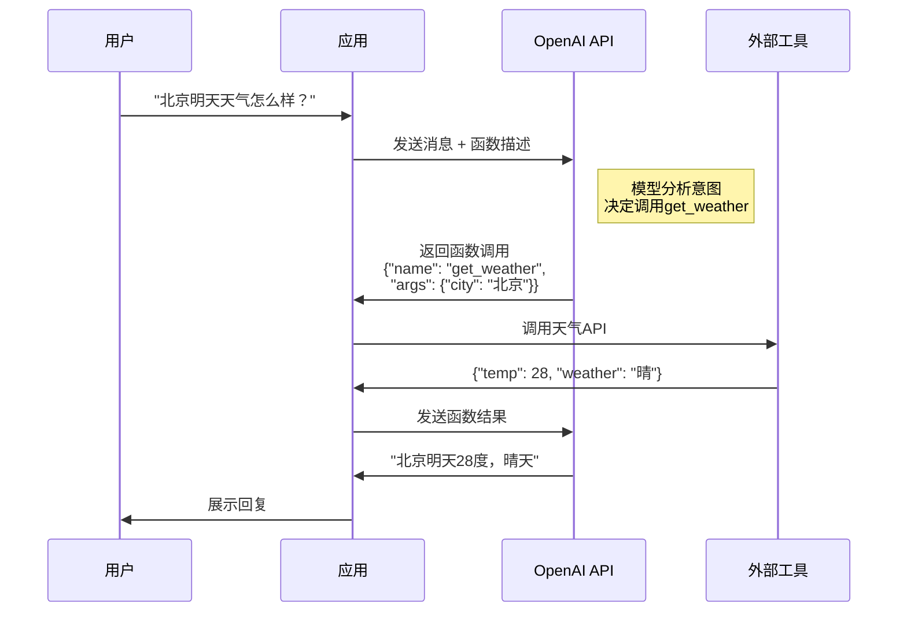

> 📊 难度：⭐⭐⭐ | ⏱️ 阅读：12分钟 | 📅 2023年6月13日 | 🏷️ API更新, 函数调用, 模型升级

# Function Calling and Other API Updates
# 函数调用与API更新：LLM连接外部世界的里程碑

## 一句话摘要

OpenAI发布Chat Completions API重大更新，引入函数调用（Function Calling）功能，让模型能够智能地选择并调用外部工具，同时发布16K上下文模型、大幅降价，并宣布旧模型退役时间表。

---

## 核心内容

### 函数调用：LLM的"双手"

函数调用是此次更新的核心功能。开发者可以向模型**描述函数**（包括函数名、参数说明），模型会根据对话上下文**智能决定是否调用函数**，并输出包含调用参数的JSON对象。

这意味着LLM从"只能说话"进化为"能动手做事"：
- 调用外部API获取实时数据（天气、股票、数据库查询）
- 将自然语言转换为API调用参数
- 执行多步骤工作流

### 函数调用的工作流程

1. 开发者在API请求中描述可用的函数（名称、参数、说明）
2. 模型分析用户消息，判断是否需要调用函数
3. 如果需要，模型返回一个JSON对象，包含函数名和参数值
4. 开发者在自己的代码中执行函数调用
5. 将函数返回结果发送回模型
6. 模型基于函数结果生成最终回复

### 模型更新

**gpt-3.5-turbo-0613**
- 新增函数调用能力
- 更可靠的系统消息响应能力（steerability）
- 开发者可以更有效地通过system message引导模型行为

**gpt-3.5-turbo-16k**
- **上下文窗口4倍扩展**：从4K token扩展到16K token
- 支持约20页文本的单次请求
- 价格为标准版的2倍（输入$0.003/1K tokens，输出$0.004/1K tokens）

**gpt-4-0613**
- 新增函数调用能力
- 改进的系统消息响应

### 价格变动

| 模型 | 变化 |
|------|------|
| text-embedding-ada-002 | **降价75%** → $0.0001/1K tokens |
| gpt-3.5-turbo输入token | **降价25%** → $0.0015/1K tokens |

### 弃用时间表

旧模型（如gpt-3.5-turbo-0301、gpt-4-0314）将在2024年6月13日停止服务。在此日期后，这些模型的API调用将自动路由到更新版本。

---

## 技术要点

1. **函数调用是Agent架构的基石**——它让LLM从"纯文本生成器"进化为"工具使用者"，是后续所有Agent框架（LangChain、AutoGPT等）的技术基础
2. **16K上下文窗口**以2倍定价实现4倍扩展——性价比显著提升，为长文档处理打开了大门
3. **系统消息可控性（Steerability）**的改进表明OpenAI在模型对齐层面的持续优化，让开发者更容易定制模型行为
4. **嵌入模型降价75%**大幅降低了RAG（检索增强生成）系统的运营成本

---

## 解读

### 🟢 通俗版解读

以前的ChatGPT就像一个"只会说话的顾问"——你问它天气，它只能说"你可以去查一下天气网站"。

**函数调用**让它变成了一个"能动手的助手"。现在它可以说："让我帮你查一下——北京今天28度，晴天。"因为你提前告诉它"这里有一个天气查询的工具，你可以用"。

具体来说就像：
1. 你告诉助手："你有这些工具可以用——天气查询、日历管理、邮件发送"
2. 客户问："明天北京会下雨吗？"
3. 助手心想："这个问题需要用天气查询工具"
4. 助手给你一张纸条："请帮我查北京明天天气"（JSON格式的参数）
5. 你查了之后告诉助手结果
6. 助手回答客户："明天北京有小雨，建议带伞。"

### 🔴 深入版解读

**架构范式转移**：函数调用的引入标志着LLM应用架构从"Prompt-Response"模式向"Plan-Execute"模式的转变。模型不再仅仅是信息生成器，而是成为了工作流中的决策节点——判断何时、如何、以什么参数调用外部能力。

**JSON参数生成的可靠性**：函数调用本质上要求模型进行受限的结构化生成。在这个早期版本中，输出的JSON并不保证格式正确（这个问题后来在Structured Outputs中解决）。开发者需要额外的错误处理逻辑。

**安全边界的模糊化**：当LLM可以调用外部函数时，安全边界从"模型说了什么"扩展到"模型做了什么"。一个被恶意提示注入的模型可能生成有害的函数调用参数——这开创了一个全新的攻击面。

**市场策略分析**：同时发布功能升级（函数调用）和大幅降价（嵌入75%、输入25%），是典型的"平台策略"——通过降低使用成本吸引更多开发者进入生态，建立网络效应和锁定。

**对后续发展的影响**：这次更新直接催生了LangChain的tool use模式、OpenAI自己的Assistant API、以及整个Agent开发生态。可以说，2023年6月的这次更新是AI Agent时代的起点。

---

## 流程图

---

## 延伸思考

1. **函数调用 → Agent**：从简单的函数调用到复杂的多步骤Agent，这条技术路径的演进逻辑是什么？
2. **安全护栏**：如何防止模型被误导或攻击而生成恶意的函数调用参数？
3. **函数描述工程**：函数的描述（description）质量直接影响模型调用的准确性——这是否是一种新型的"提示词工程"？
4. **成本结构变化**：嵌入模型降价75%如何改变了RAG系统的经济可行性？

---

## 原文链接

- [Function calling and other API updates | OpenAI](https://openai.com/index/function-calling-and-other-api-updates/)
- [Function Calling 文档](https://platform.openai.com/docs/guides/function-calling)
