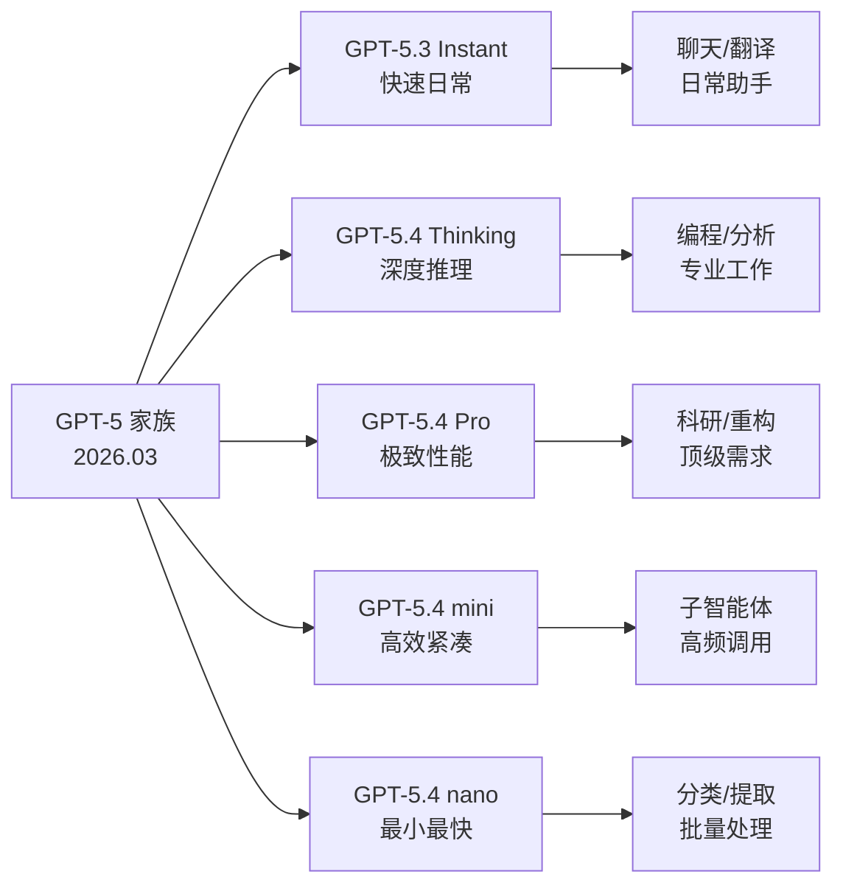

# Introducing GPT-5.3 Instant, GPT-5.4 Thinking, and GPT-5.4 Pro

**原标题:** Introducing GPT-5.3 Instant, GPT-5.4 Thinking, and GPT-5.4 Pro
**中文标题:** GPT-5.3 Instant、GPT-5.4 Thinking 与 GPT-5.4 Pro：三款新模型全解析
**作者:** OpenAI | **发布日期:** 2026年3月5日
**原文链接:** [https://academy.openai.com/public/resources/latest-model](https://academy.openai.com/public/resources/latest-model)

---

## 一句话摘要

OpenAI 一次性发布了 GPT-5 家族的三款新模型：GPT-5.3 Instant（快速日常任务）、GPT-5.4 Thinking（复杂专业推理）和 GPT-5.4 Pro（最高性能需求），形成从轻量到极致的完整产品矩阵。

---

## 🟢 通俗解读

### 三款模型，三种场景

OpenAI 这次不是发布一个模型，而是一次推出三个，每个针对不同的使用场景：

**GPT-5.3 Instant — "日常小助手"**
- 适合快速问答、写邮件、翻译等日常任务
- 速度快、成本低
- 就像一辆灵活的城市小车，日常通勤完全够用

**GPT-5.4 Thinking — "专业思考者"**
- 适合编程、数据分析、研究报告等需要深入思考的任务
- 能处理长时间的工作流程
- 就像一辆性能均衡的商务轿车，动力和舒适兼顾

**GPT-5.4 Pro — "终极引擎"**
- 面向最极端的专业需求：科学研究、大规模代码库重构、复杂推理
- 不计成本追求最高质量
- 就像一辆 F1 赛车，性能拉满但日常使用"杀鸡用牛刀"

### 对普通用户的影响

ChatGPT 用户会自动获得这些新模型的升级。免费用户也能使用 GPT-5.3 Instant，体验到比之前更好的 AI 能力。付费用户则可以在三款模型之间自由切换，按需选择。

### 为什么要分这么多层？

一个词：**效率**。不同任务需要不同级别的"思考深度"。用 GPT-5.4 Pro 来回答"今天天气怎么样"就像用超级计算机算 1+1——浪费资源。分层让用户（和 API 开发者）能够精确匹配需求和成本。

---

## 🔴 技术深入

### 模型定位与技术差异

| 维度 | GPT-5.3 Instant | GPT-5.4 Thinking | GPT-5.4 Pro |
|------|-----------------|-------------------|-------------|
| 定位 | 快速日常 | 复杂专业 | 极致性能 |
| 推理深度 | 浅层推理 | 深度推理 | 最深层推理 |
| 延迟 | 最低 | 中等 | 最高 |
| 成本 | 最低 | 中等 | 最高 |
| 上下文窗口 | 标准 | 扩展 | 最大 |
| 最佳场景 | 聊天/翻译/摘要 | 编程/分析/研究 | 科研/大规模重构 |

### GPT-5 家族的完整矩阵

加上此前发布的 GPT-5.4 mini 和 nano，OpenAI 的 GPT-5 家族现在有 7+ 个变体：

```
性能↑  GPT-5.4 Pro
       GPT-5.4 Thinking
       GPT-5.4 (基础旗舰)
       GPT-5.3 Instant
       GPT-5.4 mini
       GPT-5.4 nano
速度↑  ←───────────────→ 成本↓
```

### 对开发者的 API 策略影响

这种多模型矩阵对 API 开发者意味着需要重新思考模型路由策略：

1. **智能路由**：根据任务复杂度自动选择模型——简单查询走 Instant，复杂推理走 Thinking
2. **子智能体架构**：在多 Agent 系统中，不同角色的 Agent 使用不同级别的模型
3. **成本优化**：对于 token 密集型应用（如批量数据处理），使用 nano 或 mini 可以大幅降低成本
4. **退化降级**：当高性能模型响应超时时，自动降级到更快的模型

### 与竞品的对位

- GPT-5.3 Instant ↔ Claude Sonnet 4.6 / Gemini 2.5 Flash
- GPT-5.4 Thinking ↔ Claude Opus 4.6（标准） / Gemini 2.5 Pro
- GPT-5.4 Pro ↔ Claude Opus 4.6（Extended Thinking） / Gemini Deep Think

### Legacy 模型退役时间线

OpenAI 同时宣布 GPT-5.1 系列（Instant、Thinking、Pro）于 2026 年 3 月 11 日从 ChatGPT 中移除。Legacy deep research 模式也将在 3 月 26 日移除。这种快速退役节奏反映了 OpenAI 产品迭代的加速。

---

## 延伸思考

1. **模型碎片化**：7+ 个模型变体是否对开发者造成了选择困难？还是说这是 AI 生态成熟的必然？
2. **定价策略**：分层模型本质上是一种价格歧视策略。在 AI 成为基础设施后，定价模式是否会向云计算的按需计费模式靠拢？
3. **"Thinking"品牌**：OpenAI 将推理能力品牌化为"Thinking"，与 Google 的"Deep Think"和 Anthropic 的"Extended Thinking"形成了有趣的命名竞争。

---



*本文为 OpenAI 官方模型发布的深度中文解读。*
