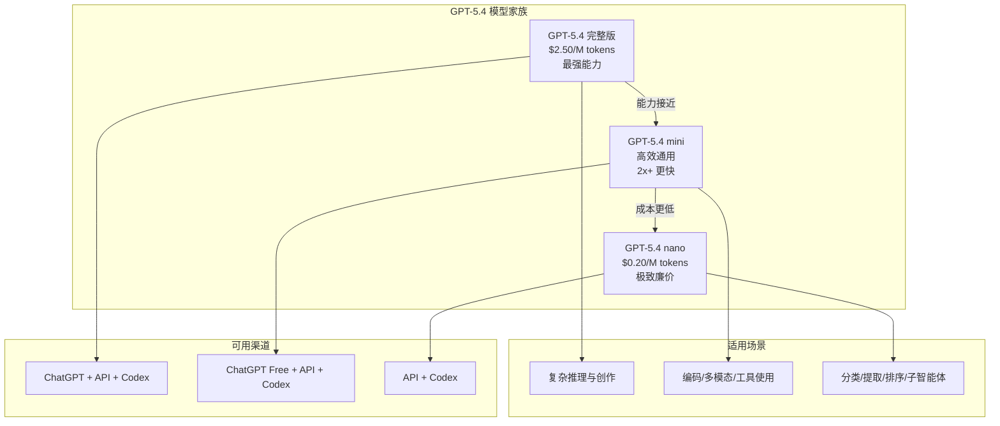

# Introducing GPT-5.4 mini and nano | GPT-5.4 mini 与 nano：为子智能体时代而生

> **原标题：** Introducing GPT-5.4 mini and nano
> **作者：** OpenAI
> **发布日期：** 2026年3月17日
> **原文链接：** https://openai.com/index/introducing-gpt-5-4-mini-and-nano/

---

## 一句话摘要

OpenAI 发布 GPT-5.4 mini 和 GPT-5.4 nano 两款高效模型——mini 在编码、推理和多模态任务上大幅超越 GPT-5 mini 并接近完整版 GPT-5.4 水平，nano 则成为最小最廉价的模型，两者共同定义了"子智能体时代"的模型矩阵。

---

## 完整核心内容翻译

### 一、产品定位：子智能体时代

OpenAI 将 GPT-5.4 mini 和 nano 定位为**"为子智能体时代而生"（Built for the subagent era）**。随着 AI 应用从单一模型调用转向多智能体协作架构，对快速、廉价且高质量的"工作马"模型的需求急剧增长。

在典型的智能体系统中，一个主控智能体可能需要调用数十甚至数百个子智能体来完成复杂任务。每个子智能体调用都产生成本和延迟——这正是 mini 和 nano 要解决的核心问题。

### 二、GPT-5.4 mini

#### 性能提升

GPT-5.4 mini 在多个关键维度上相比 GPT-5 mini 实现了显著提升：

- **编码能力：** 在 SWE-Bench Pro 上接近完整版 GPT-5.4
- **推理能力：** 大幅度提升，特别是在多步推理任务上
- **多模态理解：** 图像、文档理解能力显著增强
- **工具使用：** 函数调用和工具编排能力接近旗舰模型
- **速度：** 运行速度比 GPT-5 mini **快 2 倍以上**

#### 在 OSWorld-Verified 上的表现

GPT-5.4 mini 在 OSWorld-Verified 基准上接近完整版 GPT-5.4，展示了在真实操作系统任务中的强大能力。

#### 可用性

- 面向 ChatGPT **免费用户**开放
- 在 API 和 Codex 中均可使用

### 三、GPT-5.4 nano

#### 定位

GPT-5.4 nano 是 OpenAI 有史以来**最小、最廉价**的模型，专为以下场景优化：

- **分类任务：** 文本分类、情感分析、意图识别
- **数据提取：** 结构化信息抽取、实体识别
- **排序与排名：** 搜索结果重排序、推荐排序
- **编码子智能体：** 作为大型编码系统中的轻量级执行单元

#### 可用性

- **仅通过 API** 提供（不在 ChatGPT 中直接使用）
- 在 Codex 中可用

### 四、定价

| 模型 | 输入价格（每百万 token） | 定位 |
|------|--------------------------|------|
| GPT-5.4（完整版） | $2.50 | 旗舰模型 |
| GPT-5.4 mini | 显著低于完整版 | 高效通用 |
| GPT-5.4 nano | $0.20 | 极致廉价 |

nano 的 $0.20/百万 token 的输入价格使其成为大规模子智能体调用的理想选择——在一个需要 1,000 次子智能体调用的工作流中，nano 的总成本可能不足 1 美元。

### 五、模型矩阵

---

## 技术要点

1. **子智能体架构驱动模型设计：** GPT-5.4 mini/nano 的设计哲学从"单次调用最优"转向"系统级成本-性能最优"，反映了 AI 应用架构从单体向多智能体协作的根本性转变。
2. **性能-成本帕累托前沿：** mini 以 2 倍以上的速度提升和显著更低的成本，接近完整版 GPT-5.4 的性能，推动了帕累托前沿的扩展。
3. **nano 的极端定价策略：** $0.20/M tokens 的定价将 LLM 推入"近乎免费"的区间，使得之前因成本不可行的大量微调用场景成为可能。
4. **免费用户获得 mini 级能力：** 向 ChatGPT 免费用户开放 GPT-5.4 mini，表明 OpenAI 将高质量 AI 作为流量入口而非直接收入来源的战略转变。
5. **API-only 的 nano 定位：** nano 不提供消费者界面，明确定位为开发者工具，避免了"最小模型直接面向用户"可能带来的体验问题。

---

## 深度解读

GPT-5.4 mini 和 nano 的发布标志着 AI 模型市场进入**"分层成熟"**阶段。不再是单一旗舰模型的军备竞赛，而是构建覆盖不同性价比需求的完整产品矩阵。

**"为子智能体时代而生"不仅是营销口号，而是对架构趋势的准确判断。** 当今最复杂的 AI 应用——从自动化软件工程到企业级数据处理——都依赖多层智能体协作。在这种架构中，旗舰模型充当"指挥官"，而大量廉价模型充当"士兵"执行具体任务。nano 的 $0.20/M token 定价使这种架构在经济上完全可行。

**mini 对免费用户开放的战略意义深远。** 这意味着 OpenAI 愿意用高质量模型"补贴"免费用户以获取规模。在 AI 市场竞争日趋激烈的背景下（特别是 Claude Sonnet 和 Gemini Flash 的竞争），控制用户入口比直接变现更加重要。

**nano 的出现重新定义了"什么任务值得用 LLM"的边界。** 在 $0.20/M token 的价格下，LLM 可以用于之前被认为"不值得"的场景——日志分类、简单数据验证、路由决策等。这可能催生一波新的"LLM 微调用"应用浪潮。

**从竞争角度看，这是对 Google Gemini Flash 和 Anthropic Haiku 系列的直接回应。** 轻量级、快速、廉价的模型市场正在成为与旗舰模型同等重要的竞争战场。谁能在保持足够质量的同时提供最低的成本和延迟，谁就能赢得智能体基础设施层的市场。

---

## 延伸思考

1. 当子智能体调用成本趋近于零时，智能体架构设计是否会变得"不计成本地冗余"——用 10 个 nano 调用替代 1 个 mini 调用来提高可靠性？
2. nano 级别模型的涌现能力（emergent capabilities）如何？极小模型是否仍能展现出复杂推理的闪光点？
3. mini 对免费用户开放是否会加速"AI 原生"应用的普及，因为开发者可以假设所有用户都有访问高质量 AI 的能力？
4. 在子智能体架构中，如何确保由 nano 级模型做出的大量微决策的整体质量？是否需要新的质量保证框架？

---

*本文为 OpenAI 官方博客文章的深度中文解读。*
