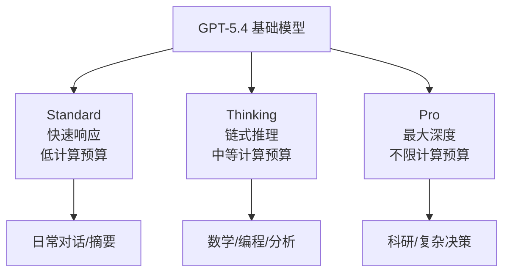

# GPT-5.4：三变体架构与百万 Token 上下文

> **原标题：** Introducing GPT-5.4
> **发布日期：** 2026年3月5日
> **原文链接：** https://openai.com/index/gpt-5-4

---

## 一句话摘要

OpenAI 发布 GPT-5.4 三变体模型系列（Standard、Thinking、Pro），提供最高 105 万 token 的上下文窗口，事实准确性较 GPT-5.2 提升 33%，标志着 OpenAI 向统一模型架构的进一步整合。

---

## 完整核心内容翻译

### 三变体架构

GPT-5.4 延续并强化了 GPT-5 系列的多变体策略：

| 变体 | 定位 | 特点 |
|------|------|------|
| **GPT-5.4 Standard** | 通用任务 | 平衡速度、成本和质量 |
| **GPT-5.4 Thinking** | 推理密集型 | 推理优先，类似 o3 的深度思考能力 |
| **GPT-5.4 Pro** | 最大能力 | 不惜成本追求最高质量 |

### 核心改进

**事实准确性大幅提升：**
- 单项声明错误率降低 **33%**
- 完整回复错误率降低 **18%**
- 相比 GPT-5.2 在幻觉控制方面有显著进步

**上下文窗口突破：**
- API 支持最高 **105 万 token** 上下文窗口
- 这是 OpenAI 商业产品中提供过的最大上下文窗口

### 与竞争对手的定位

GPT-5.4 发布时，正值多家竞争对手同期发力：
- Anthropic 的 Claude Opus 4.6 在 GDPval 上保持领先
- DeepSeek V4 以极低成本提供万亿参数模型
- Google 的 Gemini 3 系列持续迭代

### 产品整合

OpenAI 同期宣布将 ChatGPT、Codex 和 Atlas 浏览器整合为统一桌面超级应用，GPT-5.4 作为底层统一模型驱动所有功能。

此外，GPT-5.1 模型于 3 月 11 日从 ChatGPT 中下线，现有对话自动迁移到当前模型。

---

## 技术要点

1. **三变体统一架构：** Standard/Thinking/Pro 共享基础架构但在推理深度和计算预算上不同。Thinking 变体可能在内部使用类似 o3 的链式推理，Pro 变体则分配更多计算资源。
2. **105 万 token 上下文：** 这接近 Anthropic 和 Google 提供的百万 token 级别，说明长上下文已成为前沿模型的标配。关键不是上下文大小，而是在大上下文下的信息检索准确率。
3. **幻觉控制方法论：** 33% 的单项声明错误降低表明 OpenAI 在训练流程中加入了更强的事实性约束，可能包括检索增强生成（RAG）的深度集成或事实验证奖励模型。
4. **模型版本淘汰策略：** GPT-5.1 的下线和对话自动迁移展示了 OpenAI 的激进迭代策略——新模型发布后快速淘汰旧版本，降低维护成本。
5. **超级应用整合：** ChatGPT + Codex + Atlas 的统一化反映了 OpenAI 从"模型 API 提供商"向"AI 原生应用平台"的战略转型。

---

## 深度解读

### 🟢 通俗版（非专业读者）

GPT-5.4 就像一个升级版的智能助手，分成三个"工作模式"：普通模式处理日常问题，思考模式用于需要深度分析的复杂问题，专业模式则不计成本给你最好的答案。最大的改进是"说话更准了"——以前 AI 可能编造事实，现在错误率降低了三分之一。

另外，它现在能一次"记住"相当于一整本长篇小说的内容（105 万 token），让你可以让 AI 分析一整个项目的代码或一整套文件。

**为什么重要：** AI 的"准确性"一直是最大痛点。一个更准确的 AI，才能被用于真正重要的工作场景。

### 🔴 深入版（有算法基础的读者）

GPT-5.4 的发布揭示了几个值得关注的技术趋势：

**三变体策略的计算经济学：** OpenAI 的三变体本质上是同一个基础模型在不同推理预算下的表现。这与 Anthropic 的"精力控制"（Effort Controls）思路一致——让用户根据任务复杂度选择计算投入。底层技术可能是可变深度的推理链：Standard 用 1-2 步推理，Thinking 用 10-50 步，Pro 则不设上限。

**幻觉控制的方法论演进：** 33% 的错误率降低需要系统性的改进而非简单的提示词优化。可能的技术手段包括：
- 训练数据中增加事实验证样本
- 奖励模型中加入事实性奖励信号
- 推理阶段的内部事实检查回路
- 不确定时主动表达不确定性而非编造答案

**超级应用的技术挑战：** 将 ChatGPT、Codex 和 Atlas 合并为单一应用，在技术上意味着需要在同一个上下文中处理对话、代码生成和网页浏览三种截然不同的任务。模型需要在不同"模式"之间无缝切换，这对上下文管理和任务路由提出了更高要求。

---

## 延伸思考

1. **模型迭代频率的上限：** GPT-5 到 GPT-5.4 不到一年发布了 5 个版本。如此快速的迭代对用户和开发者意味着什么？API 兼容性和迁移成本如何管理？
2. **百万 token 的实际价值：** 105 万 token 的上下文窗口在理论上很强大，但实际使用中有多少场景真正需要这么大的上下文？长上下文的成本和延迟是否值得？
3. **准确性的天花板：** 33% 的错误降低令人印象深刻，但距离"零幻觉"还有多远？在哪些领域 AI 的准确性已经够用，哪些领域仍然不够？

---

> 📎 原文链接：https://openai.com/index/gpt-5-4
