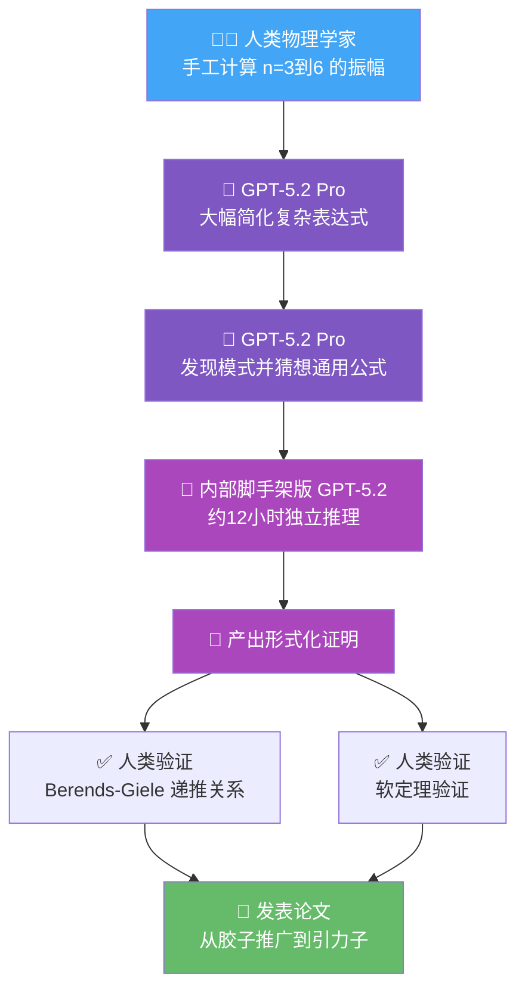

> 📊 难度：⭐⭐⭐⭐⭐ | ⏱️ 阅读：14分钟 | 📅 2026年2月13日 | 🏷️ GPT-5.2, 理论物理, 散射振幅, AI科学发现

# ⚛️ GPT-5.2 Derives a New Result in Theoretical Physics

**原标题：** GPT-5.2 derives a new result in theoretical physics
**中文标题：** GPT-5.2 在理论物理学中推导出一项新成果

**发布日期：** 2026年2月13日
**作者：** Alex Lupsasca (Vanderbilt University / OpenAI)
**合作者：** Alfredo Guevara (普林斯顿高等研究院), David Skinner (剑桥大学), Andrew Strominger (哈佛大学), Kevin Weil (OpenAI)
**原文链接：** [https://openai.com/index/new-result-theoretical-physics/](https://openai.com/index/new-result-theoretical-physics/)

---

## 📝 一句话摘要

GPT-5.2 在胶子散射振幅研究中首次猜想出一个通用公式，随后被内部模型证明并经人类物理学家验证，证明了一类此前被认为恒为零的树级振幅在特定动量空间切面上非零。

---

## 📖 完整核心内容翻译

### 🔬 核心发现

OpenAI 发布了一篇新预印本，证明了许多物理学家预期不会发生的一类粒子相互作用，在特定条件下实际上可以发生。这项工作聚焦于**胶子（gluons）**——携带强核力的粒子。预印本已发布在 arXiv 上，正在提交出版。

预印本题为"**Single-minus gluon tree amplitudes are nonzero（单负胶子树级振幅非零）**"，作者包括 Alfredo Guevara（普林斯顿高等研究院）、Alex Lupsasca（范德堡大学和 OpenAI）、David Skinner（剑桥大学）、Andrew Strominger（哈佛大学），以及 Kevin Weil 代表 OpenAI。

### 🌀 散射振幅与传统认知

预印本研究了粒子物理学中的核心概念——**散射振幅（scattering amplitude）**。散射振幅是物理学家用来计算粒子以特定方式相互作用的概率的量。对于胶子，许多振幅在"树级"（即仅保留最简单的、没有量子环路的费曼图的计算）呈现出出乎意料的简洁形式。这些简化反复揭示了量子场论中更深层的结构——量子场论是将狭义相对论与量子力学统一起来的物理框架。

然而，有一种情况通常被认为是不存在的（振幅为零）。**当一个胶子具有负螺旋度（即无质量粒子两种可能的自旋取向之一），而剩余的 n-1 个胶子具有正螺旋度时**，标准教科书论证认为对应的树级振幅必定为零。因此，这种构型在很大程度上被搁置。

### 💥 打破传统结论

预印本表明，这一结论过于强烈。标准论证假设通用粒子动量——即方向和能量不处于任何特殊排列。研究团队识别出动量空间中一个特定且精确定义的切面（slice），在那里推导不再适用——称为**半共线区域（half-collinear regime）**。半共线意味着胶子动量遵循一种非典型但数学上定义良好且自洽的特殊对齐条件。在这个切面上，振幅不会消失，研究团队在一个特殊的运动学区域中计算了它。

这一结果为许多新问题打开了大门，包括将类似的振幅计算扩展到**引力子（gravitons）**——介导引力的粒子。

### 🤖 GPT-5.2 的关键贡献

论文的一个核心方面涉及**方法论**。最终公式——预印本中的方程 (39)——**最初由 GPT-5.2 Pro 猜想**。

工作流程如下：

1. 人类作者手工计算了整数 n 到 n=6 的振幅，得到了方程 (29)-(32) 中非常复杂的表达式——对应于复杂度随 n 呈超指数增长的"费曼图展开"。

2. **GPT-5.2 Pro 大幅简化了这些表达式**，提供了方程 (35)-(38) 中更简洁的形式。

3. 从这些基础案例出发，GPT-5.2 Pro **发现了模式并提出了一个对所有 n 都有效的公式**。

4. 一个**内部脚手架版本的 GPT-5.2 随后花了大约 12 小时进行推理**，得出了相同的公式并产出了一个形式化证明。

5. 该方程随后被分析验证满足 **Berends-Giele 递推关系**（一种从更小的构建模块逐步构建多粒子树级振幅的标准方法），并对照**软定理**（soft theorem）进行了验证。

在 GPT-5.2 的帮助下，这些振幅已经从胶子扩展到了引力子，其他推广也在进行中。

### 🗣️ 物理学家的评价

**Nima Arkani-Hamed（普林斯顿高等研究院物理学教授）：**
> "这些高度简并散射过程的物理学是我大约十五年前第一次遇到时就一直好奇的东西，所以看到这篇论文中惊人简洁的表达式令人兴奋。在物理学的这个领域，用教科书方法计算的某些物理可观测量的表达式看起来极其复杂，但结果却非常简单。这很重要，因为简单的公式往往将我们送上发现和理解深层新结构的旅程......'寻找简单公式'一直是繁琐的，也是我长期以来觉得可以由计算机自动化的事情。看起来在多个领域，我们开始看到这种情况发生；这篇论文中的例子似乎特别适合利用现代 AI 工具的力量。"

**Nathaniel Craig（加州大学圣巴巴拉分校物理学教授）：**
> "我已经在思考这篇预印本对我们研究项目的影响。这显然是推进理论物理前沿的期刊级研究......这篇预印本感觉像是窥见了 AI 辅助科学的未来，物理学家与 AI 携手产生和验证新见解。毫无疑问，物理学家与 LLM 之间的对话可以产生根本性的新知识。"

---

## 🔧 技术要点

1. **半共线区域的发现：** 在胶子动量空间中识别出一个精确定义的切面（半共线区域），标准的振幅消失论证在此处不再成立。

2. **AI 驱动的公式发现流程：** GPT-5.2 Pro 从人类计算的复杂基础案例中简化表达式、识别模式、猜想通用公式，形成了一个完整的"AI 数学物理学家"工作流程。

3. **形式化证明的 AI 生成：** 内部脚手架版 GPT-5.2 花费约 12 小时独立推导出相同公式并产出形式化证明，随后通过 Berends-Giele 递推关系和软定理进行了双重验证。

4. **超指数复杂度的化简：** 费曼图展开的复杂度随粒子数 n 超指数增长，GPT-5.2 将复杂表达式化简为紧凑形式，展示了 AI 在符号化简方面的强大能力。

5. **从胶子到引力子的推广：** 研究结果已被推广到引力子——介导引力相互作用的粒子，打开了更广阔的理论物理研究空间。

---

## 🧩 深度解读

### 🟢 通俗版

想象一本数学教科书告诉你："1-2+3-4+5-6...这类交替加减的无穷级数的结果永远是零。"几十年来所有学生都这样学。然后有一天，一个 AI 说："等等，如果这些数字排列成特定的模式，结果其实不是零。"人类数学家一开始不信，但 AI 不仅指出了规律，还花了半天时间写出了完整的证明。数学家们验证后发现——AI 是对的，教科书需要修改。这就是 GPT-5.2 在粒子物理中做的事：推翻了一个被广泛接受的"某种粒子交互不可能发生"的结论。

### 🔴 深入版

这篇文章标志着 AI 辅助科学研究的一个里程碑式进展，但其意义远超表面。

**最引人注目的不是 AI "发现"了一个物理结果，而是它在发现过程中扮演的角色。** GPT-5.2 并非简单地搜索已知公式或组合已有结果——它从具体的复杂计算中抽象出了一个全新的通用模式，这是一种需要高度数学直觉的能力。传统上，这种"从特例中提炼简洁公式"的能力被认为是人类数学物理学家的独特天赋。

**研究方法论本身就是一项创新。** 人类物理学家负责定义问题、手工计算基础案例、提供物理直觉和验证；AI 负责化简复杂表达式、发现模式和猜想公式。这种人机协作的分工模式可能成为未来理论科学研究的标准范式。

**12 小时的独立推理尤为引人注目。** 内部脚手架版 GPT-5.2 不是简单地被提问然后回答——它进行了长达半天的持续推理，独立得出了相同的公式和证明。这暗示了 AI 模型在获得足够计算时间时，能够进行深度的数学推理。

**Nima Arkani-Hamed 的评论特别值得关注。** 作为当代最杰出的理论物理学家之一，他直接将这项工作与"寻找简单公式"的长期挑战联系起来，并期待这成为一个通用的"简单公式模式识别"工具。这代表了顶级物理学家对 AI 工具的认可和期待。

---

## 💭 延伸思考

1. **AI 的"数学直觉"本质：** GPT-5.2 从复杂表达式中发现简洁公式的能力，究竟是统计模式匹配，还是某种真正的数学理解？这个问题对科学哲学有深远影响。

2. **科学发现的归属问题：** 当 AI 猜想出核心公式、另一个 AI 版本产出证明、人类物理学家进行验证时，科学发现应归功于谁？这篇论文列出了人类和 AI 的贡献，但学术界需要建立新的归属框架。

3. **可重复性与可验证性：** 虽然最终结果通过了标准数学验证（递推关系和软定理），但 AI 的推导过程本身是否可解释？如果 AI 的"12 小时推理"产出了错误的证明，我们如何检测？

4. **对理论物理学的范式影响：** 如果 AI 能够系统性地发现被人类忽视的"非零振幅"情况，这是否暗示理论物理中存在大量因人类认知偏见而被忽视的结果？AI 是否将成为挑战"教科书共识"的系统性工具？

---

*本文为 OpenAI 研究博客的深度中文解读，仅供学习参考。*
