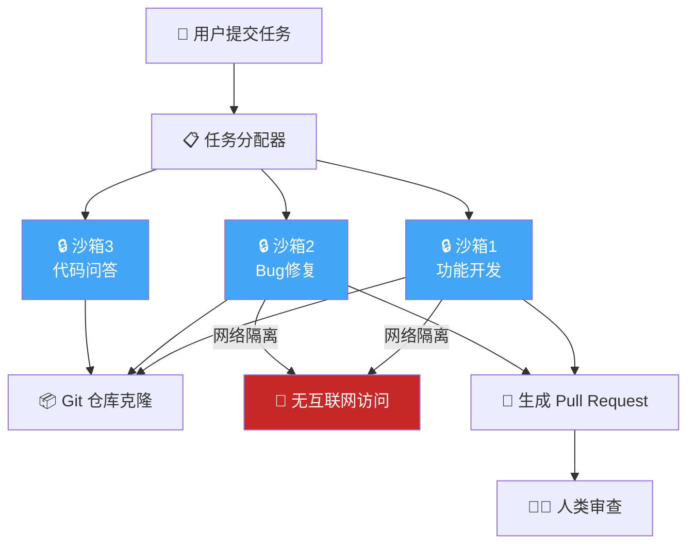

> 📊 难度：⭐⭐⭐ | ⏱️ 阅读：10分钟 | 📅 2025年5月 | 🏷️ Codex, AI编程, 软件工程智能体, 云端沙箱

# 💻 Introducing Codex

## 📌 原标题
Introducing Codex

## 📌 中文标题
Codex发布：云端AI软件工程智能体的诞生

## 📝 一句话摘要
2025年5月，OpenAI发布Codex——一个基于codex-1模型的云端软件工程智能体，能够在独立沙箱中并行处理多项编码任务，从代码编写、Bug修复到Pull Request生成，标志着AI编程从"代码补全"进入"自主工程"时代。

---

## 📖 核心内容

### 🎯 产品定位

2025年5月，OpenAI推出了Codex——一个能够在云端并行处理多项任务的软件工程智能体。与传统的代码补全工具不同，Codex被设计为一个真正的"软件工程师"，能够独立完成从需求理解到代码实现、测试和PR提交的完整工作流。

2025年6月3日，Codex向ChatGPT Plus用户开放。

### ⚡ 核心能力

Codex能够执行以下软件工程任务：

- **编写功能**：根据自然语言描述，在代码库中实现新功能
- **代码库问答**：理解并回答关于已有代码结构、逻辑和设计的问题
- **Bug修复**：定位并修复代码中的错误
- **Pull Request生成**：完成修改后自动创建PR供人类审查

每项任务都在独立的云端沙箱环境中运行，预加载了用户的代码仓库。

### 🏗️ 云端沙箱架构

Codex的安全架构是其核心设计亮点：

**隔离容器**：Codex智能体完全在云端的安全、隔离容器中运行。每个任务拥有独立的执行环境。

**网络隔离**：在任务执行期间，互联网访问被完全禁用。智能体的交互仅限于通过GitHub仓库显式提供的代码和用户预配置的已安装依赖。它无法访问外部网站、API或其他服务。

**仓库克隆**：Codex将用户的仓库克隆到自己的沙箱中，以便可以在用户的代表下运行命令和创建分支。

### 🧠 codex-1模型

Codex的底层驱动力是codex-1——一个专为软件工程优化的o3模型变体。codex-1的独特之处在于其训练方式：

- 使用强化学习（Reinforcement Learning）在多种环境下的真实编码任务上进行训练
- 训练目标是生成与人类编码风格和PR偏好高度吻合的代码
- 继承了o3的推理能力，能够在复杂代码场景中进行深度思考

### 🔄 并行任务处理

Codex的一个关键优势是并行处理能力：

- 内置的工作树（worktrees）和云环境支持智能体跨项目并行工作
- 开发者可以同时委派多项编码任务
- "几周的工作量可以在几天内完成"

### 🌱 生态演进

Codex发布后持续迭代：

- **Codex CLI**：开源的命令行界面，将智能体式编码直接带入本地开发环境，使开发者可以在真实仓库上运行Codex、迭代审查变更、在人类监督下应用编辑
- **GPT-5.2-Codex**（2025年12月）：代码生成、审查、仓库级推理和工具驱动编码智能体的专用模型
- **GPT-5.3-Codex**（2026年）：迄今最强大的智能体编码模型

---

## 🔧 技术要点

1. **沙箱隔离安全模型**：每个任务在独立的、网络隔离的容器中执行，从架构层面杜绝了AI智能体对外部系统的未授权访问
2. **codex-1的RL训练范式**：不同于传统的监督微调，codex-1使用强化学习在真实编码任务上训练，使模型输出更贴近人类开发者的代码风格和PR习惯
3. **仓库级上下文理解**：Codex不是逐文件处理，而是将整个仓库作为上下文，实现跨文件的依赖分析、架构理解和一致性编码
4. **并行工作树架构**：通过Git工作树机制，多个任务可以在同一仓库的不同分支上并行进行，互不干扰
5. **从o3到codex-1的模型特化**：将通用推理模型针对软件工程场景进行专门优化，证明了"基础模型+领域特化"的模型演进路线的有效性

---

## 🧩 深度解读

### 🟢 通俗版

以前的 AI 编程助手就像一个只会帮你补全句子的打字员——你写了一半代码，它猜你接下来想写什么。Codex 则是一个真正的实习工程师：你告诉他"把登录功能加上"，他就去读整个项目的代码，理解架构，写好代码，跑完测试，然后提交一个 Pull Request 让你审核。而且他在一个"隔离的办公室"里工作（沙箱），没有网络，只能用你给他的代码和工具——这样即使他犯了错，也不会搞坏外面的任何东西。更厉害的是，你可以同时给他十个任务，他会在十个"隔离办公室"里并行工作。

### 🔴 深入版

Codex的发布是"AI辅助编程"到"AI自主工程"转变的标志性事件。

**从Copilot到Codex的范式跃迁**：GitHub Copilot式的代码补全工具解决的是"微观层面"的编程效率——补全当前行、生成当前函数。Codex解决的则是"宏观层面"的工程效率——理解整个代码库的架构、独立完成功能开发、生成可审查的PR。这不是量变，而是质变。

**沙箱设计的深思熟虑**：禁用网络访问这一看似简单的决定，实际上反映了OpenAI对AI安全的深刻理解。当AI智能体能够自主执行代码时，如果它同时拥有网络访问权限，就可能在执行过程中下载恶意代码、泄露敏感信息或攻击外部系统。通过从架构层面切断网络，Codex将安全性从"行为约束"提升为"物理隔离"。

**强化学习训练的战略意义**：codex-1使用RL在真实编码任务上训练，这意味着模型的目标函数直接对齐了"代码能通过测试并被人类接受"这一终极指标。相比于简单地在代码语料上做预训练或SFT，RL训练使模型学会了"什么样的代码是好的"而不仅仅是"什么样的代码是常见的"。

**对软件工程职业的影响**：Codex不会完全替代程序员，但它将深刻改变编程工作的性质。初级的、模式化的编码工作将被大量自动化，而软件工程师的核心价值将转向：需求理解与拆解、架构设计、代码审查和质量把关。程序员将更多地扮演"工程经理"而非"代码产出者"的角色。

**持续迭代的模型策略**：从codex-1到GPT-5.2-Codex再到GPT-5.3-Codex，OpenAI展示了针对编码场景持续迭代专用模型的决心。这种"通用基础模型+领域专用变体"的策略可能成为AI产品化的主流模式。

---

## 💭 延伸思考

1. 当AI智能体可以并行处理数十个编码任务时，软件项目的管理方式需要如何变革？传统的Sprint规划和任务分配是否需要重新设计？
2. 沙箱隔离策略在保障安全的同时也限制了Codex的能力（如无法调用外部API）。随着信任度的提升，这一限制是否应该逐步放宽？如何在安全与能力之间找到最优平衡？
3. codex-1通过RL训练来匹配人类的PR偏好，但不同团队和项目的代码风格差异巨大。如何实现针对特定团队风格的个性化适配？
4. Codex的开源CLI版本允许在本地环境中运行，这是否会引发新的代码安全和知识产权问题？

---

## 🔗 原文链接
https://openai.com/index/introducing-codex/
