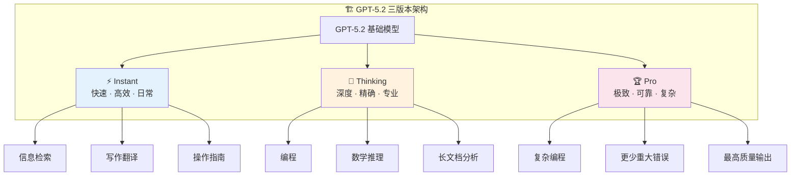
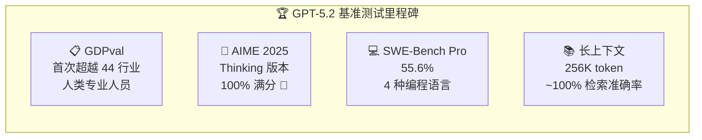
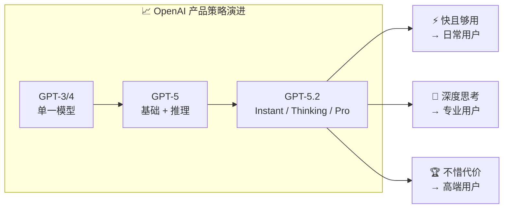

# Introducing GPT-5.2

## GPT-5.2发布：面向专业工作与长时智能体的最强前沿模型

> ⭐⭐ 中级 | 🕐 阅读时间：10 分钟 | 📅 2025-12-11 | 🏷️ `GPT-5.2` `OpenAI` `前沿模型` `智能体` `基准测试`

---

## 一句话摘要

2025年12月11日，OpenAI发布GPT-5.2系列——包含Instant、Thinking和Pro三个版本，在专业知识工作、长上下文理解、智能体工具调用等方面全面超越前代，在GDPval基准上首次超过44个行业的人类专业人员。

---

## 🟢 通俗版：GPT-5.2 是什么？

想象你需要一个 AI 助手，但不同的事情需要不同"档位"的帮助 🚗：

| 版本 | 类比 | 适用场景 |
|------|------|---------|
| ⚡ **Instant** | 🏎️ 城市代步车——快速灵活 | 日常问答、翻译、写作 |
| 🧠 **Thinking** | 🚙 越野SUV——深度强劲 | 编程、数学推理、长文档分析 |
| 🏆 **Pro** | 🏁 赛车——不惜代价求最优 | 复杂编程、极致质量要求 |

GPT-5.2 的重大突破：
- 🏅 在 44 个行业的专业知识考试中**首次超越人类专家**
- 💯 数学竞赛（AIME 2025）达到 **100% 满分**
- 📚 能在 256K token（约 500 页文档）中精准找到任何信息

> 📝 类比总结：GPT-5.2 不是一辆车，而是一个**车队**——根据你要去的地方，自动派出最合适的车型。

---

## 🔴 深入版：完整技术解析

### 📋 发布概览

2025年12月11日，OpenAI正式推出GPT-5.2，将其定位为"面向专业工作与长时运行智能体的最先进前沿模型"。这是继2025年8月GPT-5首次亮相后的重大迭代升级。

GPT-5.2在通用智能、长上下文理解、智能体工具调用和视觉感知方面带来了显著提升，使其在执行复杂、真实世界的端到端任务时优于以往任何模型。

### 🏗️ 三版本架构

GPT-5.2首次采用了三版本架构设计，满足不同使用场景的需求：

| 版本 | 定位 | 核心优势 | 适用场景 |
|------|------|---------|---------|
| ⚡ **Instant** | 快速高能的日常助手 | 信息检索、写作翻译 | 日常办公、学习、快速问答 |
| 🧠 **Thinking** | 深度工作的利器 | 编程、数学推理、长文档 | 复杂任务、精细思考 |
| 🏆 **Pro** | 困难问题的终极选择 | 更少错误、更强表现 | 宁可等、也要最高质量 |

### 📊 基准测试表现

GPT-5.2在多项基准测试中创下新纪录：

| 基准测试 | 成绩 | 意义 |
|---------|------|------|
| 📋 **GDPval** | 超越 44 行业人类专家 | 🏅 白领工作能力临界点 |
| 🔢 **AIME 2025** | 100%（无工具） | 💯 数学推理里程碑 |
| 💻 **SWE-Bench Pro** | 55.6%（4 种语言） | 🔧 多语言工程实践 |
| 📚 **长上下文检索** | ~100%（256K token） | 📖 大规模文档精准检索 |

### 🚀 核心能力提升

GPT-5.2在以下方面带来了实质性的改进：

- 📊 **创建电子表格**：能够理解复杂的数据结构并生成高质量的表格
- 📑 **构建演示文稿**：更好地理解演示逻辑和视觉呈现
- 💻 **代码编写**：在多语言代码生成和调试方面显著增强
- 🖼️ **图像感知**：更准确地理解和描述视觉内容
- 📚 **长上下文理解**：处理大规模文档时保持高精度的信息提取
- 🔧 **工具使用**：更高效的智能体工具调用和多步骤项目管理

### 📅 可用性

GPT-5.2的Instant、Thinking和Pro版本于12月11日开始向付费用户推出，API同步向所有开发者开放。

---

## 🔬 技术要点

1. 🏗️ **三版本架构创新**：Instant/Thinking/Pro的分层设计让同一基础模型根据任务复杂度自适应调节计算资源，首次在产品层面实现了"速度-质量"权衡的精细化管理

2. 🏅 **GDPval超越人类专家**：在44个职业的结构化知识工作任务中首次超过人类专业人员，标志着AI在"白领工作"领域的能力临界点

3. 💯 **数学满分里程碑**：GPT-5.2 Thinking在AIME 2025上无工具达到100%，这是数学推理能力的标志性突破

4. 📚 **超长上下文可靠性**：256K token范围内近100%的多针检索准确率，解决了长上下文模型"知道但找不到"的核心痛点

5. 💻 **SWE-Bench Pro多语言突破**：在全新的SWE-Bench Pro基准上达到55.6%，覆盖4种编程语言，更真实地反映了工程实践中的多语言场景

---

## 🧠 深度解读

GPT-5.2的发布代表了OpenAI在模型产品化策略上的重要演进。

### 从单一模型到产品矩阵

三版本架构的推出表明，OpenAI认识到不同用户在不同场景下的需求差异巨大。Instant满足"快且够用"的日常需求，Thinking服务"需要深度思考"的专业场景，Pro则瞄准"不惜代价追求最优"的高端用户。这种分层策略既最大化了用户覆盖面，又优化了计算资源的分配效率。

### GDPval的里程碑意义

在44个职业的知识工作评估中超越人类专业人员，这一结果的意义超越了技术层面。它预示着AI对白领工作的影响将从"辅助"走向"替代"，尤其是在结构化、可标准化的知识工作领域。企业需要认真思考如何将GPT-5.2级别的AI能力整合进工作流程。

| 影响阶段 | 描述 |
|---------|------|
| 🤝 **辅助阶段**（当前大部分场景） | AI 作为人类的助手，提升效率 |
| 🔄 **协作阶段**（正在到来） | AI 独立完成部分任务，人类审核 |
| 🤖 **自主阶段**（部分领域已现端倪） | AI 端到端完成结构化知识工作 |

### 长上下文的实用化

此前的长上下文模型虽然技术上支持大窗口，但在实际使用中往往"知道但找不到"——即模型能处理长输入但无法精确检索关键信息。GPT-5.2在256K范围内近100%的检索准确率，意味着AI助手终于可以可靠地处理完整的代码库、法律文书、研究论文集等大规模文档。

### 智能体能力的成熟

GPT-5.2被明确定位为"长时运行智能体"的引擎，这反映了OpenAI对AI未来形态的判断——模型不再是被动响应的聊天机器人，而是能够自主规划、调用工具、跨步骤执行复杂项目的智能体。

---

## 💭 延伸思考

1. 🏗️ **三版本架构是否会成为行业标准？** 其他AI厂商是否也会推出类似的"速度-质量"分级产品？

2. 🎓 **当AI在44个行业的结构化知识工作中超越人类专家后**，教育体系和职业培训应如何调整以应对这一变化？

3. 📚 **256K token的可靠长上下文**在法律审查、金融分析、学术研究等领域可能催生哪些新的应用范式？

4. 💰 **GPT-5.2 Pro版本的"宁可多等也要更好"策略**，是否暗示了未来AI服务将更多地采用"按质定价"而非"按量计费"的商业模式？

---

## 🔗 原文链接

[Introducing GPT-5.2 - OpenAI](https://openai.com/index/introducing-gpt-5-2/)

📅 发布日期：2025 年 12 月 11 日 | 🏢 来源：OpenAI
