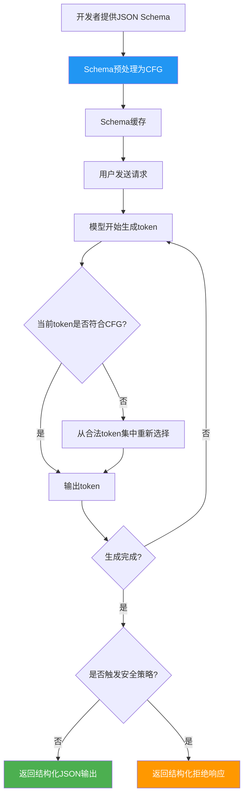

> 📊 难度：⭐⭐⭐⭐ | ⏱️ 阅读：14分钟 | 📅 2024年8月6日 | 🏷️ API更新, JSON Schema, 结构化输出

# Introducing Structured Outputs in the API
# API中的结构化输出：让AI严格遵守你的数据格式

## 一句话摘要

OpenAI推出结构化输出功能，通过将JSON Schema预处理为上下文无关文法，保证模型输出100%符合开发者指定的JSON Schema格式——从"尽力匹配"升级为"保证匹配"。

---

## 核心内容

### 从JSON Mode到Structured Outputs的进化

在2023年DevDay发布的**JSON Mode**虽然提高了模型生成有效JSON的可靠性，但无法保证输出符合特定的Schema。开发者仍需处理格式不匹配、缺少字段、类型错误等问题。

**Structured Outputs（结构化输出）**彻底解决了这个问题：模型的输出将**精确匹配**开发者提供的JSON Schema。

### 实现原理

OpenAI的技术方案借鉴了开源工具（如jsonformer、llama.cpp）的思路：将JSON Schema**预处理为上下文无关文法（Context-Free Grammar, CFG）**，然后在推理过程中用该文法约束token生成。

这意味着模型在每一步token选择时，都只能选择符合Schema的token——从根本上消除了格式错误的可能性。

### 两种使用方式

**方式一：函数调用中的严格模式**
```json
{
  "tools": [{
    "type": "function",
    "function": {
      "name": "get_weather",
      "strict": true,
      "parameters": {
        "type": "object",
        "properties": {
          "location": {"type": "string"},
          "unit": {"type": "string", "enum": ["celsius", "fahrenheit"]}
        },
        "required": ["location", "unit"],
        "additionalProperties": false
      }
    }
  }]
}
```

**方式二：response_format中的JSON Schema模式**
```json
{
  "response_format": {
    "type": "json_schema",
    "json_schema": {
      "name": "math_response",
      "strict": true,
      "schema": {
        "type": "object",
        "properties": {
          "steps": {"type": "array", "items": {"type": "string"}},
          "answer": {"type": "string"}
        },
        "required": ["steps", "answer"],
        "additionalProperties": false
      }
    }
  }
}
```

### JSON Schema限制

结构化输出仅支持JSON Schema的一个**子集**，有以下关键限制：

- 所有对象必须设置 `"additionalProperties": false`
- 所有键必须列在 `"required"` 中
- **不支持可选属性**（Optional Properties）

### 为什么不默认启用strict模式？

OpenAI工程师Ted Sanders解释了三个原因：
1. **预处理延迟**：Schema到CFG的转换引入额外延迟
2. **功能覆盖不全**：某些复杂Schema特性不被支持
3. **灾难性失败风险**：在strict模式下，模型可能进入无限循环，持续消耗token直到达到最大限制

### 安全机制

新增了**拒绝机制**：当触发内容安全策略时，模型不再以文本中断方式拒绝，而是返回结构化的拒绝响应（JSON对象），便于程序化处理。

### 配套更新

- **Python/Node SDK更新**：官方SDK原生支持Pydantic模型定义
- **新模型发布**：gpt-4o-2024-08-06同步发布，输入成本降低50%，输出成本降低33%
- **输出上限翻倍**：从4,096 token增至16,384 token

---

## 技术要点

1. **CFG约束生成**是结构化输出的核心技术——将Schema编译为文法规则后在推理时实时约束token空间
2. **strict模式的权衡**：保证格式正确但增加延迟，且存在无限循环的风险——这是工程中典型的正确性vs.性能权衡
3. **不支持Optional属性**意味着所有字段都必须出现在输出中——这简化了约束逻辑但限制了灵活性
4. **结构化拒绝**是安全与可用性融合的良好范例——安全事件本身也成为结构化数据
5. **Pydantic集成**借鉴了社区工具Instructor的设计理念，体现了OpenAI对社区创新的吸收

---

## 解读

### 🟢 通俗版解读

想象你在一家餐厅点菜。以前你说"给我来份意面"，厨房可能给你一碗汤面、一份炒面，或者真的给你意面但忘了加酱——输出不可控。

**JSON Mode**就像告诉厨房"一定要给我上一盘面"——保证是面，但具体什么面不确定。

**Structured Outputs**就像给厨房一份精确的食谱：
- 必须是意面（不是别的面）
- 必须有番茄酱（不能漏）
- 必须用帕马森奶酪（不能用其他奶酪）
- 不能额外加任何食谱外的东西

厨房（AI模型）在做菜（生成输出）的每一步，都会对照食谱检查——如果下一步要用的食材不在食谱里，就不会用。

### 🔴 深入版解读

**技术路线的演进**：Structured Outputs的CFG约束方法实际上是对logit偏置（logit bias）和受控解码（constrained decoding）技术的工程化应用。在学术界，这类技术已被广泛研究（如LMQL、Guidance），OpenAI的贡献在于将其产品化并与大规模推理基础设施集成。

**性能影响分析**：CFG预处理引入的延迟主要来自首次Schema编译（之后可以缓存）。但在推理时对token空间的约束会改变模型的概率分布，可能影响生成质量——模型被迫从一个更小的合法token集合中选择，这相当于在推理时施加了一个强先验。

**无限循环问题**：这是受限解码的经典陷阱。当Schema非常复杂时（如深层嵌套、递归结构），模型可能找不到合法的延续路径，导致在某个位置上循环生成同一个token。OpenAI选择以消耗完token上限的方式"超时"，而非设置明确的循环检测，这是一个值得关注的设计选择。

**对应用架构的影响**：Structured Outputs使得"LLM作为结构化数据提取器"的模式更加可靠。这对于RAG管道、数据ETL、API编排等场景是重大进步——开发者可以直接将LLM输出反序列化为类型安全的对象，无需中间的解析/修复逻辑。

---

## 流程图



---

## 延伸思考

1. **Schema设计即提示词工程**：结构化输出将输出格式的控制从"提示词技巧"升级为"Schema工程"——开发者需要掌握JSON Schema设计的最佳实践
2. **与Agent系统的协同**：智能体系统（如Function Calling）依赖结构化输出来可靠地传递工具调用参数——这是Agent可靠性的基础设施
3. **开源替代方案**：Outlines、LMQL等开源项目提供了类似功能，OpenAI的竞争优势在于与其推理基础设施的深度集成
4. **Token效率**：强制所有字段为必填可能导致冗余输出（如值为null的字段），如何优化token使用？

---

## 原文链接

- [Introducing Structured Outputs in the API | OpenAI](https://openai.com/index/introducing-structured-outputs-in-the-api/)
- [Structured Outputs API文档](https://developers.openai.com/api/docs/guides/structured-outputs)
- [Structured Outputs Cookbook](https://developers.openai.com/cookbook/examples/structured_outputs_intro)
