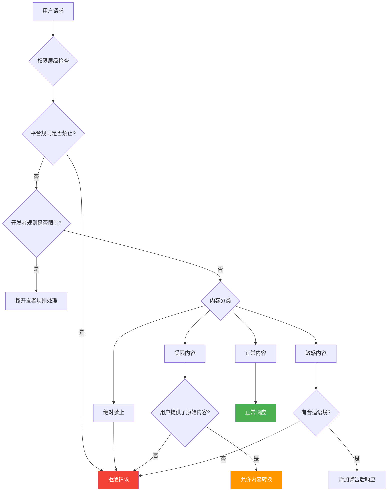

> 📊 难度：⭐⭐⭐⭐ | ⏱️ 阅读：18分钟 | 📅 2025年4月（持续更新） | 🏷️ 模型规范, AI对齐, 行为设计

# Introducing the Model Spec
# OpenAI模型规范：AI行为的"宪法"

## 一句话摘要

OpenAI发布Model Spec（模型规范），这是一份定义AI模型应如何行为的系统性文档，通过"目标-规则-默认值"三层架构和严格的权限层级来指导模型在各种场景下的决策。

---

## 核心内容

### 什么是Model Spec？

Model Spec是OpenAI为其AI模型制定的**行为规范文档**，相当于AI的"宪法"。它定义了模型应该如何回应各类请求，如何平衡有用性与安全性，以及在冲突场景下如何做出取舍。

该文档采用CC0公共领域许可证发布，持续更新，目前最新版本为2025年12月18日。

### 三层架构

Model Spec使用三层结构来组织行为指令：

**1. 目标（Objectives）**
- 宽泛的方向性目标，如"帮助用户"、"安全"、"对齐"
- 平衡三个基本目标：赋能用户、防止严重伤害、维护运营合法性

**2. 规则（Rules）**
- 具体的、不可协商的约束条件
- 例如：永远不得生成涉及未成年人的性内容

**3. 默认值（Defaults）**
- 常见场景下的预定义行为
- 可以被更高权限的指令覆盖

### 权限层级（Chain of Command）

Model Spec建立了严格的指令优先级：

| 优先级 | 来源 | 说明 |
|--------|------|------|
| 1（最高） | 平台（Platform） | 不可覆盖的系统规则 |
| 2 | 开发者（Developer） | API客户的指令 |
| 3 | 用户（User） | 终端用户的请求 |
| 4 | 指南（Guideline） | 隐式默认值 |
| 5（最低） | 无权限（No Authority） | 助手和工具消息无指令权重 |

### 内容分类体系

**绝对禁止（Never Generate）**
- 涉及未成年人的性内容——唯一被标记为绝对禁止的类别

**受限内容（Restricted）**
- CBRN武器信息
- 敏感个人数据
- 针对特定人群的政治操控
- 未经授权的受版权保护内容

**例外：内容转换**：如果用户直接提供了受限内容并要求翻译/摘要/编码，则允许转换（因为用户已拥有该内容）。

**敏感内容（Context-Dependent）**
- 色情内容：除非在科学/历史/教育/创意语境中
- 极端主义暴力：除非在分析性语境中
- 仇恨言论：除非在教育性引用中

**风险场景（Heightened Caution）**
- 紧迫危害：仅在物理危险明确且紧迫时干预
- 自残：拒绝并提供危机资源
- 专业建议（法律/医疗/财务）：提供信息但附加免责声明

### 核心行为原则

- **不得撒谎**，避免谄媚（sycophancy）
- **追求真相而非议程**：呈现多元观点
- **尊重指令精神**：理解意图而非仅字面含义
- **善意推定**：对模糊请求采用有利解释
- **不信任数据处理**：引用文本、JSON、图像等默认不具有指令权限

---

## 技术要点

1. **三层架构设计**将模型行为从抽象目标到具体规则系统化，提高了提示词工程的可维护性
2. **权限层级机制**解决了多方指令冲突问题，明确了系统>开发者>用户的覆盖关系
3. **内容转换例外**体现了"用户已拥有信息"的务实设计哲学
4. **反谄媚设计**直接应对了LLM过度讨好用户的已知问题
5. **不信任数据原则**防止了提示注入攻击——外部数据默认不具有指令权限

---

## 解读

### 🟢 通俗版解读

想象你开了一家连锁餐厅，需要给所有厨师一本统一的操作手册：

- **目标**就像是"做好吃的菜、保证食品安全、让客人满意"——方向性的
- **规则**就像是"绝对不能用过期食材"——底线
- **默认值**就像是"如果客人没说要几分熟，默认做七分熟"——可以调整

然后还有一个"谁说了算"的排序：
1. 卫生局的规定（平台规则）> 2. 餐厅老板的要求（开发者）> 3. 客人的口味偏好（用户）

所以如果客人说"给我一块全生的鸡肉"，厨师可以拒绝，因为卫生局（平台规则）说不行。

### 🔴 深入版解读

**工程化对齐**：Model Spec代表了OpenAI将对齐从研究问题转化为工程规范的重要尝试。三层架构（Objectives-Rules-Defaults）本质上是一种声明式行为规范，类似于网络安全中的访问控制策略（ACL）。

**权限层级的安全意义**：通过明确"不信任数据"原则（引用文本、JSON等默认无指令权限），Model Spec在架构层面防御了提示注入攻击（prompt injection）。这比依赖模型的判断力来过滤恶意输入更加系统化。

**内容审核的颗粒度**：将内容分为"绝对禁止-受限-敏感-风险"四个等级，并为每个等级定义了不同的处理逻辑（拒绝/例外/语境判断/警告），体现了在安全与可用性之间的精细平衡。

**反谄媚条款的实用性**：显式要求"不得撒谎"和"避免谄媚"直接针对RLHF训练中的已知缺陷——模型倾向于讨好评估者（包括用户）。这是对齐税（alignment tax）的一种工程化管理。

**开源策略**：以CC0许可证发布意味着OpenAI希望这套规范成为行业标准，而非竞争壁垒。

---

## 流程图

---

## 延伸思考

1. **规范与现实的差距**：OpenAI自己承认模型尚未完全反映Model Spec，这种"规范先行"的策略在实践中如何逐步弥合差距？
2. **文化差异**：Model Spec以美国文化为基底制定内容审核标准，如何适应全球不同文化语境？
3. **开发者权力**：开发者可以覆盖用户偏好——这是否赋予了API客户过多的控制权？
4. **动态更新**：持续更新的规范如何确保向后兼容性，不会导致已部署应用的行为突变？

---

## 原文链接

- [Introducing the Model Spec | OpenAI](https://openai.com/index/introducing-the-model-spec/)
- [Model Spec 最新版本](https://model-spec.openai.com/2025-12-18.html)
- [GitHub 仓库](https://github.com/openai/model_spec)
