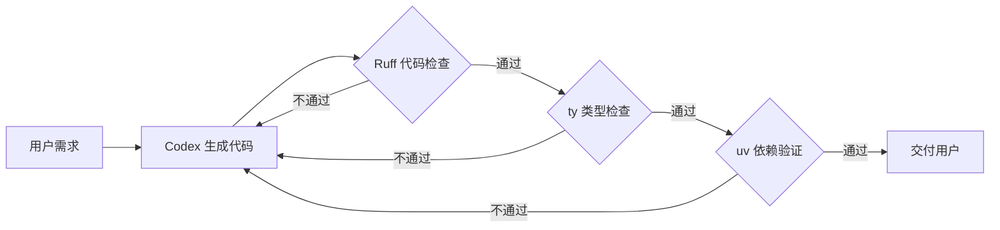

# OpenAI 收购 Astral：从 AI 模型到开发者工具全栈布局

> **原标题：** OpenAI to Acquire Astral
> **发布日期：** 2026年3月19日
> **原文链接：** https://openai.com/index/openai-to-acquire-astral/

---

## 一句话摘要

OpenAI 宣布收购 Python 开发者工具公司 Astral（uv、Ruff、ty 的开发者），将其整合进 Codex 编程助手生态，标志着 OpenAI 从"AI 模型提供商"向"全栈开发者平台"的战略转型。

---

## 完整核心内容翻译

### 收购概要

OpenAI 宣布收购 Astral，后者是 Python 生态中最受欢迎的开源开发者工具的创造者。收购完成后，Astral 团队将加入 OpenAI 的 Codex 团队。

### Astral 的核心产品

| 工具 | 功能 | 用户规模 |
|------|------|---------|
| **uv** | 超快速 Python 包管理器和项目管理工具 | 数百万开发者 |
| **Ruff** | 极速 Python 代码检查器和格式化工具（用 Rust 编写） | Python 生态标准工具 |
| **ty** | Python 类型检查器 | 新兴工具 |

这些工具已成为现代 Python 开发的基础设施，被数百万开发者日常使用。

### 战略意图

OpenAI 的 Codex 编程助手已拥有超过 200 万周活跃用户，自年初以来用户增长 3 倍、使用量增长 5 倍。通过整合 Astral 的工具和工程能力，OpenAI 计划：

1. **增强 Codex 的代码质量保障：** Ruff 的代码检查能力可以实时验证 Codex 生成的代码质量
2. **优化开发环境管理：** uv 的包管理能力可以让 Codex 更好地管理项目依赖
3. **扩展全生命周期覆盖：** 从代码生成扩展到代码质量、项目管理、类型安全

### 开源承诺

OpenAI 承诺在收购完成后继续支持 Astral 的开源产品，维护其在 Python 社区的基础设施地位。

### 收购条件

收购需通过常规审批程序，包括监管批准。双方未披露具体财务条款。

---

## 技术要点

1. **Rust 性能优势：** Astral 的工具（特别是 Ruff 和 uv）用 Rust 编写，性能远超 Python 原生同类工具（如 Ruff 比 Flake8 快 10-100 倍），这种极致性能对 AI 辅助开发至关重要——Codex 需要在生成代码的同时实时检查质量。
2. **AI + 传统工具链融合：** 这次收购代表了一种趋势——AI 编程助手需要与传统开发工具深度集成，而非替代它们。类型检查、代码检查、包管理都是 AI 生成代码后的质量保障环节。
3. **Codex 闭环构建：** AI 生成代码 → Ruff 检查质量 → ty 验证类型 → uv 管理依赖，形成完整的 AI 辅助开发闭环。
4. **开源治理风险：** 商业公司收购开源基础设施总会引发社区担忧。OpenAI 的开源承诺能否长期兑现，取决于商业利益与社区利益是否持续对齐。
5. **与 Anthropic Claude Code 的竞争升级：** Claude Code 通过 MCP 生态连接工具，OpenAI 则选择直接收购工具公司。两种策略各有优劣——收购获得更深集成但增加组织复杂度，开放协议获得更广生态但集成深度有限。

---

## 深度解读

### 🟢 通俗版（非专业读者）

想象 AI 写代码就像一个实习生写报告——速度很快但可能有错别字和格式问题。Astral 的工具就像一套自动校对和排版系统。OpenAI 收购 Astral，等于给自家的 AI 程序员配了一套专业校对工具——AI 写完代码后，自动检查格式、找出错误、确保项目能正常运行。

**为什么重要：** AI 写代码只是第一步，确保写出的代码是高质量的、能运行的，才是真正让 AI 编程实用化的关键。

### 🔴 深入版（有算法基础的读者）

这次收购揭示了 AI 编程赛道的竞争正在从"模型能力"转向"工具链生态"：

**AI 编程的质量瓶颈：** 当前 AI 生成代码的主要问题不是"能不能写出来"，而是"写出来的代码能不能用"。类型错误、依赖冲突、风格不一致是 AI 代码的常见问题。将 Ruff/ty/uv 内置到 Codex 中，可以在生成阶段就进行质量过滤，而非事后修复。

**开源商业化的经典困境：** Simon Willison（知名开发者）在评论中指出，OpenAI 承诺维护开源项目，但历史上大公司收购开源项目后的记录参差不齐。关键观察点：uv 和 Ruff 是否会出现"核心功能免费、高级功能付费"的分化？

**AI 编程工具的三种竞争模式：**
1. **OpenAI 模式：** 收购工具公司，深度垂直整合
2. **Anthropic 模式：** 开放 MCP 协议，构建工具生态
3. **Google 模式：** 依托 Android Studio/Cloud 既有开发者生态

长期来看，哪种模式能建立最强的开发者锁定效应，将决定 AI 编程赛道的胜负。

---

## 延伸思考

1. **开发者主权问题：** 当核心开发工具被 AI 公司拥有，开发者是否面临工具链被锁定的风险？如果 OpenAI 修改 uv 的开源协议，整个 Python 生态会受到多大影响？
2. **AI 生成代码的质量标准：** Ruff 和 ty 目前的规则是人类开发者制定的。AI 大规模生成代码后，是否需要新的质量标准和检查规则？
3. **收购连锁反应：** OpenAI 收购 Astral 后，Anthropic、Google 是否会加速收购其他开发者工具公司？

---

> 📎 原文链接：https://openai.com/index/openai-to-acquire-astral/
