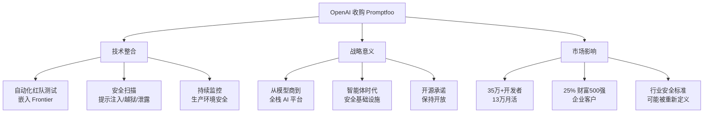

# OpenAI to Acquire Promptfoo

**原标题:** OpenAI to acquire Promptfoo
**中文标题:** OpenAI 收购 Promptfoo：为 AI 智能体筑起安全防线
**作者:** OpenAI | **发布日期:** 2026年3月9日
**原文链接:** [https://openai.com/index/openai-to-acquire-promptfoo/](https://openai.com/index/openai-to-acquire-promptfoo/)

---

## 一句话摘要

OpenAI 宣布收购 AI 安全测试平台 Promptfoo，将其自动化安全检测和红队测试能力整合进 OpenAI Frontier 平台，以帮助企业识别和修复 AI 智能体中的提示注入、越狱、数据泄露等安全风险。

---

## 🟢 通俗解读

### 为什么 OpenAI 要买一家安全公司？

随着 AI 智能体（Agent）越来越强大——能浏览网页、执行代码、操作工具——安全问题也变得越来越紧迫。Promptfoo 就像是 AI 系统的"安全检测站"，能在 AI 产品上线之前发现各种安全隐患。

### Promptfoo 是什么？

Promptfoo 是一个开源的 AI 安全测试工具，由 Ian Webster 和 Michael D'Angelo 创建。它的核心功能是帮助开发者在开发阶段就发现 LLM 系统的安全漏洞：
- **35万+开发者**使用过
- **13万月活**用户
- **25%+ 的财富500强**企业在用

### 能检测什么？

- **提示注入**：恶意用户试图"劫持"AI 的指令
- **越狱攻击**：绕过 AI 的安全限制
- **数据泄露**：AI 意外暴露敏感信息
- **工具滥用**：AI 智能体错误地使用外部工具
- **违反策略的行为**：AI 做出不符合企业规定的操作

### 整合后会怎样？

Promptfoo 的技术将直接嵌入 OpenAI Frontier（OpenAI 的企业 AI 平台），这意味着企业在构建 AI 智能体时，安全测试将成为"内建功能"而非"额外步骤"。

### 开源会继续吗？

OpenAI 承诺 Promptfoo 将继续保持开源，并继续服务现有的用户和客户。

---

## 🔴 技术深入

### 收购的战略逻辑

在 AI 智能体时代，安全测试的需求正在发生根本性变化：

1. **从静态到动态**：传统 LLM 安全测试主要针对单轮对话，而智能体需要多步骤、跨工具的安全测试
2. **从人工到自动化**：手动红队测试无法跟上智能体的部署速度，需要自动化的持续安全扫描
3. **从事后到事前**：安全测试需要嵌入开发流程（shift-left），而非上线后才发现问题

### Promptfoo 的技术能力

Promptfoo 提供的核心技术栈包括：

- **自动化红队测试**：针对 LLM 系统自动生成对抗性测试用例
- **评估框架**：系统化地测试 LLM 在各种边界条件下的行为
- **安全扫描**：检测提示注入、越狱、PII 泄露等安全风险
- **持续监控**：在生产环境中持续监测 AI 系统的安全状态

### 与 OpenAI Frontier 的整合架构

```
开发者构建 AI 智能体
        ↓
OpenAI Frontier 平台
        ↓
┌──────────────────────────────┐
│  Promptfoo 安全层（内建）      │
│  ├─ 提示注入检测              │
│  ├─ 越狱攻击防护              │
│  ├─ 数据泄露扫描              │
│  ├─ 工具调用安全审计           │
│  └─ 策略合规性检查             │
└──────────────────────────────┘
        ↓
安全验证通过 → 部署上线
```

### 市场竞争格局

这次收购是 OpenAI 2026 年密集 M&A 战略的一部分。此前 OpenAI 已收购了 Astral（Rust 开发者工具）。连续的收购表明 OpenAI 正在从"模型提供商"转型为"全栈 AI 平台"——模型只是基础，开发者工具和安全保障才是企业客户的真正需求。

### 对行业的影响

- **安全测试标准化**：Promptfoo 的方法论可能成为行业标准
- **开源生态**：OpenAI 保留开源承诺对整个生态至关重要
- **竞争壁垒**：内建安全能力将成为 AI 平台的关键差异化因素

---

## 延伸思考

1. **安全测试的 AI 化**：用 AI 来测试 AI 的安全性，本质上是一场"左手 vs 右手"的博弈。攻击能力和防御能力是否会同步增长？
2. **开源承诺的持久性**：历史上，大公司收购开源项目后保持开源的记录参差不齐。OpenAI 能否长期兑现这一承诺？
3. **智能体安全的根本挑战**：即使有完善的测试，智能体在复杂真实环境中的行为仍然难以完全预测。安全测试能覆盖多大比例的风险场景？

---



*本文为 OpenAI 官方公告的深度中文解读。*
