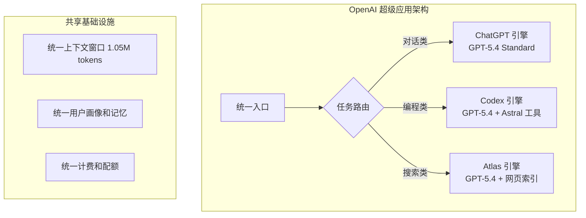

# OpenAI 超级应用整合：ChatGPT + Codex + Atlas 三合一

> **原标题：** OpenAI Consolidates Products into Desktop Superapp
> **发布日期：** 2026年3月
> **原文链接：** https://openai.com/blog/desktop-superapp

---

## 一句话摘要

OpenAI 将 ChatGPT（对话）、Codex（编程）和 Atlas（浏览器）整合为统一桌面超级应用，9 亿周活跃用户将在单一界面中获得对话、编程和网页浏览的无缝体验，同时下线 GPT-5.1 模型和旧版深度研究模式。

---

## 完整核心内容翻译

### 整合策略

OpenAI 正在将三大独立产品合并为一个桌面超级应用：

| 产品 | 功能 | 整合后定位 |
|------|------|-----------|
| **ChatGPT** | 通用 AI 对话 | 核心对话界面 |
| **Codex** | AI 编程助手 | 内置编程环境 |
| **Atlas** | AI 浏览器 | 内置网页搜索和浏览 |

### 产品清理

作为整合的一部分，OpenAI 同时进行了产品线清理：

- **GPT-5.1 模型下线：** 自 3 月 11 日起，ChatGPT 中不再提供 GPT-5.1 系列，现有对话自动迁移到当前模型
- **旧版深度研究模式移除：** 定于 3 月 26 日移除，被新的集成研究功能替代
- **电商功能收缩：** ChatGPT 的商品购买功能未达预期，OpenAI 宣布收缩这一方向

### 用户规模

- **9 亿**周活跃用户
- **Codex：** 超过 200 万周活跃用户，年初至今用户增长 3 倍、使用量增长 5 倍
- **Codex for Students：** 向美国和加拿大高校学生提供 100 美元 ChatGPT 积分

### 电商尝试的失败

OpenAI 此前曾在 ChatGPT 中推出商品直接购买功能，试图将聊天机器人打造为电商入口。但这一功能未达预期，OpenAI 承认正在"战略转向"。

---

## 技术要点

1. **统一上下文管理：** 将对话、编程和浏览整合到同一应用中，意味着模型需要在单一上下文窗口中处理三种截然不同的任务类型。这要求更智能的上下文路由和任务切换机制。
2. **模型版本激进淘汰：** GPT-5.1 在 GPT-5.4 发布仅 6 天后就被下线，展示了 OpenAI 的快速迭代策略。但这也意味着依赖特定版本 API 的开发者需要频繁适配。
3. **超级应用 vs 单一功能：** 在移动互联网时代，中国的微信是超级应用的成功案例，但西方市场对超级应用的接受度一直存疑。OpenAI 的整合是否能打破这一定律？
4. **电商失败的启示：** AI 聊天机器人在"信息获取"和"任务完成"上有天然优势，但在"交易/电商"上面临信任和习惯的壁垒。用户可能愿意让 AI 回答问题和写代码，但不愿意让 AI 代为购物。
5. **学生市场的战略布局：** Codex for Students 是典型的"先培养习惯再收费"策略。让下一代开发者从学生时代就依赖 Codex，建立长期用户粘性。

---

## 深度解读

### 🟢 通俗版（非专业读者）

以前 OpenAI 有三个独立的产品：聊天助手（ChatGPT）、编程工具（Codex）和 AI 浏览器（Atlas）。现在它们要合并成一个"超级应用"——就像微信集合了聊天、支付、小程序一样，OpenAI 要在一个应用里集合 AI 对话、AI 编程和 AI 上网。

同时，OpenAI 也在做"断舍离"——关掉不太成功的功能（比如让 AI 帮你网购），淘汰旧版本的模型。

**为什么重要：** 这预示着 AI 产品的未来形态——不是很多独立的 AI 工具，而是一个"AI 万能助手"应用。

### 🔴 深入版（有算法基础的读者）

超级应用整合揭示了 AI 产品设计的核心挑战：

**上下文切换的技术挑战：** 在同一个会话中，用户可能先问一个常识问题，然后切换到编程，再切换到网页搜索。模型需要：
1. 识别任务类型变化
2. 动态切换系统提示词和工具集
3. 在不同任务间共享相关上下文、隔离不相关上下文

**电商失败的深层原因：** AI 在信息密集型任务（搜索、对话、分析）上有天然优势，因为这些任务的核心是"理解和生成语言"。但交易类任务的核心是"信任和便利"——用户信任 Amazon 的物流和退款体系，而不是 AI 的商品推荐能力。这揭示了 AI 产品的一个重要规律：**AI 擅长增强信息流，但不擅长替代交易流。**

**9 亿用户的规模效应：** 9 亿周活跃用户产生的交互数据，是训练下一代模型的重要资源。超级应用整合意味着 OpenAI 可以获取更多样化的用户行为数据——从日常对话到专业编程到网页浏览模式——这对模型能力的全面提升至关重要。

---

## 延伸思考

1. **超级应用的反垄断风险：** 将 AI 对话、编程和浏览捆绑在一起，是否可能面临反垄断审查？特别是在 AI 成为基础设施的背景下。
2. **开发者生态的影响：** 如果 OpenAI 直接提供完整的编程环境，第三方 AI 编程工具（Cursor、GitHub Copilot 等）的生存空间是否会被压缩？
3. **用户数据的集中化：** 将对话、编程和浏览数据集中到一个平台，隐私风险如何评估？

---

> 📎 原文链接：https://openai.com/blog/desktop-superapp
