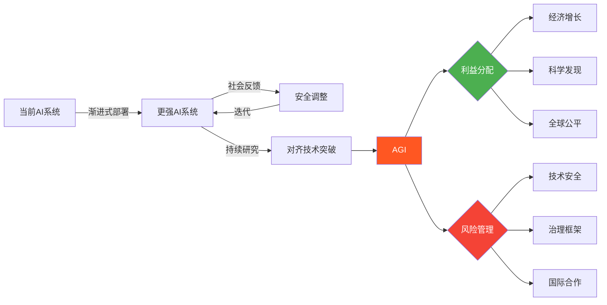

> 📊 难度：⭐⭐⭐ | ⏱️ 阅读：12分钟 | 📅 2023年2月24日 | 🏷️ AGI, 战略愿景, AI安全

# Planning for AGI and beyond
# 规划AGI及其未来

## 一句话摘要

OpenAI CEO Sam Altman发表纲领性博文，阐述了公司对AGI（通用人工智能）的愿景——渐进式部署、广泛分享利益、以及将AGI风险视为生存性风险的安全立场。

---

## 核心内容

### OpenAI的使命宣言

Altman开宗明义："我们的使命是确保AGI惠及全人类。"他将AGI定义为一种人类的放大器——能够提升丰富度、加速全球经济、帮助发现改变可能性边界的新科学知识。

### 短期策略：渐进式过渡

Altman强调，**渐进式过渡**优于突然式转变。OpenAI的策略是部署逐步增强的系统，在实际使用中积累经验。核心论点包括：

- **部署即学习**：通过让社会逐步接触越来越强大的AI系统，允许人们、政策制定者和机构有时间适应
- **持续校准**：在实践中不断调整安全措施和治理框架
- **避免"实验室惊喜"**：如果强大的AI系统只在实验室中开发而不经过社会检验，风险反而更大

### 长期愿景：AGI的利益分享

Altman提出AGI的利益应当被**广泛且公平地分享**。具体包括：

- AGI应该提升全人类的生活水平，而非集中在少数人手中
- 接入（access）和治理（governance）都需要民主化
- 经济利益的分配应当考虑全球公平性

### 安全立场：视为生存性风险

这是博文中最引人关注的立场之一：

> 随着系统越来越接近AGI，我们变得越来越谨慎。我们认为需要比社会通常对新技术施加的更多谨慎……我们应当像AGI风险是生存性风险一样来运作。

Altman承认AGI伴随着严重的**误用风险和灾难性事故风险**，并表示OpenAI正在加大对对齐（alignment）研究的投入。

### 对世界的承诺

- **对齐研究**：持续投入确保AI系统按照人类意图行事
- **独立审查**：欢迎外部审查和技术审计
- **国际合作**：呼吁全球协作来管理AGI的发展
- **利润上限**：OpenAI的有限利润结构旨在确保AGI利益不被过度商业化

---

## 技术要点

1. **渐进式部署（Iterative Deployment）**是OpenAI的核心安全策略——通过分阶段发布来降低突发风险
2. **对齐问题（Alignment Problem）**被视为AGI安全的核心技术挑战
3. **"生存性风险"定位**意味着OpenAI将安全投入提升到与核武器防扩散类似的优先级
4. **治理民主化**要求在技术之外建立新型的全球治理机制

---

## 解读

### 🟢 通俗版解读

想象人类正在发明一种新的超级工具——比电力和互联网都强大得多。Sam Altman说的是：

"我们正在造一个超级聪明的东西，它可以帮助解决很多人类的难题，比如治病、搞科研、发展经济。但同时它也很危险，就像核能一样。"

所以他的计划是：
- **慢慢来**：不要一下子放出一个超级AI，而是一步步升级，让大家有时间适应
- **大家一起分享**：这个工具的好处不应该只属于硅谷的少数人，而是全世界的人
- **非常小心**：要把它当成可能威胁人类生存的东西来对待，安全措施要做到极致

这就像是说："我们在建一座核电站，我们要确保它安全运行，让所有人都用上电，而不是让它变成核弹。"

### 🔴 深入版解读

**战略定位分析**：这篇博文的发布时机（ChatGPT爆火后不久）具有重要的战略意义。它同时面向多个受众：投资者（AGI即将到来且OpenAI走在前列）、监管者（我们是负责任的）、竞争对手（我们已经在思考长远问题），以及公众（AGI会让所有人受益）。

**渐进式部署的两面性**：Altman的"渐进式部署"论点巧妙地将商业化正当化为安全策略。在实验室中封闭开发确实有风险，但大规模部署本身也带来新的风险（如deepfakes、信息污染）。这种论证回避了一个关键问题：谁来决定"渐进"的速度？

**"生存性风险"话语的策略性**：将AGI定位为生存性风险既表达了对安全的承诺，也隐含着对AGI能力的极高预期。这种定位在募资和人才招聘中具有战略价值。

**治理悖论**：Altman呼吁民主化的治理，但OpenAI本身从非营利转向有限营利模式的过程恰恰缺乏广泛的民主参与。组织结构与宣言之间存在张力。

---

## 流程图

---

## 延伸思考

1. **速度 vs. 安全**：在激烈的行业竞争中（Google、Anthropic、Meta等），"渐进式部署"的承诺能否真正落实？
2. **利益分配机制**：具体如何实现AGI利益的全球公平分享？现有的国际治理框架是否足够？
3. **定义问题**：AGI的到来是一个明确的时间点，还是一个渐变过程？这如何影响治理时机？
4. **OpenAI的转型**：从非营利到有限营利到近期结构调整，组织形态如何影响其使命的可信度？

---

## 原文链接

- [Planning for AGI and beyond | OpenAI](https://openai.com/index/planning-for-agi-and-beyond/)
