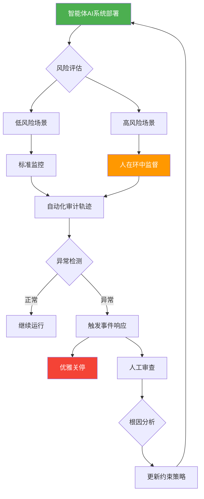

> 📊 难度：⭐⭐⭐⭐ | ⏱️ 阅读：15分钟 | 📅 2023年12月 | 🏷️ AI治理, Agent安全, 政策框架

# Practices for Governing Agentic AI Systems
# 智能体AI系统的治理实践

## 一句话摘要

OpenAI发布白皮书，系统性地提出了管理和治理具有自主行动能力的AI智能体系统的框架与实践建议，涵盖利益相关者职责、安全防护和问责机制。

---

## 核心内容

### 什么是"智能体AI系统"？

OpenAI将**智能体AI系统（Agentic AI Systems）**定义为：能够在有限人类监督下，自主追求复杂目标的AI系统。与传统的问答式AI不同，智能体AI可以自主规划、使用工具、与外部系统交互，甚至代表用户执行现实世界中的操作。

这些系统的应用场景包括：自优化供应链管理、自动化理赔处理、自主代码编写与部署等。

### 利益相关者角色定义

白皮书定义了智能体AI生态系统中的关键角色：

- **开发者（Developers）**：构建AI模型和基础能力的团队，需要内置可中断性钩子（interruptibility hooks）和策略执行机制
- **部署者（Deployers）**：将AI系统集成到实际应用中的组织，必须建立"风险偏好声明"并监控数据风险
- **用户（Users）**：最终使用AI系统的个人或组织
- **委托人（Principals）**：对AI行为负有最终责任的实体

### 七大治理防护建议

1. **约束与监控模式（Constrain-and-Monitor）**：限制智能体的行动范围，同时进行实时监控
2. **不可变思维链（Immutable Chains-of-Thought）**：保留完整的推理审计轨迹，用于事后分析和问责
3. **优雅关停能力（Graceful Shutdown）**：在紧急情况下能够安全禁用智能体
4. **身份验证机制（Agent Identity Verification）**：使用DID签名凭证验证智能体身份
5. **数据遏制（Data Containment）**：防止未授权的数据导出
6. **动态持续风险评估**：随系统演进持续评估风险，而非一次性审查
7. **分层控制**：结合技术、组织和监管层面的多重保障

### 核心治理原则

- **人在环中（Human-in-the-Loop）**：特别是对于高影响或不可逆操作，必须保持人类监督
- **事件响应协议**：建立快速干预的标准流程
- **透明度与可解释性**：优先部署能够解释其推理过程的系统
- **红队测试与对抗测试**：作为持续性要求而非一次性工作

---

## 技术要点

1. **智能体AI的核心挑战**在于其自主性——系统可以在没有人类持续监督的情况下做出影响现实世界的决策
2. **多方责任模型**明确了从开发到部署到使用各环节的安全责任分配
3. **"约束与监控"架构**是实现安全自主系统的核心设计模式
4. **不可变审计轨迹**解决了AI系统决策的可追溯性问题
5. **"结果倒推"治理法**通过模拟攻击（如提示注入、网络分区）来验证防护有效性

---

## 解读

### 🟢 通俗版解读

想象你雇了一个非常聪明的助手来帮你管理公司。这个助手可以自己发邮件、下订单、做决策。但问题是：你怎么确保这个助手不会做出你不想要的事？

OpenAI这篇白皮书就像是一本"如何管理超级助手"的指南。它说：
- 首先，要给助手划定明确的工作范围（不能随便花钱超过一定额度）
- 其次，要有监控摄像头（记录助手的每一步操作）
- 第三，要有紧急停止按钮（万一助手出了问题能立刻叫停）
- 第四，要确认助手是你雇的那个人（身份验证）
- 最后，要定期演练紧急情况（不能等出了事才想怎么办）

### 🔴 深入版解读

本白皮书的核心贡献在于将智能体AI的治理从抽象的伦理讨论推进到了可操作的工程实践层面。

**架构层面**：提出的"约束与监控"模式本质上是一种沙箱化方法论——通过限制智能体的行动空间和资源访问来降低风险。这与操作系统中的权限管理思想一脉相承，但需要适应AI系统的动态性和模糊性。

**可追溯性设计**：不可变思维链的概念借鉴了区块链的不可篡改性，但应用于AI推理过程。这为监管审计和事故调查提供了技术基础，也是实现"可解释AI"的实用路径。

**多智能体场景的挑战**：当多个智能体协作时，治理复杂度呈指数级增长。白皮书提出的分层控制模型需要在实践中进一步验证其可扩展性。

**实践启示**：对于开发者而言，关键启发是在设计阶段就要内置安全机制（Security by Design），而非在部署后再打补丁。

---

## 流程图

---

## 延伸思考

1. **监管标准化**：随着智能体AI在金融、医疗等关键领域的普及，是否需要行业级的强制治理标准？
2. **自主性悖论**：过度约束智能体会削弱其价值，过少约束则带来风险——最佳平衡点在哪里？
3. **跨系统交互**：当不同组织部署的智能体需要协作时，如何建立统一的信任和治理框架？
4. **责任归属**：当智能体造成损害时，开发者、部署者和用户之间的法律责任如何划分？

---

## 原文链接

- [Practices for Governing Agentic AI Systems | OpenAI](https://openai.com/index/practices-for-governing-agentic-ai-systems/)
- [白皮书PDF](https://cdn.openai.com/papers/practices-for-governing-agentic-ai-systems.pdf)
