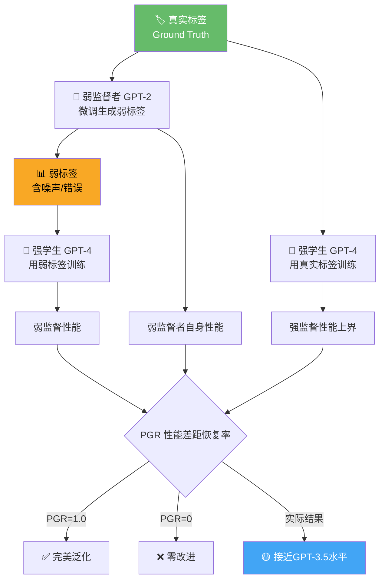

> 📊 难度：⭐⭐⭐⭐ | ⏱️ 阅读：14分钟 | 📅 2023年12月 | 🏷️ 超对齐, 弱到强泛化, GPT-2, GPT-4

# 🔬 Weak-to-Strong Generalization — 弱到强泛化

> **原标题**: Weak-to-Strong Generalization
> **中文标题**: 弱到强泛化：用GPT-2监督GPT-4，超对齐的第一步
> **发布日期**: 2023年12月（论文发布）/ 2024年2月（开放讨论）
> **原文链接**: https://openai.com/index/weak-to-strong-generalization/

## 📝 一句话摘要

OpenAI超对齐团队发布首项核心研究成果，证明弱模型(GPT-2级别)可以有效监督强模型(GPT-4)并激发其接近GPT-3.5级别的能力表现，为未来人类监督超智能AI提供了理论和实验基础。

---

## 📖 核心内容

### 🧩 一、问题的本质

超对齐(Superalignment)面临的核心挑战是：未来的超智能AI系统将远超人类智能，而人类需要监督和对齐这些比自己聪明得多的系统。这构成了一个根本性悖论——一个较弱的监督者如何确保一个更强的被监督者按照前者的意图行事？

OpenAI的超对齐团队将这个问题转化为一个可研究的类比：弱AI模型能否有效监督强AI模型？具体而言——用GPT-2来监督GPT-4。

### 🔬 二、实验方法论

研究采用三步法：

**第一步：创建弱监督者**
用真实标签(ground truth labels)微调小型模型(如GPT-2)，使其生成弱标签(weak labels)。这些标签必然包含错误，因为弱模型的能力有限。

**第二步：训练强学生模型**
用弱模型生成的标签（而非真实标签）来微调大型模型(如GPT-4)。关键问题是：强模型会照搬弱监督者的错误，还是能超越这些错误？

**第三步：建立性能天花板**
用真实标签训练强模型，作为强监督下的性能上界。

**核心度量指标——性能差距恢复率(Performance Gap Recovery, PGR)**：
- PGR = 1.0：完美泛化——强模型完全恢复到真实标签训练水平
- PGR = 0：零改进——强模型性能等同于弱监督者
- 实质含义：衡量弱监督信号中有多少"潜在正确性"被强模型成功提取

### 🌐 三、实验覆盖范围

研究横跨三大领域：

**📝 自然语言处理(NLP)任务**
- 包括情感分析、自然语言推理、常识推理等标准基准
- 结果：强学生模型始终优于其弱监督者
- 使用辅助置信度损失(auxiliary confidence loss)后，用GPT-2级别监督者微调GPT-4，能恢复接近GPT-3.5级别的性能

**♟️ 国际象棋**
- 用棋力较弱的模型生成的落子作为监督信号
- 测试泛化能力在非语言推理领域的表现

**🏆 奖励建模(Reward Modeling)**
- 这是与对齐最直接相关的场景——RLHF(基于人类反馈的强化学习)的核心组件
- 弱奖励模型能否有效引导强策略模型？
- 结果表明方法"缺乏稳定性"，奖励建模场景的泛化最具挑战性

### 🛠️ 四、关键增强技术

**迭代引导(Iterative Boosting)**
不是直接从弱到强的一步跳跃，而是通过中间规模的模型逐步递进。每一步的中间模型作为下一步更大模型的监督者。这种渐进式方法"显著提升了泛化能力"。

**辅助置信度损失(Auxiliary Confidence Loss)**
在标准训练损失之外添加额外的损失项，鼓励模型对自己的预测保持高置信度。这减少了模型对弱标签错误的模仿，"缓解了对弱标签的过拟合"。

**无监督微调(Unsupervised Fine-tuning)**
结合无监督微调与其他技术，PGR提升约30-40%。

### 🔑 五、核心发现

1. **弱到强泛化是一种普遍现象**：在所有测试设置中，强学生模型总是优于其弱监督者——弱监督信号中包含了超越弱模型自身能力的有用信息
2. **简单方法即可大幅提升泛化**：通过置信度损失和迭代引导等技术，可以显著改善弱监督者激发强模型知识的能力
3. **奖励建模是最难的场景**：对齐最核心的组件(奖励模型)恰恰是泛化最不稳定的领域，这指向了未来研究的关键方向
4. **这是类比而非解法**：研究者明确指出，弱模型监督强模型只是人类监督超智能AI的类比，不能直接等同

### 🌍 六、开放计划

OpenAI配套发布了：
- 完整的开源代码
- 1000万美元的资助计划，面向研究生、学者和其他研究者，支持超人类AI对齐的广泛研究

---

## 🔧 技术要点

1. **类比框架**：将"人类监督超智能AI"的不可测问题转化为"弱模型监督强模型"的可实验问题
2. **PGR度量**：定义了评估弱到强泛化程度的标准化指标，使不同实验结果可比较
3. **辅助置信度损失**：关键技术创新——通过鼓励高置信预测来抑制对弱标签错误的过拟合
4. **迭代引导策略**：通过中间模型的逐步递进替代直接跨越，提升泛化稳定性
5. **奖励建模的挑战**：揭示了对齐核心组件的泛化困难，指明了超对齐研究的关键瓶颈

## 🧩 深度解读

### 🟢 通俗版

想象你是一个小学数学老师（弱监督者），要培养一个天才数学研究生（强模型）。你出的题和给的答案可能有些错误，但研究生足够聪明，能从你的指导中学到正确的东西，甚至超越你的水平。这项研究就证明了这一点：即使"老师"比"学生"弱得多，学生也能从不完美的教导中提炼出有价值的知识。不过有个问题——在"打分"这件事上（类比为奖励建模），学生从弱老师那里学到的效果最差。这很关键，因为 AI 对齐的核心就是让 AI 学会正确的"打分标准"。

### 🔴 深入版

这项研究是OpenAI超对齐团队的奠基性工作，其价值不在于解决了超对齐问题，而在于将一个哲学性的难题转化为了可实验的科学问题。

**最令人振奋的发现**是弱到强泛化的普遍性。GPT-2的标签虽然包含大量错误，但GPT-4在这些嘈杂标签上训练后不仅超越了GPT-2的水平，还接近了GPT-3.5的表现。这意味着强模型并非简单地模仿监督信号，而是能够从中提取深层模式——即使这些模式在监督信号表面并不清晰。

**最值得警惕的发现**是奖励建模场景的不稳定性。在RLHF框架中，奖励模型承担着"人类价值观代理"的角色。如果弱到强泛化在这个最关键的组件上表现最差，那么依赖弱人类偏好数据来对齐超智能AI的整条路径都需要重新审视。

**后续发展令人唏嘘**：超对齐团队在2024年中期经历了重大人事变动(联合创始人Ilya Sutskever和团队负责人Jan Leike先后离开)，后续的Mission Alignment团队也在2026年2月被解散。这项研究所开辟的研究方向是否还在OpenAI内部得到持续推进，值得外界关注。

## 💭 延伸思考

1. **类比的有效性边界**：GPT-2到GPT-4的能力差距是否真正模拟了人类到超智能AI的差距？当差距从量变到质变（例如，超智能AI具有人类完全无法理解的推理能力）时，弱到强泛化是否仍然成立？
2. **对齐税的可持续性**：如果确保弱到强泛化的有效性需要越来越复杂的技术栈(置信度损失+迭代引导+无监督微调+...)，这个"对齐税"会不会在实践中因成本过高而被忽视？
3. **开源的双面性**：OpenAI开源了代码并资助外部研究，但超对齐团队本身已不复存在。当开创性研究的组织根基消失后，社区能否独立推进这条研究路线？
