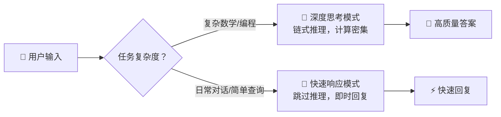
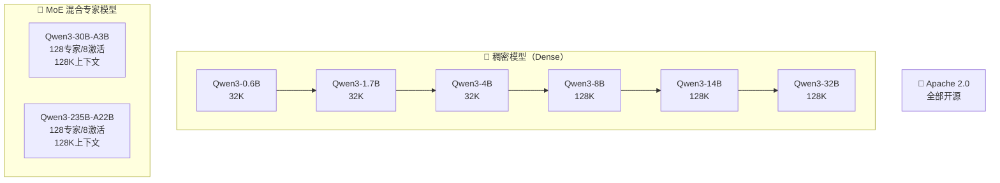
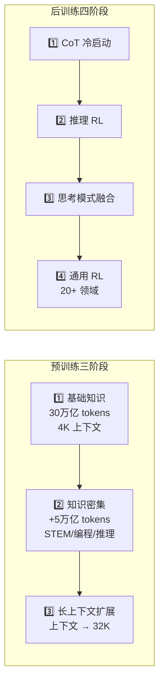

# Qwen3: Think Deeper, Act Faster

> ⭐⭐ 中等难度 | ⏱️ 阅读时间：12 分钟 | 📅 2026-03-21 | 🏷️ `Qwen3` `MoE` `混合思考` `多语言` `开源模型`

## 📌 原标题 / 中文标题

**原标题**: Qwen3: Think Deeper, Act Faster
**中文标题**: Qwen3：思考更深，行动更快

## 📌 一句话摘要

阿里Qwen团队发布Qwen3系列大模型，首创"混合思考"模式，旗舰MoE模型Qwen3-235B-A22B以仅22B激活参数比肩DeepSeek-R1、o1等顶级模型，并支持119种语言。

---

## 🟢 通俗版：Qwen3 是什么？

想象你有两种工作模式：

- 🐢 **深度思考模式**：遇到难题时，花时间仔细推理
- 🐇 **快速响应模式**：简单问题直接秒答

Qwen3 的"混合思考"就是让 AI 也有了这两种模式的切换能力 —— 难题慢慢想，简单问题快速答。

> 🎯 **最惊人的数字**：Qwen3-4B（40亿参数的小模型）能匹敌 Qwen2.5-72B（720亿参数）的性能，相当于用 1/18 的参数做到了同样的事！

---

## 🔴 深入版：核心内容详解

### 1. 📦 模型家族概览

Qwen3是通义千问系列的最新一代大语言模型，代表着团队迈向通用人工智能(AGI)和超级人工智能(ASI)的重要里程碑。本次发布包含8个开源模型：

| 类型 | 模型 | 总参数 | 激活参数 | 上下文 |
|------|------|--------|---------|--------|
| 🔷 稠密 | Qwen3-0.6B | 0.6B | 0.6B | 32K |
| 🔷 稠密 | Qwen3-1.7B | 1.7B | 1.7B | 32K |
| 🔷 稠密 | Qwen3-4B | 4B | 4B | 32K |
| 🔷 稠密 | Qwen3-8B | 8B | 8B | 128K |
| 🔷 稠密 | Qwen3-14B | 14B | 14B | 128K |
| 🔷 稠密 | Qwen3-32B | 32B | 32B | 128K |
| 🔶 MoE | Qwen3-30B-A3B | 30B | **3B** | 128K |
| 🔶 MoE | Qwen3-235B-A22B | 235B | **22B** | 128K |

### 2. 🧠 核心创新：混合思考模式

Qwen3的标志性创新在于"混合思考(Hybrid Thinking)"机制。用户可以通过`enable_thinking`参数或在对话中使用`/think`、`/no_think`标签，在两种模式间灵活切换：

| 模式 | 触发方式 | 适用场景 | 计算开销 |
|------|---------|---------|---------|
| 🐢 深度思考 | `enable_thinking=True` 或 `/think` | 复杂数学、编程、逻辑推理 | ⬆️ 高 |
| 🐇 快速响应 | `enable_thinking=False` 或 `/no_think` | 简单查询、日常对话 | ⬇️ 低 |

> 💡 这种设计让用户可以根据任务复杂度动态调节计算资源投入，在效果和效率之间取得最优平衡。

### 3. 🏋️ 训练方法论

**📚 预训练阶段**——数据规模扩展至约36万亿token（相比Qwen2.5的18万亿翻倍），分为三个阶段：

**🎯 后训练阶段**——精心设计的四阶段流水线：
1. 🔗 思维链(Chain-of-Thought)冷启动初始化
2. 🧠 基于推理的强化学习
3. 🔀 思考模式融合训练
4. 🌐 覆盖20+领域的通用强化学习

### 4. 🌍 多语言支持

Qwen3支持**119种语言和方言**，涵盖印欧语系、汉藏语系、亚非语系等多个语系，是目前覆盖语言最广的开源大模型之一。

### 5. 🤖 智能体能力

增强的工具调用(Tool Calling)和MCP(模型上下文协议)支持，使Qwen3在Agent应用场景中表现出色，能够与外部工具和服务进行无缝交互。

### 6. 📊 性能表现

| 对比 | 结果 | 意义 |
|------|------|------|
| 🏆 Qwen3-235B-A22B vs DeepSeek-R1/o1/o3-mini | 持平 | 仅用 22B 激活参数达到旗舰水平 |
| ⚡ Qwen3-30B-A3B vs QwQ-32B | 超越 | 1/10 激活参数超越全激活模型 |
| 🤯 Qwen3-4B vs Qwen2.5-72B-Instruct | 匹敌 | 惊人的 18 倍压缩比 |

---

## 🧪 技术要点

1. **🧠 混合思考模式**：首创的双模式推理机制，用户可在深度推理和快速响应之间自由切换，兼顾能力和效率
2. **📚 36万亿token预训练**：数据规模相比上代翻倍，配合三阶段递进训练策略，逐步构建知识、推理和长上下文能力
3. **⚡ MoE架构极致效率**：Qwen3-235B-A22B仅激活22B参数即可达到旗舰级性能，Qwen3-4B可匹敌72B模型
4. **🌍 119种语言覆盖**：业界最广泛的多语言支持，推动开源模型在全球化场景中的应用
5. **🔧 四阶段后训练流水线**：从思维链冷启动到多领域强化学习的系统化对齐方案

---

## 🔬 深度解读

Qwen3的发布标志着开源大模型进入了一个新的竞争维度。最值得关注的是以下几个趋势：

🧠 **"混合思考"是推理模型的务实方案。** 自OpenAI o1以来，推理模型(reasoning model)成为热门方向，但其高昂的计算成本一直是实际部署的障碍。Qwen3的混合思考模式本质上是对"按需推理"理念的工程化落地——不是所有问题都需要深度思考，让用户（或系统）决定何时启用推理链，这在成本和效果之间找到了更好的平衡点。

⚡ **MoE架构正在改写参数效率的认知。** Qwen3-4B匹敌72B模型的表现，以及30B-A3B超越QwQ-32B的事实，说明参数量已不再是衡量模型能力的唯一标准。激活参数效率和训练数据质量的重要性正在超越粗暴的参数堆叠。

🤖 **Agent能力成为标配。** 工具调用和MCP协议的强化意味着Qwen团队将Agent化视为大模型的核心发展方向，而非附加功能。这与他们后续推出Qwen3-Coder的战略一脉相承。

📚 **36万亿token的数据飞轮。** 预训练数据翻倍体现了阿里在数据工程上的持续投入。三阶段训练策略（通识→知识密集→长上下文）的设计也反映了对课程学习(curriculum learning)理念的成熟应用。

### 📊 Qwen 系列演进速度

| 版本 | 发布时间 | 旗舰参数量 | 关键突破 |
|------|---------|-----------|---------|
| Qwen1 | 2023 | 72B | 基础系列发布 |
| Qwen2 | 2024 H1 | 72B | 多语言增强 |
| Qwen2.5 | 2024 H2 | 72B | 18T tokens 训练 |
| Qwen3 | 2025 | 235B (MoE) | 混合思考 + 36T tokens |

---

## 💭 延伸思考

1. 🤔 混合思考模式是否会成为行业标准？如果大模型都支持"按需推理"，那么衡量模型能力的基准测试是否也需要相应调整？
2. ⚡ MoE模型的激活参数效率不断提升，是否意味着未来稠密模型将逐渐退出主流竞争？
3. 🌍 支持119种语言的意义不仅在于技术指标——在全球化AI部署中，语言覆盖度直接决定了产品的可达市场规模。
4. 🏎️ 从Qwen2到Qwen2.5到Qwen3的演进速度来看，阿里正在维持接近每半年一代的迭代节奏，这种速度对整个开源生态意味着什么？

---

## 🔗 原文链接

[Qwen3: Think Deeper, Act Faster](https://qwenlm.github.io/blog/qwen3/)
