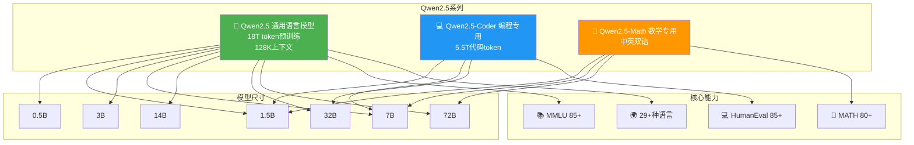

# 🎉 Qwen2.5: A Party of Foundation Models!

> 📊 难度：⭐⭐ | ⏱️ 阅读：12分钟 | 📅 2024年9月 | 🏷️ 基础模型, 开源, 多尺寸, 通义千问

## 📋 原标题 / 中文标题

**原标题**: Qwen2.5: A Party of Foundation Models!
**中文标题**: Qwen2.5：基础模型的盛宴！

## 📝 一句话摘要

Qwen团队发布"可能是史上最大规模的开源模型发布"——Qwen2.5系列，涵盖通用、编程、数学三大家族共十余个尺寸的模型，预训练数据达18万亿token，各项能力全面超越前代。

---

## 🏗️ 模型家族全景

---

## 📖 完整核心内容翻译

### 🎯 发布概览

Qwen2.5被团队自信地称为"可能是史上最大规模的开源发布"，一次性推出三个模型家族、覆盖从5亿到720亿参数的多个尺寸。

### 📦 模型家族

**Qwen2.5（通用语言模型）**
- 尺寸：0.5B、1.5B、3B、7B、14B、32B、72B
- 预训练数据：最多18万亿token
- 上下文长度：128K token，生成能力8K token
- 多语言支持：29+种语言

**Qwen2.5-Coder（编程专用模型）**
- 尺寸：1.5B、7B、32B
- 代码相关训练数据：5.5万亿token

**Qwen2.5-Math（数学专用模型）**
- 尺寸：1.5B、7B、72B
- 支持思维链、程序思维和工具集成推理三种解题方式

### 📊 性能亮点

- **MMLU**（知识）：85+
- **HumanEval**（编程）：85+
- **MATH**（数学）：80+
- Qwen2.5-72B 全面超越 Llama-3.1-70B，甚至能与 Llama-3-405B 抗衡
- Qwen2.5-Math-72B 超越 GPT-4o

### 🔧 关键技术改进

- 长文本生成能力提升至8K token
- 结构化数据理解能力增强
- 可靠的JSON输出生成
- 工具调用支持（vLLM、Ollama、Transformers）

### 📦 开源许可

大部分模型采用Apache 2.0许可证，可在Hugging Face、ModelScope获取。

---

## 🔑 技术要点

1. **18万亿token预训练规模**：相比Qwen2大幅提升，是支撑全面能力提升的数据基础
2. **三大家族差异化定位**：通用、编程、数学三个专用家族体现了"专精优于万能"的模型策略
3. **小模型能力上移**：3B模型展现惊人实力，1.5B数学模型可对标大模型
4. **工具集成推理（TIR）**：Qwen2.5-Math支持在解题过程中调用计算工具
5. **128K长上下文 + 8K生成**：上下文理解和长文本生成的双重提升

---

## 🧠 深度解读

### 🟢 通俗版

Qwen2.5 就像一个"全家桶"——一次性给你提供了从手机能跑的迷你版（0.5B）到需要服务器的旗舰版（72B）的全部选择，还有专门擅长写代码的版本和擅长做数学题的版本。

最厉害的是，即使是最小的数学版本（1.5B参数），做数学题的水平也能和大模型一较高下。就像一个小学生在数学单科上考赢了大学生。

### 🔴 深入版

Qwen2.5的发布是开源大模型竞争白热化阶段的一个标志性事件。

**"专用模型"战略的成熟。** 与其试图让一个模型在所有领域都表现优异，不如针对编程和数学等高价值垂直领域训练专用模型。Qwen2.5-Math-72B超越GPT-4o的数学表现尤其令人印象深刻。

**尺寸覆盖的完整性具有战略意义。** 从0.5B到72B的完整覆盖确保了无论部署环境是手机端还是数据中心，都能找到合适的Qwen模型。这种"全尺寸覆盖"策略直接与Meta的Llama系列竞争。

**18万亿token的数据工程。** 预训练数据的质量和规模是大模型竞争中最难以复制的壁垒之一。

**开源生态的网络效应。** Qwen2.5兼容大量微调、量化和部署框架，说明开源模型的竞争力不仅来自模型本身，更来自围绕它建立的工具链和社区生态。

---

## 💡 延伸思考

1. 专用模型和通用模型的边界在哪里？随着通用模型能力持续提升，专用模型是否终将被替代？
2. 18万亿token的训练数据中，中文数据的比例和质量如何？
3. 模型尺寸从0.5B到72B的密集分布，是否意味着模型选型正在从"选最大的"转向"选最合适的"？

---

## 🔗 原文链接

[Qwen2.5: A Party of Foundation Models!](https://qwenlm.github.io/blog/qwen2.5/)
