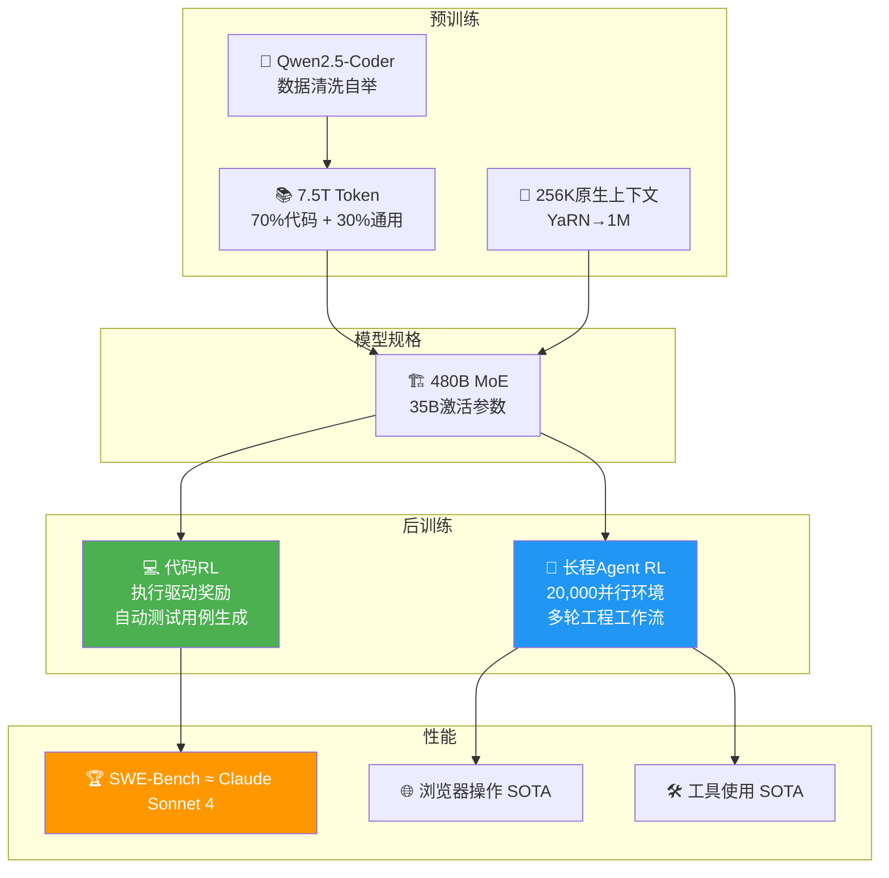

# 💻 Qwen3-Coder: Agentic Coding in the World

> 📊 难度：⭐⭐⭐ | ⏱️ 阅读：12分钟 | 📅 2025年7月 | 🏷️ AI编程, Agent, MoE, 通义千问

## 📋 原标题 / 中文标题

**原标题**: Qwen3-Coder: Agentic Coding in the World
**中文标题**: Qwen3-Coder：面向真实世界的智能体编程模型

## 📝 一句话摘要

阿里Qwen团队推出Qwen3-Coder，采用480B参数MoE架构（35B激活），通过代码强化学习和长程智能体RL训练，在智能体编程、浏览器操作和工具使用上达到开源模型SOTA，性能比肩Claude Sonnet 4。

---

## 🏗️ 训练流程

---

## 📖 完整核心内容翻译

### 🔍 模型概述

Qwen3-Coder旗舰版采用480B参数MoE架构，激活参数仅35B，在三个核心维度达到开源SOTA：
- **智能体编程**：SWE-Bench等真实软件工程任务
- **智能体浏览器操作**：自动操控浏览器完成任务
- **智能体工具使用**：调用各类外部工具

综合性能"与Claude Sonnet 4相当"。

### 📐 技术规格

- **上下文长度**：原生256K，YaRN外推至100万token
- **训练数据**：7.5万亿token，代码数据占比70%

### 🎓 预训练方法

1. **Token规模扩展**：7.5T token，70%代码数据注入
2. **上下文扩展**：针对仓库级代码理解和PR场景优化
3. **数据质量**：使用Qwen2.5-Coder对训练数据进行合成数据清洗和重写

### 🔧 后训练创新

**代码强化学习(Code RL)**：跨多种真实编程任务扩展Code RL，通过自动测试用例生成获取奖励信号。

**长程智能体RL**：基础设施支持**并行运行20,000个独立环境**，模型在训练中直接学习完整的"发现问题→定位代码→实现修复→验证结果"工作流。

### 🔌 开发者工具与集成

**Qwen Code**：基于Gemini Code适配的命令行工具。兼容OpenAI SDK、可集成到Claude Code、支持Cline集成。

---

## 🔑 技术要点

1. **代码RL的天然适配性**：代码任务的可执行性和可测试性使其成为RL的理想训练场
2. **20,000并行环境的长程Agent RL**：将RL从单轮任务扩展到多轮软件工程工作流
3. **70%代码数据的预训练配比**：大比例代码数据注入确保编程领域的深度理解
4. **256K到1M的上下文扩展**：为仓库级代码理解提供必要条件
5. **"以模型改进模型"的数据自举**：使用Qwen2.5-Coder清洗训练数据

---

## 🧠 深度解读

### 🟢 通俗版

传统AI编程工具就像一个只会"接话"的助手——你说一半代码，它帮你补全后一半。Qwen3-Coder更像一个真正的初级程序员：你给它一个Bug报告，它会自己去看代码、找问题在哪里、写修复代码、跑测试确认修好了。

为了训练这种能力，阿里同时开了20,000个编程练习场，让模型反复练习"从发现问题到解决问题"的完整流程。

### 🔴 深入版

Qwen3-Coder的发布标志着"AI编程"正在从"代码补全"升级为"软件工程"。

**从代码补全到Agent工程师。** 早期的AI编程工具主要做代码补全和建议。Qwen3-Coder瞄准的是让AI像初级软件工程师一样工作。

**长程Agent RL是核心技术差异化。** 20,000个并行环境进行长程Agent RL，让模型在训练阶段就学会了多步骤、多轮次的工程决策——这需要强大的基础设施支撑，正是阿里云的优势。

**"比肩Claude Sonnet 4"的含义。** 如果属实，意味着开源模型在软件开发这一高价值场景上正在追平闭源模型。

**可集成Claude Code是务实的生态策略。** 不是非此即彼，而是让用户在现有工作流中无缝使用Qwen模型。

---

## 💡 延伸思考

1. 当AI编程模型能处理SWE-Bench级别的任务时，初级软件工程师的角色将如何演变？
2. 长程Agent RL的训练成本极高（20,000并行环境），开源社区如何跟进？
3. 百万token上下文对代码理解确实重要，但模型是否存在"迷失在中间"的问题？

---

## 🔗 原文链接

[Qwen3-Coder: Agentic Coding in the World](https://qwenlm.github.io/blog/qwen3-coder/)
