# ⚙️ GSPO: Towards Scalable Reinforcement Learning for Language Models

> 📊 难度：⭐⭐⭐ | ⏱️ 阅读：10分钟 | 📅 2025年 | 🏷️ RL算法, MoE训练, 策略优化, 通义千问

## 📋 原标题 / 中文标题

**原标题**: GSPO: Towards Scalable Reinforcement Learning for Language Models
**中文标题**: GSPO：迈向可扩展的语言模型强化学习

## 📝 一句话摘要

Qwen研究团队提出组序列策略优化(GSPO)算法，通过序列级别的裁剪、奖励和优化，解决了GRPO在MoE模型训练中的不稳定性问题，在Qwen3-30B上展现了显著优于GRPO的训练效率和可扩展性。

---

## 🏗️ GSPO vs GRPO 对比

```mermaid
graph LR
    subgraph GRPO 问题
        GT[📝 Token级优化]
        GI[❌ MoE训练不稳定]
        GR[🔧 需要Routing Replay补丁]
        GV[📉 长短序列数值范围差异大]
    end

    subgraph GSPO 解决方案
        ST[📋 序列级优化]
        SN[📐 长度归一化<br/>s = &#40;π/π_old&#41;^&#40;1/&#124;y&#124;&#41;]
        SS[✅ MoE内在稳定]
        SP[📈 更好的Scaling特性]
        SF[🏗️ 基础设施友好<br/>容忍精度差异]
    end

    GT -->|升级为| ST
    GI -->|解决| SS
    GR -->|无需| SS
    GV -->|通过| SN

    style GT fill:#f44336,color:white
    style GI fill:#f44336,color:white
    style ST fill:#4CAF50,color:white
    style SS fill:#4CAF50,color:white
```

---

## 📖 完整核心内容翻译

### 🔍 研究背景

随着强化学习在大语言模型后训练中的地位日益重要，训练的稳定性和可扩展性成为了关键瓶颈。GRPO在MoE模型上面临严重的稳定性挑战，GSPO正是为解决这些问题而提出的。

### 🧩 核心算法

GSPO的核心创新在于将优化粒度从token级别提升到序列级别，使用基于序列似然度的重要性比率，通过长度归一化将所有序列的数值范围统一。

### 📊 相比GRPO的核心优势

1. **训练效率显著提升**：展现出更好的scaling特性
2. **MoE模型训练的内在稳定性**：无需Routing Replay等额外补丁
3. **基础设施友好**：对精度差异更具容忍性

### 📈 实验结果

在Qwen3-30B上，GSPO在AIME'24、LiveCodeBench、CodeForces等基准上持续优于GRPO，裁剪率比GRPO高两个数量级。

---

## 🔑 技术要点

1. **序列级vs.Token级优化**：核心思想转变，通过长度归一化解决数值范围不一致问题
2. **MoE训练稳定性**：内在解决了GRPO需要补丁才能缓解的MoE训练不稳定问题
3. **更好的Scaling特性**：允许通过增加计算、数据和生成长度来持续获得提升
4. **高裁剪率的正面效果**：打破了"低裁剪率=好训练"的传统认知
5. **基础设施简化**：对精度差异的容忍性降低了大规模训练的工程复杂度

---

## 🧠 深度解读

### 🟢 通俗版

想象你在给学生的作文打分。GRPO 是逐字打分（"这个字用得好"+"那个标点不对"），结果长作文和短作文的分数差距巨大，评分系统很不稳定。GSPO 换了个思路——给整篇作文打一个综合分，然后按字数做平均，这样长文和短文的评分标准就统一了，打分过程也稳定了。

### 🔴 深入版

GSPO虽然看似是一篇算法改进的技术论文，但折射出Qwen团队在RL训练方面的深度积累。

**从实践中来的算法创新。** GSPO是在训练Qwen3时实际遇到GRPO的稳定性瓶颈后的解决方案。

**MoE模型的RL训练是被低估的难题。** 大多数RL研究使用稠密模型实验，但工业界前沿模型越来越多采用MoE架构。GSPO对这一问题的"内在解决"具有重要实用价值。

**序列级别思考的哲学意义。** 强化学习的奖励本质上是对"整个回答"的评价，序列级别的优化更符合RL的本质逻辑。

**GSPO是Qwen3训练的"内功"。** 理解GSPO有助于理解为什么Qwen3在RL后训练阶段能够稳定高效地训练。

---

## 💡 延伸思考

1. GSPO的序列级优化是否可以进一步推广到"轮次级"优化，用于多轮对话和Agent交互场景？
2. "高裁剪率反而更好"是否挑战了PPO/GRPO系列算法中关于裁剪率的传统理解？
3. 随着更多团队转向MoE架构，GSPO是否会取代GRPO成为新的标准RL算法？

---

## 🔗 原文链接

[GSPO: Towards Scalable Reinforcement Learning for Language Models](https://qwenlm.github.io/blog/gspo/)
