# 👁️ Qwen2.5-VL: To See the World More Clearly

> 📊 难度：⭐⭐⭐ | ⏱️ 阅读：14分钟 | 📅 2025年1月 | 🏷️ 视觉语言, 动态分辨率, GUI Agent, 通义千问

**原标题:** Qwen2.5 VL! Qwen2.5 VL! Qwen2.5 VL!
**中文标题:** Qwen2.5-VL：更清晰地看见世界——新一代视觉语言旗舰模型

## 📝 一句话摘要

Qwen 团队于 2025 年 1 月发布 Qwen2.5-VL 视觉语言模型系列（3B/7B/72B），首次引入从零训练的原生动态分辨率视觉 Transformer（ViT）和窗口注意力机制，在文档理解、视觉 Agent、长视频理解等多项任务上达到或超越 GPT-4o 和 Claude 3.5 Sonnet。

---

## 🏗️ 技术架构

```mermaid
graph TB
    subgraph 输入处理
        IMG[🖼️ 任意分辨率图像]
        VID[🎬 动态帧率视频]
    end

    subgraph 视觉编码器
        VIT[👁️ 原生动态分辨率 ViT<br/>从零训练<br/>无需固定分辨率]
        WA[🪟 窗口注意力<br/>O&#40;n·w&#41;复杂度]
        DFS[⏱️ 动态帧率采样]
        ATE[📐 绝对时间编码<br/>MRoPE升级]
    end

    subgraph 语言模型
        LLM[🧠 Qwen2.5 LLM骨干<br/>保持语言能力]
    end

    subgraph 六大能力
        C1[🔍 视觉识别]
        C2[🤖 视觉Agent<br/>Computer Use + Phone Use]
        C3[🎬 长视频理解<br/>1小时+事件定位]
        C4[📍 空间定位<br/>JSON坐标输出]
        C5[📄 文档智能<br/>发票/表格/表单]
        C6[🌍 多语言OCR]
    end

    IMG --> VIT
    VID --> DFS --> VIT
    VIT --> WA
    WA --> LLM
    ATE --> VIT
    LLM --> C1
    LLM --> C2
    LLM --> C3
    LLM --> C4
    LLM --> C5
    LLM --> C6

    style VIT fill:#4CAF50,color:white
    style WA fill:#2196F3,color:white
    style C2 fill:#FF9800,color:white
```

---

## 📖 核心内容

### 📦 模型概览

- **Qwen2.5-VL-72B**：旗舰版，对标 GPT-4o 和 Claude 3.5 Sonnet
- **Qwen2.5-VL-7B**：多项任务超越 GPT-4o-mini
- **Qwen2.5-VL-3B**：边缘部署版本，性能超越前代 7B 模型

### 🎯 六大核心能力

1. **视觉识别**：识别动植物、建筑地标、影视角色到商业产品
2. **视觉 Agent**：Computer Use 和 Phone Use 两种 Agent 模式
3. **长视频理解**：超过 1 小时视频 + 事件定位
4. **空间定位**：边界框/坐标点，JSON 结构化输出
5. **文档智能**：发票、表格和表单处理
6. **多语言 OCR**：中英日等多语言混合文档

### 🔧 技术架构创新

**原生动态分辨率 ViT**：从零训练，不再依赖固定分辨率的预训练视觉编码器。

**窗口注意力**：将计算复杂度从 O(n^2) 降至 O(n*w)，使高分辨率图像处理成为可能。

**动态帧率采样 + 绝对时间编码**：将图像和视频在同一框架下统一处理。

### 📊 基准测试

72B 版本关键指标：MMMU 70.2、DocVQA 96.4、VideoMME 73.3/79.1。

---

## 🔑 技术要点

1. **原生动态分辨率 ViT**：摆脱固定分辨率范式，实现真正的"像素级理解"
2. **窗口注意力优化**：保持原生分辨率的前提下大幅降低计算复杂度
3. **时空统一建模**：图像和视频在同一框架下统一处理
4. **语言能力保持**：大幅提升视觉能力的同时保持核心语言能力
5. **实际坐标系统**：使用实际图像坐标而非归一化值

---

## 🧠 深度解读

### 🟢 通俗版

传统的视觉AI模型就像一个"近视眼"——不管你给它多清晰的图片，它都会先缩小到固定尺寸再看，细节全丢了。Qwen2.5-VL装上了一副"自适应眼镜"，能以原始清晰度看任何尺寸的图片。

更酷的是，它不仅能看，还能动手——它可以操控你的电脑和手机，像一个真正的助手一样帮你完成屏幕上的操作。

### 🔴 深入版

Qwen2.5-VL 代表了视觉语言模型从"看图说话"到"理解并行动"的关键跃迁。

**从感知到行动的闭环**：Computer Use 和 Phone Use 能力意味着模型不仅能理解屏幕内容，还能执行操作——与 Anthropic 的 Claude Computer Use 形成正面竞争。

**动态分辨率的深远意义**：传统 VLM 将所有图像 resize 到固定分辨率（如 336x336），导致小字、复杂图表的信息丢失。Qwen2.5-VL 从根本上解决了这一问题。

**3B 模型超越前代 7B 的启示**：视觉编码器架构的改进带来的收益，甚至可以弥补模型参数量的差距。

---

## 💡 延伸思考

1. **视觉 Agent 的安全边界在哪里？** 当模型可以操作计算机和手机时，如何防止误操作或恶意利用？
2. **动态分辨率训练的成本**：从零训练动态分辨率 ViT 需要大量高质量、多分辨率的图像数据
3. **开源 VLM 的生态竞争**：谁能率先在真实应用场景中证明价值，谁就能赢得开发者社区

---

## 🔗 原文链接
- Qwen 官方博客: https://qwenlm.github.io/blog/qwen2.5-vl/
- 技术报告 (arXiv): https://arxiv.org/abs/2502.13923
- Hugging Face: https://huggingface.co/collections/Qwen/qwen25-vl
