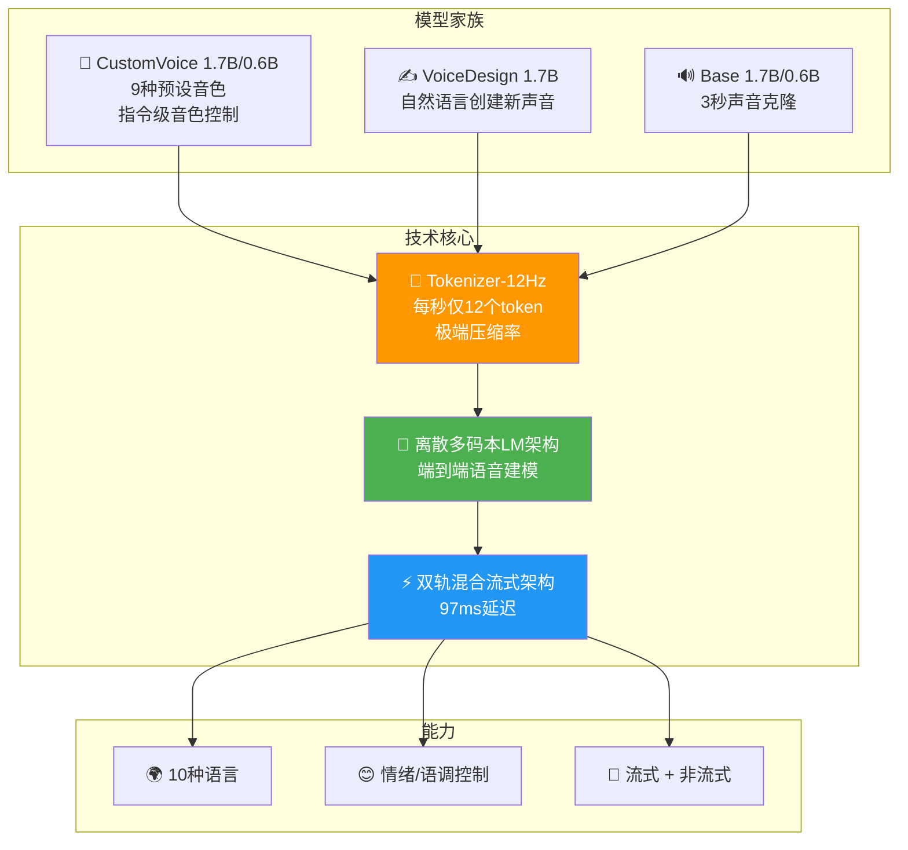

# 🎙️ Qwen3-TTS Family: Voice Design, Clone, and Generation

> 📊 难度：⭐⭐⭐ | ⏱️ 阅读：12分钟 | 📅 2026年1月 | 🏷️ 语音合成, 声音克隆, TTS, 通义千问

**原标题:** Qwen3-TTS Family is Now Open Sourced: Voice Design, Clone, and Generation
**中文标题:** Qwen3-TTS 系列开源：声音设计、声音克隆与高质量语音生成

## 📝 一句话摘要

Qwen 团队于 2026 年 1 月开源 Qwen3-TTS 系列语音合成模型（0.6B/1.7B），基于自研 Qwen3-TTS-Tokenizer-12Hz 离散多码本架构，支持 3 秒快速声音克隆、自然语言声音设计和 10 种语言的流式语音生成，端到端合成延迟低至 97 毫秒。

---

## 🏗️ 产品矩阵与技术架构

---

## 📖 核心内容

### 📦 产品矩阵

| 模型 | 参数量 | 核心能力 |
|------|--------|---------|
| CustomVoice (1.7B/0.6B) | 17亿/6亿 | 9 种预设音色 + 指令级控制 |
| VoiceDesign (1.7B) | 17亿 | 基于自然语言描述设计新声音 |
| Base (1.7B/0.6B) | 17亿/6亿 | 3 秒快速声音克隆 |

### 🎯 三大核心能力

**1. 声音克隆**：只需 3 秒参考音频即可提取说话人特征。

**2. 声音设计**：接受自然语言描述创建全新声音。例如"一位温柔的年轻女性，语速稍慢，带有轻微的南方口音"。

**3. 可控语音生成**：9 种音色 + 指令控制情绪、语调和韵律。

### 🔧 技术架构

**12Hz 语音 Tokenizer**：每秒仅 12 个 Token 表示语音，极端压缩率下保留副语言信息。

**离散多码本 LM 架构**：单一模型完成文本到语音的端到端生成。

**双轨混合流式架构**：端到端合成延迟低至 97 毫秒。

### 🌍 语言支持

覆盖 10 种主要语言：中文、英文、日文、韩文、德文、法文、俄文、葡萄牙文、西班牙文和意大利文。

---

## 🔑 技术要点

1. **12Hz 语音 Tokenizer**：每秒仅 12 个 Token，在极端压缩率下保留副语言信息
2. **离散多码本 LM 架构**：端到端生成，避免两阶段方案的信息瓶颈
3. **97ms 端到端延迟**：满足实时对话场景需求
4. **3 秒声音克隆**：极少样本即可提取说话人特征
5. **自然语言声音设计**：首次实现通过文本描述创建全新声音

---

## 🧠 深度解读

### 🟢 通俗版

传统的语音合成就像用模板画画——只有几种固定的声音可选。Qwen3-TTS 开了三个新功能：
1. 听你 3 秒说话就能模仿你的声音（声音克隆）
2. 你用文字描述想要什么样的声音，它就能创造出来（声音设计）
3. 可以控制情绪和语气，同一句话可以说得开心或悲伤（可控生成）

而且说话延迟只有 97 毫秒，几乎感觉不到等待。

### 🔴 深入版

Qwen3-TTS 的发布标志着开源 TTS 领域从"能说话"到"说得像、说得好、说得快"的质变。

**12Hz 的技术赌注**：传统语音编解码器通常以 50-75Hz 操作，Qwen3-TTS 压缩到 12Hz——每秒少了 4-6 倍的 Token 数量。这直接降低了推理延迟和计算成本，但要求 Tokenizer 在极低信息量下保留足够的语音细节。

**声音设计是杀手级功能**：在此之前，创建新的 TTS 音色需要专业录音棚和长时间数据采集。VoiceDesign 将这一过程简化为一句自然语言描述。

**开源生态的战略价值**：在 ElevenLabs、Play.ht 等闭源 TTS 服务主导市场的背景下，Qwen3-TTS 的开源意味着开发者可以本地部署高质量 TTS。

---

## 💡 延伸思考

1. **声音克隆的伦理边界**：3 秒即可克隆声音，如何防止被用于诈骗和深度伪造？
2. **12Hz 的下限在哪里？** 是否可以进一步压缩到 6Hz？
3. **TTS 与 ASR 的闭环**：Qwen3-TTS + Qwen3-ASR 是否会催生"语音原生"的 AI Agent？

---

## 🔗 原文链接
- Qwen 官方博客: https://qwen.ai/blog?id=qwen3tts-0115
- GitHub 仓库: https://github.com/QwenLM/Qwen3-TTS
- Hugging Face Demo: https://huggingface.co/spaces/Qwen/Qwen3-TTS
