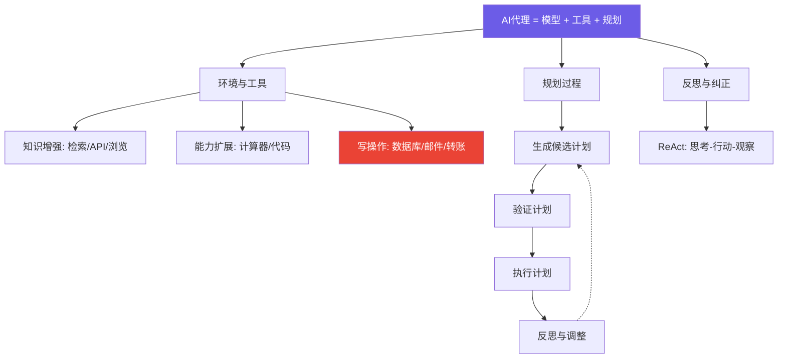

# Agents / AI代理全面指南：从定义到评估的系统性思考

> 📊 难度：⭐⭐⭐ | ⏱️ 阅读：18分钟 | 📅 2025年1月7日 | 🏷️ AI代理, 工具调用, 规划, 评估体系

> **原标题**: Agents
> **作者**: Chip Huyen
> **发布日期**: 2025年1月7日
> **原文链接**: https://huyenchip.com/2025/01/07/agents.html

## 📝 一句话摘要

在AI代理概念尚缺乏统一理论框架的早期阶段，本文系统性地梳理了代理的核心定义（感知 + 行动）、关键组件（环境、工具、规划）、规划方法论（函数调用、控制流、反思），以及评估体系（有效性、准确性、效率），为从业者提供了急需的结构化认知地图。

---

## 🔍 核心内容翻译

### 什么是AI代理？

Huyen 从最基础的定义出发：代理是**"任何能感知其环境并对环境采取行动的事物"**。在AI系统中，代理是将基础模型与工具结合起来，自主完成复杂任务的系统。

这个定义看似简单，但它精准地抓住了代理与普通聊天机器人的本质区别：**代理不仅能"思考"（生成文本），还能"行动"（调用工具改变环境状态）**。

### 核心组件

#### 环境与工具

代理在特定的环境中运行（互联网、计算机系统、游戏世界），其能力边界由可用的工具集定义。工具可分为三类：

- **知识增强工具**：检索器、API、网页浏览——扩展代理的信息获取能力
- **能力扩展工具**：计算器、代码解释器、翻译器——赋予代理新的处理能力
- **写操作工具**：数据库更新、邮件发送、资金转账——让代理能改变外部世界的状态

Huyen 特别强调：**代理的成功不仅取决于模型能力，同样取决于工具集的设计**。不同的模型对工具有不同的偏好——GPT-4倾向于使用更广泛的工具集，而ChatGPT则表现出更窄的偏好。工具选择需要实验验证，没有通用规则。

#### 规划过程

有效的代理将**规划与执行分离**：

1. **生成候选计划**：为任务完成生成多个可能的行动序列
2. **验证计划**：使用启发式规则或AI评判器评估计划的可行性
3. **执行计划**：只执行通过验证的计划
4. **反思与调整**：分析执行结果，根据需要调整策略

文章坦诚地指出，自回归模型的规划能力仍存在争议。但证据表明，在提供合适的结构和工具描述时，模型能够生成连贯的计划。

### 规划方法论

#### 函数调用（Function Calling）

模型从预定义的工具清单中自动选择合适的工具和参数。这是目前最主流的代理交互方式，但存在一个关键风险：**参数可能被幻觉**——模型可能生成看似合理但实际上不存在或不正确的参数值。

#### 控制流模式

代理的执行计划可以采用不同的控制流结构：
- **顺序执行**：步骤一个接一个执行
- **并行执行**：多个独立步骤同时执行
- **条件分支**（if语句）：根据条件选择不同路径
- **循环迭代**（loop）：重复执行直到满足条件

复杂度从顺序到循环递增，生成和执行的难度也相应增加。

#### 粒度控制

计划可以从高度具体的函数调用到抽象的自然语言描述，需要在**精确性和灵活性之间取得平衡**。过于具体的计划缺乏适应性，过于抽象的计划则难以可靠执行。

### 反思与错误纠正

基于 ReAct（Reasoning + Acting）和 Reflexion 等框架，代理可以交替进行推理和行动：

1. 解释当前的思考过程
2. 执行一个具体步骤
3. 观察和分析执行结果
4. 决定下一步行动或调整策略
5. 重复直到任务完成

这种"思考-行动-观察"的循环使代理能够从错误中学习并自我纠正。

### 失败模式分析

Huyen 系统地分类了代理可能遇到的失败：

#### 规划失败
- **工具选择错误**：选择了不适当的工具
- **参数错误**：工具选对了但参数不对
- **参数值错误**：参数名对了但值错误
- **目标达成失败**：所有步骤都执行了但没有达成最终目标
- **反思错误**：错误地判断任务已完成（虚假完成）

#### 工具失败
工具本身输出了错误的结果，与代理的推理质量无关。

#### 效率问题
步骤过多、成本过高、耗时过长——即使最终达成了目标，效率不足也是严重的实际问题。

### 评估体系

评估代理需要追踪以下指标：
- **有效计划生成率**：代理能否生成合法的行动计划
- **工具调用准确率**：工具选择和参数设置是否正确
- **目标达成率**：最终是否完成了用户的任务
- **每任务成本**：完成任务的总API调用和token消耗
- **时间效率**：完成任务所需的墙钟时间

---

## 🔬 技术要点

1. **代理 = 模型 + 工具 + 规划**：代理不是一个新的模型架构，而是一种将LLM与外部工具和规划逻辑组合的系统设计模式。

2. **规划与执行分离原则**：先生成计划、验证计划、再执行计划的三步模式，显著降低了代理犯错的概率和错误的影响范围。

3. **函数调用中的幻觉风险**：即使模型正确选择了工具，参数值仍可能被幻觉。这是代理可靠性的核心挑战之一。

4. **反思循环的价值与成本**：ReAct/Reflexion 风格的反思循环提升了成功率，但增加了延迟和成本。需要根据任务的容错要求权衡。

5. **多维度评估的必要性**：仅看"任务是否完成"远远不够。成本、时间、步骤数等效率指标在生产环境中同样关键。

---

## 🧠 深度解读

### 🟢 通俗版

Chip Huyen 这篇文章的独特价值在于其**系统性和结构化**。在AI代理概念炒作盛行的当下，大多数讨论要么过于技术化（聚焦于某个特定框架），要么过于概念化（停留在"代理将改变一切"的愿景层面）。Huyen 在两者之间找到了完美的平衡点。

### 🔴 深入版

几个特别值得关注的深层洞见：

**工具定义代理边界**。Huyen 明确指出代理的能力由其工具集定义，而非由底层模型定义。这意味着**设计正确的工具集可能比选择更强大的模型更重要**。这与软件工程中"API设计定义系统能力"的原则一脉相承。

**"缺乏理论框架"的诚实承认**。在一个充斥着过度承诺的领域，Huyen 坦率地指出AI代理"是一个缺乏既定理论框架的新兴领域"。这种诚实比任何技术分析都更有价值，因为它提醒从业者：当前的最佳实践仍在快速演化，今天的"正确做法"明天可能被推翻。

**失败模式的系统分类**。将代理的失败分为规划失败、工具失败和效率问题三个层面，为代理的调试和优化提供了清晰的分析框架。这种"先分类再解决"的工程思维，远比"端到端优化"的模糊方法更实用。

---

## 💡 延伸思考

1. **代理安全的深层挑战**：写操作工具（数据库更新、资金转账）使代理的错误可能产生不可逆的后果。如何设计"可撤销"的代理行动机制？

2. **人机协作的最佳比例**：完全自主的代理和完全人工控制之间，存在一个巨大的中间地带。对于不同类型的任务，人类应该在何时介入？

3. **代理的组合与嵌套**：当多个代理需要协作完成复杂任务时（多代理系统），通信协议、冲突解决和全局协调成为新的挑战。

4. **评估基准的标准化**：当前代理评估缺乏统一标准，不同论文使用不同的基准测试，导致横向比较困难。行业是否需要一个类似GLUE/SuperGLUE的代理评估标准？

---

*翻译整理日期：2026年3月21日*
