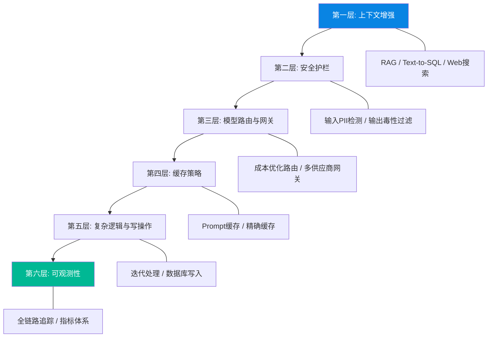

# Building A Generative AI Platform / 构建生成式AI平台：从概念到生产的完整架构指南

> 📊 难度：⭐⭐⭐⭐ | ⏱️ 阅读：20分钟 | 📅 2024年7月25日 | 🏷️ GenAI平台, RAG, 护栏, 可观测性

> **原标题**: Building A Generative AI Platform
> **作者**: Chip Huyen
> **发布日期**: 2024年7月25日
> **原文链接**: https://huyenchip.com/2024/07/25/genai-platform.html

## 📝 一句话摘要

一份从零到一构建生产级生成式AI平台的完整架构指南，涵盖RAG检索增强、安全护栏、模型路由与网关、缓存策略、复杂逻辑编排以及可观测性六大核心层，强调渐进式架构演进和"在每个阶段都进行评估"的工程哲学。

---

## 🔍 核心内容翻译

### 架构演进：从简单到复杂

Chip Huyen 提出了一个关键的架构理念：**生成式AI平台应该渐进式发展**，从最简单的"查询-响应"模型开始，只在确实需要时才添加新的组件层。她将完整的平台架构分解为以下几个逐步叠加的层次。

### 第一层：增强上下文（Context Enhancement）

#### RAG（检索增强生成）

这是最核心的架构模式。通过在将用户查询发送给LLM之前，先检索相关的外部信息来增强提示词。RAG 有两种主要的检索方式：

- **基于词项的检索**：使用 BM25、Elasticsearch 等关键词搜索算法。Huyen 特别指出："基于词项的检索比基于嵌入的检索快得多，也便宜得多"，推荐将两者结合使用。
- **基于嵌入的检索**：使用 BERT 等模型生成向量表示，通过向量相似度进行语义搜索。

#### 其他数据源集成
- **Text-to-SQL**：将自然语言转换为SQL查询，访问结构化数据
- **Web搜索集成**：获取实时信息
- **Agentic RAG**：让模型自主决定是否需要检索以及检索什么

#### 查询重写

将模糊的、带上下文依赖的用户查询重新表述为更精确的检索查询。这在多轮对话中尤其重要——用户的后续问题可能包含代词和省略，需要结合对话历史进行重构。

### 第二层：安全护栏（Guardrails）

#### 输入护栏
- **PII检测和脱敏**：在将数据发送给外部API之前，自动检测并遮蔽个人身份信息
- **提示注入防护**：过滤可能试图操纵模型行为的恶意输入
- **异常检测**：识别异常的输入模式

#### 输出护栏
对模型输出进行多维度质量监控：
- 空响应或格式错误的响应
- 有毒或有害内容
- 事实性幻觉和矛盾
- 敏感信息泄露
- 品牌风险言论
- 总体质量低下

失败处理策略包括：重试逻辑、并行请求、人工升级。

### 第三层：模型路由与网关

#### 路由器
意图分类器决定不同类型的查询应该如何处理：
- **成本优化**：将简单查询路由到更便宜的模型
- **领域专精**：将专业问题路由到针对特定领域微调的模型
- **越界检测**：识别并拒绝超出系统设计范围的查询

#### 网关
提供统一的API接口，实现：
- 集中式的访问控制和成本管理
- API故障或速率限制时的降级策略
- 负载均衡和使用分析
- 多供应商支持（OpenAI、Google、自托管等）

### 第四层：缓存策略

#### Prompt缓存
存储可重用的文本片段（尤其是系统提示词），避免重复处理。Huyen 指出，"缓存的输入token相比常规输入token可享受75%的折扣"。

#### 精确缓存
对完全相同的查询返回缓存结果。适用于向量搜索等计算密集型操作。

#### 语义缓存
对语义相似（但不完全相同）的查询复用响应。但 Huyen 明确警告："语义缓存的价值更加存疑，因为它的许多组件都容易出错"——阈值设置过于宽松会导致错误的缓存命中，过于严格则失去缓存的意义。

### 第五层：复杂逻辑与写操作

#### 迭代处理
模型可以生成中间输出，将其作为新的输入反馈给自身进行迭代优化。这使得多步骤规划和任务分解成为可能。

#### 写操作
从只读检索扩展到数据库更新、API调用等"改变世界"的操作。这极大增强了系统能力，但同时引入了严重的安全和安全性问题，需要严格的访问控制。

### 第六层：可观测性（Observability）

#### 指标体系
- **系统指标**：吞吐量、内存、硬件利用率、可用性
- **模型指标**：准确率、毒性、幻觉率
- **检索指标**：上下文相关性和精确度
- **延迟指标**：首个token时间、每秒token数
- **成本追踪**：按查询量和token用量计费

#### 日志哲学
Huyen 的核心原则：**"记录一切"**。包括系统配置、查询、输出、组件状态变化，并使用标签进行全链路追踪。

#### 全链路追踪
详细记录请求执行路径：数据转换、检索的文档、采取的操作，以及每个步骤的时间和成本。

### 流水线编排

对于何时引入编排工具（如LangChain），Huyen 给出了务实的建议：**先不用编排框架**，等应用确实变得复杂到难以手工管理时再引入。避免过早增加不必要的抽象层。

---

## 🔬 技术要点

1. **混合检索策略**：将传统的基于词项的检索与语义向量检索结合，取两者之长——关键词检索的速度和可靠性 + 语义检索的灵活性。

2. **双层护栏设计**：输入侧防御（PII脱敏、注入检测）+ 输出侧监控（幻觉检测、毒性过滤）构成完整的安全闭环。

3. **语义缓存的陷阱**：看似优雅的语义缓存在实践中问题重重——相似度阈值是一个脆弱的超参数，误判的代价远高于缓存未命中的成本。

4. **渐进式架构演进**：从最简架构开始，只在实际需求驱动下添加新层。过度设计是生成式AI项目失败的常见原因。

5. **可观测性前置**：监控和日志不是事后补救，而应该从第一天就集成到系统中。"记录一切"是调试和优化生成式AI系统的基础。

---

## 🧠 深度解读

### 🟢 通俗版

Chip Huyen 这篇文章的最大价值在于**弥合了学术研究与工程实践之间的鸿沟**。大多数关于RAG和AI应用的教程停留在"让它跑起来"的层面，而 Huyen 讨论的是"让它在生产环境中可靠运行"所需要的完整基础设施。

### 🔴 深入版

几个值得特别关注的洞见：

**上下文工程 ≈ 特征工程**。Huyen 明确类比了生成式AI中的上下文构建与经典机器学习中的特征工程。这个类比非常深刻——就像特征工程往往比模型选择更重要一样，如何构建送入LLM的上下文，往往比选择哪个LLM更关键。

**对编排框架的谨慎态度**。在LangChain等工具风靡的当下，Huyen 建议"先不用编排框架"。这反映了资深工程师的共识：抽象层有成本，过早引入框架可能隐藏关键细节，增加调试难度。

**安全性随能力增长**。当系统从只读查询扩展到写操作（修改数据库、发送邮件），安全风险呈指数级增长。这呼应了 Simon Willison 的"致命三要素"概念。

---

## 💡 延伸思考

1. **评估是最大的痛点**：Huyen 反复强调"在每个阶段都进行评估"，但生成式AI的评估本身就是一个未解决的难题。如何建立可靠的自动化评估流水线，是行业的核心挑战。

2. **成本优化的复杂性**：模型路由、缓存、批处理等策略都涉及成本-质量-延迟的三角权衡。没有通用的最优解，需要根据具体业务场景调优。

3. **多模型时代的运维挑战**：当系统同时使用多个AI模型（路由、嵌入、主模型、评估模型）时，版本管理、一致性保证和故障排查的复杂度急剧上升。

4. **开源 vs 商业API的选择**：Huyen 的架构天然支持多供应商，但自托管模型与商业API在延迟、成本、隐私和可控性上的权衡仍需要更深入的分析。

---

*翻译整理日期：2026年3月21日*
