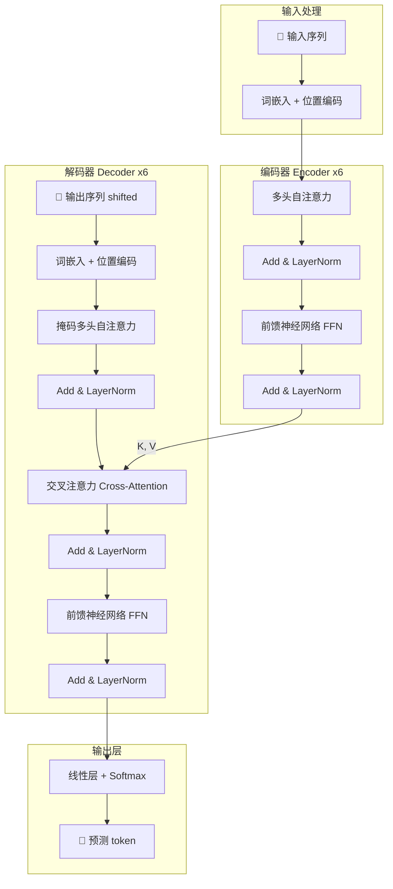
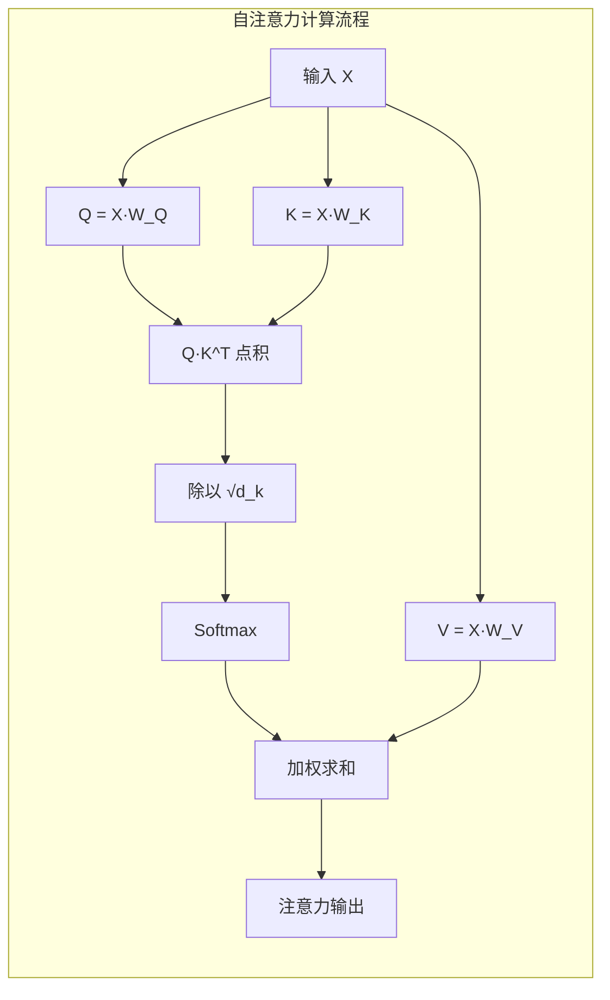
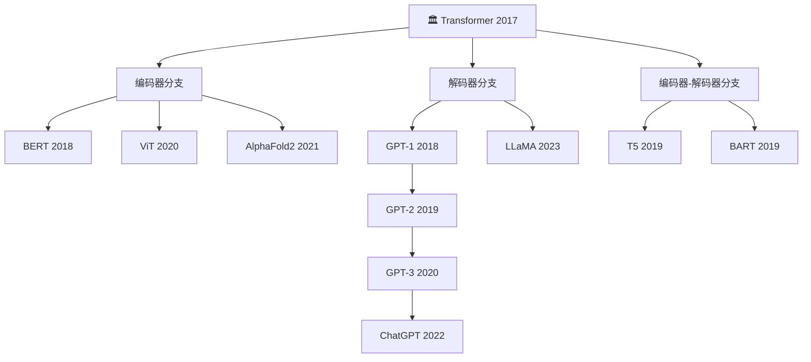

# Attention Is All You Need — Transformer 架构全面解读

> 🏷️ `难度：⭐⭐⭐` | `阅读时间：15 分钟` | `日期：2026-03-21` | `标签：#Transformer #注意力机制 #架构革命 #NLP基石`

**原标题**: Attention Is All You Need
**中文标题**: 注意力就是你所需要的一切 —— Transformer 革命性架构深度解析
**原始论文**: Vaswani et al., Google Brain, 2017 (NeurIPS)

---

## 📌 一句话摘要

> Transformer 架构完全摒弃了循环神经网络（RNN）和卷积神经网络（CNN），仅凭注意力机制就在机器翻译任务上取得了当时最优成绩，同时大幅提升了训练并行化能力，奠定了 GPT、BERT 等所有现代大语言模型的技术基石。

---

## 🗺️ 一图看懂 Transformer



---

## 🟢 通俗版：给所有人看的解释

### 💡 核心思想

想象你在读一句话："小猫**坐**在垫子上，因为**它**很累了。" 你的大脑会自动把"它"和"小猫"联系起来，而不是和"垫子"联系。这就是**注意力机制**的本质——让模型能够"注意"到句子中最相关的部分。

在 Transformer 之前，AI 处理语言就像**逐字读书**——必须从头读到尾，一个字一个字地处理（这就是 RNN）。Transformer 的突破在于：**一次性看到整句话**，然后让每个词自己去找最相关的其他词。

### 🎯 三个关键比喻

| 概念 | 比喻 | 说明 |
|------|------|------|
| 🔑 自注意力 | 课堂上每个学生都能同时问所有人问题 | 不再是一对一的传话游戏 |
| 🧠 多头注意力 | 8 双眼睛同时看一幅画 | 有人看颜色、有人看构图、有人看细节 |
| 📍 位置编码 | 给每个学生编号 | 虽然同时发言，但知道谁在谁前面 |

### 🏆 成果有多厉害？

- 🚀 翻译质量超越所有前辈（包括"组团"参赛的集成模型）
- ⏱️ 8 块 GPU 训练 3.5 天，RNN 同样效果需要数周
- 🌍 后来催生了 GPT、BERT、ChatGPT 等一切现代 AI

---

## 🔴 深入版：技术细节全解析

### 1. ❓ 为什么需要 Transformer？

在 Transformer 出现之前，序列建模的主流方案是 RNN（循环神经网络）及其变体 LSTM、GRU。这些模型存在两个根本性问题：

- **顺序处理**：RNN 必须按时间步逐个处理输入，无法并行化，训练速度极慢。
- **长距离依赖困难**：尽管 LSTM 缓解了梯度消失问题，但对于极长序列中的远距离依赖关系，仍然力不从心。

Transformer 的核心洞察是：**完全可以用注意力机制取代循环结构**，让模型在一次操作中同时"看到"序列的所有位置，既解决了并行化问题，也天然地捕获了长距离依赖。

#### 🆚 架构对比

| 特性 | RNN / LSTM | Transformer |
|------|-----------|-------------|
| 处理方式 | 逐步顺序 | 全序列并行 |
| 长距离依赖 | 信号逐步衰减 | 直接连接任意两点 |
| 训练并行化 | ❌ 无法并行 | ✅ 完全并行 |
| 计算复杂度 | O(n) 步骤但不可并行 | O(1) 步骤但 O(n²) 注意力 |
| 训练速度 | 数周 | 数天 |

### 2. 🔧 核心组件详解

#### 2.1 自注意力机制（Self-Attention）

自注意力是 Transformer 的灵魂。它允许序列中的每个位置同时关注序列中的所有其他位置，计算彼此之间的相关性。

每个输入 token 的嵌入向量会被线性变换为三个向量：

- **🔍 查询（Query, Q）**：代表"我在寻找什么信息"
- **🔑 键（Key, K）**：代表"我能提供什么信息"
- **📦 值（Value, V）**：代表"我实际携带的信息内容"

注意力分数通过 Q 和 K 的点积计算，再经过 softmax 归一化后，作为权重对 V 进行加权求和。



#### 2.2 缩放点积注意力（Scaled Dot-Product Attention）

注意力的核心公式：

```
Attention(Q, K, V) = softmax(QK^T / √d_k) · V
```

其中 `d_k` 是键向量的维度。**缩放因子 `√d_k`** 至关重要 —— 当维度较高时，点积的数值会变得很大，导致 softmax 梯度趋近于零。除以 `√d_k` 可以防止这种梯度消失现象。

论文选择点积注意力而非加性注意力，理由是：**点积注意力在实践中更快、更节省内存**，因为可以利用高度优化的矩阵乘法实现。

#### 2.3 多头注意力（Multi-Head Attention）

单个注意力头只能学习一种关注模式。多头注意力让模型**并行运行 h 个独立的注意力头**（论文中 h=8），每个头在不同的表示子空间中操作，可以同时关注不同类型的关系（如语法关系、语义关系、位置关系等）。

所有头的输出拼接后，再通过一个线性变换映射回原始维度：

```
MultiHead(Q, K, V) = Concat(head_1, ..., head_h) · W_O
其中 head_i = Attention(QW_i^Q, KW_i^K, VW_i^V)
```

#### 2.4 位置编码（Positional Encoding）

由于 Transformer 不含循环结构，序列中 token 的位置信息需要**显式注入**。论文使用不同频率的正弦和余弦函数生成位置编码：

```
PE(pos, 2i) = sin(pos / 10000^(2i/d_model))
PE(pos, 2i+1) = cos(pos / 10000^(2i/d_model))
```

这种设计的巧妙之处在于：模型可以通过线性组合来学习相对位置关系，而且能够泛化到训练时未见过的序列长度。实验表明，学习式位置编码与固定正弦编码性能几乎相同。

#### 2.5 编码器-解码器结构

**编码器（Encoder）**：由 N=6 个相同层堆叠而成，每层包含：
1. 多头自注意力子层
2. 前馈神经网络子层
3. 每个子层都有残差连接和层归一化（Layer Normalization）

**解码器（Decoder）**：同样 N=6 层，但多了一个关键设计：
1. **🎭 掩码多头自注意力**：通过掩码（mask）确保每个位置只能关注它之前的位置，保证自回归生成的正确性
2. **🔗 交叉注意力（Cross-Attention）**：解码器的 Q 来自自身，K 和 V 来自编码器输出，实现从源语言到目标语言的信息传递
3. 前馈神经网络子层

#### 2.6 前馈神经网络（Feed-Forward Network）

每个注意力子层之后都跟着一个位置级前馈网络，对每个位置独立应用相同的两层线性变换（中间有 ReLU 激活）：

```
FFN(x) = max(0, xW_1 + b_1)W_2 + b_2
```

内层维度（2048）是模型维度（512）的 4 倍，起到了信息扩展和压缩的作用。

#### 2.7 残差连接与层归一化

每个子层的输出为 `LayerNorm(x + Sublayer(x))`。残差连接使得深层网络的训练更加稳定，层归一化则加速了收敛。

### 3. 📊 训练与成果

| 任务 | BLEU 分数 | 对比 |
|------|----------|------|
| WMT 2014 英德翻译 | 28.4 | 超越所有模型 2+ BLEU |
| WMT 2014 英法翻译 | 41.0 | 刷新最佳纪录 |

- ⚡ **训练效率**：仅用 8 个 GPU 训练 3.5 天，而同等质量的 RNN 模型需要数周
- 🔄 **泛化能力**：在英语成分句法分析任务上也展现了强大的迁移能力

---

## 📊 Transformer 的后裔家族



---

## 🔑 技术要点

1. **🔄 自注意力取代循环**：Transformer 证明了注意力机制可以完全替代 RNN/CNN 来处理序列数据，且在质量和速度上均有优势。

2. **📐 缩放点积注意力的数学优雅**：通过 `1/√d_k` 缩放因子，简洁地解决了高维点积导致的梯度问题，使得训练更加稳定。

3. **👁️ 多头注意力的表示多样性**：h 个并行注意力头让模型可以从多个角度同时理解序列关系，大幅增强了表达能力。

4. **📍 位置编码的可扩展性**：正弦位置编码既不增加可学习参数，又能泛化到任意长度的序列，是一个精妙的工程决策。

5. **⚡ 并行化带来的训练革命**：消除了序列依赖后，Transformer 可以充分利用 GPU 的并行计算能力，使得大规模模型训练成为可能。

---

## 🧠 深度解读

Transformer 论文的影响力远超其直接的技术贡献。它重新定义了深度学习的架构范式：

**🔀 从"序列"到"集合"的认知转变**。RNN 将语言视为严格的时间序列，一个 token 必须在前一个处理完后才能被处理。Transformer 则将语言视为一个"集合"，所有 token 同时可见，位置信息作为附加特征注入。这种转变不仅加速了计算，更重要的是改变了我们对语言建模的思考方式。

**🔍 注意力机制的可解释性**。与 RNN 的隐藏状态不同，注意力权重矩阵直接展示了模型"关注了什么"。这为理解大语言模型的内部工作原理提供了一扇窗口，尽管后续研究表明这种可解释性远比想象中复杂。

**📈 规模化的基础设施**。Transformer 的并行化特性使得后来的 GPT-3（1750 亿参数）、PaLM（5400 亿参数）等超大模型成为可能。可以说，没有 Transformer，就没有今天的大语言模型革命。

**🌐 架构的统一性**。Transformer 不仅统一了 NLP 领域（BERT 用编码器、GPT 用解码器），还逐步渗透到计算机视觉（ViT）、语音处理、蛋白质结构预测（AlphaFold2）等领域，成为真正的"通用架构"。

值得注意的是，论文的标题 "Attention Is All You Need" 本身就是一个大胆的宣言 —— 它声称注意力机制是唯一需要的核心组件。历史证明，这个宣言在很大程度上是正确的，尽管后续研究在位置编码、归一化方式、激活函数等细节上做了大量改进。

---

## 💭 延伸思考

1. **⏳ 注意力的二次复杂度问题**：标准自注意力的计算复杂度为 O(n²)，对于超长序列（如整本书）仍然是瓶颈。FlashAttention、线性注意力等后续工作正在尝试解决这一问题。

2. **📍 位置编码的演进**：从原始的正弦编码到 RoPE（旋转位置编码）、ALiBi 等，位置编码的设计仍是活跃的研究方向。如何让模型更好地处理超出训练长度的序列，是一个未解决的核心问题。

3. **🤔 Transformer 是否是终极架构？**：近年来 Mamba（状态空间模型）等替代架构的出现表明，注意力机制虽然强大，但并非唯一的选择。未来的最优架构可能融合注意力和其他机制的优点。

4. **👥 从 8 位作者到万亿产业**：这篇论文的 8 位作者后来分散到了不同公司和创业项目中，其中多位成为 AI 领域最具影响力的人物。一篇学术论文如何催生了一个全新的产业生态，本身就是科技史上的传奇。

---

## 🔗 原文链接

- **原始论文**: [Attention Is All You Need (arXiv)](https://arxiv.org/abs/1706.03762)
- **NeurIPS 正式版**: [Proceedings](https://papers.neurips.cc/paper/7181-attention-is-all-you-need.pdf)
- **参考解读**: [Towards AI 深度解析](https://towardsai.net/p/machine-learning/attention-is-all-you-need-a-deep-dive-into-the-revolutionary-transformer-architecture)
- **参考解读**: [BioErrorLog 论文精读](https://en.bioerrorlog.work/entry/attention-is-all-you-need-paper)

---

*翻译整理日期: 2026-03-21*
