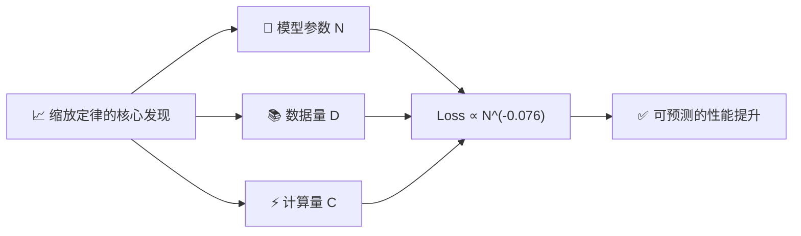
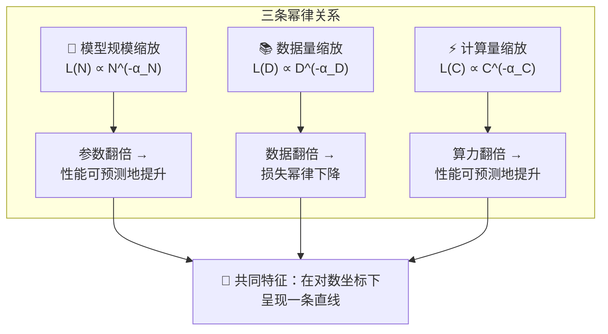
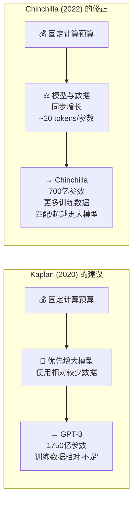

# Scaling Laws for Neural Language Models — 神经语言模型的缩放定律

> ⭐⭐⭐ 较高难度 | ⏱️ 阅读时间：14 分钟 | 📅 2026-03-21 | 🏷️ `缩放定律` `幂律` `计算效率` `Chinchilla` `模型设计`

**原标题**: Scaling Laws for Neural Language Models
**中文标题**: 神经语言模型的缩放定律 —— 从经验直觉到数学预测的范式转变
**原始论文**: Kaplan et al., OpenAI, 2020

---

## 📌 一句话摘要

> OpenAI 研究团队发现神经语言模型的性能与模型规模、数据量和计算量之间存在简洁的幂律关系，这一发现将大模型开发从"凭直觉试错"转变为"用数学预测"，直接影响了 GPT-3 等超大模型的设计决策。

---

## 🟢 通俗版：缩放定律是什么？

想象你在经营一家餐厅：

- 🍳 **厨师人数**（模型参数） → 越多厨师，菜品质量越好
- 🥬 **食材数量**（训练数据） → 越多食材，菜品种类越丰富
- ⏱️ **烹饪时间**（计算量） → 越多时间，菜品越精致

缩放定律告诉你：**这三者与菜品质量之间有精确的数学关系！** 你可以用小厨房的数据，预测大厨房能做出多好的菜，而不用真的建一个大厨房来试。

> 🎯 **核心价值**：把 AI 研发从"赌博"变成了"工程" —— 投入多少资源，就能预测得到多好的模型。



---

## 🔴 深入版：核心内容详解

### 1. 🔍 什么是缩放定律？

缩放定律描述的是一个惊人的发现：**语言模型的测试损失（test loss）与模型大小、数据集大小、计算量之间存在可预测的幂律（power-law）关系**。这些趋势跨越了超过七个数量级，展现出惊人的规律性。

换句话说，如果你知道一个较小模型的表现，你可以用简单的数学公式预测一个更大模型会表现多好 —— 无需实际训练那个大模型。

### 2. 📐 三条核心幂律



#### 2.1 🔢 模型规模缩放

```
L(N) ∝ N^(-α_N)
```

其中 `N` 是模型参数量，`α_N` 是缩放指数。损失随参数量的增加呈幂律下降。关键发现是：**将模型参数翻倍，性能提升是一致且可预测的**，与起始规模无关。

#### 2.2 📚 数据量缩放

```
L(D) ∝ D^(-α_D)
```

其中 `D` 是训练数据量（token 数）。更多的训练数据同样以幂律方式降低损失。

#### 2.3 ⚡ 计算量缩放

```
L(C) ∝ C^(-α_C)
```

其中 `C` 是计算预算（FLOPs）。给定更多计算资源，性能可预测地提升。

### 3. 🔑 关键发现

| 发现 | 描述 | 意义 |
|------|------|------|
| 🏗️ 架构细节影响甚微 | 宽度/深度选择对缩放行为影响不大 | 参数总量 > 架构选择 |
| 📈 大模型更高效利用样本 | 大模型在相同数据上提取更多信息 | 计算效率最优 ≠ 训练到收敛 |
| 📊 性能平滑可预测 | 不存在突然的"跳跃"或"拐点" | 可用数学公式精确预测 |

> 💡 **反直觉结论**：计算效率最优的训练方式是使用非常大的模型，在相对适量的数据上训练，并在**远未收敛时就停止训练**。

### 4. 🧪 实验基础

研究团队训练了从 768K 到 15 亿参数的 Transformer 模型，在 2200 万到 230 亿 token 的数据集上进行实验。一致的幂律模式跨越了这些范围，表明这不是特定架构的巧合，而是神经语言模型训练的**基本属性**。

### 5. 💰 计算预算分配问题

原始论文揭示了一个重要但未完全解决的问题：**给定固定的计算预算，应该如何在模型大小和训练数据量之间分配？**



Kaplan 等人的建议倾向于：优先增大模型规模，使用相对较少的数据。这一建议直接影响了 GPT-3（1750 亿参数）的设计 —— 一个参数极大但训练数据相对"不足"的模型。

### 6. 🔄 Chinchilla 的修正

2022 年，DeepMind 的 Chinchilla 论文对 Kaplan 的结论做出了重要修正：

| 对比 | Kaplan (2020) | Chinchilla (2022) |
|------|--------------|-------------------|
| 📐 核心主张 | 优先增大模型，适量数据 | 模型与数据**同步增长** |
| 📊 最优配比 | 未精确量化 | ~20 tokens/参数 |
| 🎯 实践影响 | 催生 GPT-3 (175B) | 证明 GPT-3 训练不足 |
| 🏆 结果 | — | 70B 模型匹配 175B+ 性能 |

> ⚠️ 这意味着许多已训练的大模型（包括 GPT-3）实际上是**训练不足的** —— 它们的参数量相对于训练数据量来说过大了。

---

## 🧪 技术要点

1. **📐 幂律的普适性**：损失与规模的幂律关系横跨七个数量级，是一种类似物理学中的"自然法则"，而非工程上的经验规则。

2. **🏗️ 参数量 > 架构细节**：在合理范围内，模型的总参数量比具体的宽度/深度选择更重要，这一发现简化了模型设计的决策空间。

3. **🔄 训练效率的反直觉结论**：最高效的方式不是让模型训练到收敛，而是用更大的模型训练更短的时间 —— 这颠覆了传统的"充分训练"理念。

4. **🎯 预测性工程**：缩放定律让 AI 研发从"先训练，再看效果"变为"先预测，再决定是否值得投入资源"，大幅降低了研发风险。

5. **📚 Chinchilla 修正的实践意义**：数据量与模型规模同等重要，这一认识推动了高质量训练数据集的建设（如 The Pile、RedPajama 等）。

---

## 🔬 深度解读

缩放定律的发现对 AI 领域的影响是多维度的：

💪 **"大力出奇迹"的理论基础**。在缩放定律发表之前，"增大模型就能变好"更多是一种直觉和信仰。Kaplan 的工作第一次为这种信仰提供了数学框架。这直接催生了 AI 领域的"军备竞赛" —— 各大公司竞相训练更大的模型，因为缩放定律承诺了可预测的回报。

💰 **AI 研发的经济学转变**。缩放定律使得 AI 研发变成了一个资本密集型的"确定性投资"：你投入多少计算资源，就能大致预测得到多好的模型。这改变了整个行业的融资和投资逻辑 —— 从"可能成功的研究"变成了"可以计算 ROI 的工程项目"。

⚡ **涌现能力的伏笔**。虽然缩放定律描述的是平滑的损失下降，但后续研究发现某些能力（如算术推理、多步推理）会在特定规模阈值上"突然出现"。这种"涌现"现象与平滑的缩放定律之间的张力，至今仍是 AI 研究中最令人困惑的问题之一。

📚 **数据瓶颈的预言**。Kaplan 的工作隐含地预示了一个危机：如果模型规模持续增长，高质量训练数据将成为最稀缺的资源。按当前的消耗速度，公开可用的互联网文本数据可能在未来几年内被"耗尽"。这推动了合成数据生成、数据质量过滤等新研究方向。

### 📊 缩放定律的历史演进

| 时间 | 里程碑 | 核心观点 |
|------|--------|---------|
| 2020 | 🟢 Kaplan (OpenAI) | 幂律关系，优先增大模型 |
| 2022 | 🟡 Chinchilla (DeepMind) | 数据与模型同等重要，~20 tokens/参数 |
| 2023 | 🔵 Llama 系列 (Meta) | 推理效率优先，用更多数据训练更小模型 |
| 2024-25 | 🟣 推理缩放 (OpenAI o1, DeepSeek-R1) | 推理阶段的计算也遵循缩放定律 |

---

## 💭 延伸思考

1. **🚧 缩放是否有尽头？**：幂律关系是否会在某个规模上"断裂"？如果存在不可逾越的性能上限（类似物理学中的热力学极限），当前的"堆算力"策略将面临根本性挑战。

2. **🧠 推理缩放定律**：最新研究开始关注推理时的缩放 —— 在推理阶段投入更多计算（如更长的思考链），是否也遵循类似的幂律？这可能开辟出一条绕过训练缩放瓶颈的新路径。

3. **⚖️ 效率与规模的博弈**：Chinchilla 证明了"聪明地缩放"比"盲目地缩放"更重要。未来的突破可能来自更好的训练算法、数据质量提升或架构创新，而非单纯的规模增长。

4. **🖼️ 多模态缩放定律**：当模型处理的不仅是文本，还包括图像、视频、音频时，缩放定律是否仍然成立？跨模态的缩放行为尚未被充分研究。

---

## 🔗 原文链接

- **原始论文**: [Scaling Laws for Neural Language Models (arXiv)](https://arxiv.org/abs/2001.08361)
- **参考解读**: [Michael Brenndoerfer 交互式解析](https://mbrenndoerfer.com/writing/scaling-laws-neural-language-models-power-law-predictions)
- **参考解读**: [Medium 缩放定律解读](https://medium.com/@checkpoint89/scaling-laws-for-neural-language-models-fa1c0790833d)
- **Chinchilla 论文**: [Training Compute-Optimal Large Language Models (arXiv)](https://arxiv.org/abs/2203.15556)

---

*翻译整理日期: 2026-03-21*
