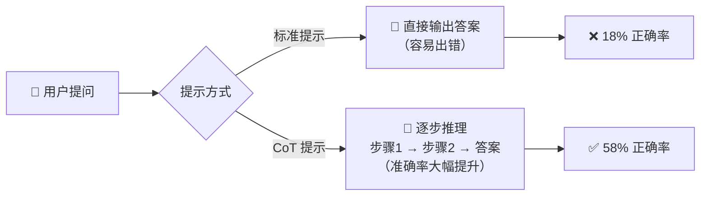
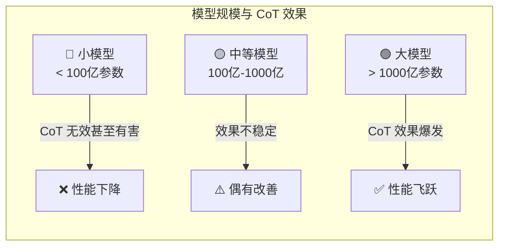
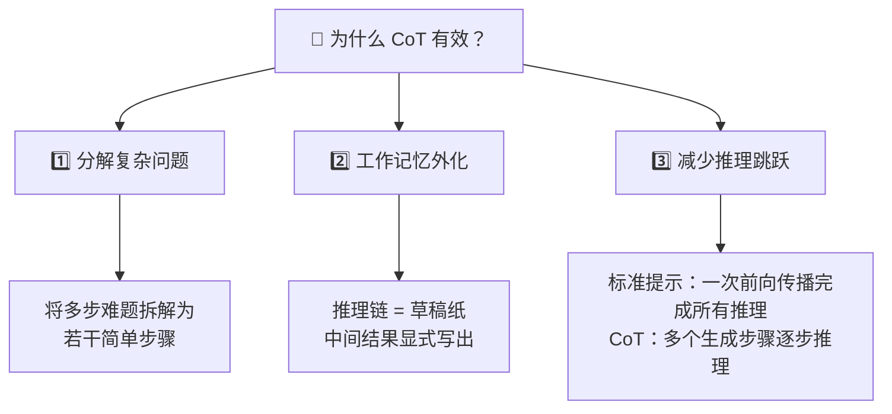

# Chain-of-Thought Prompting — 思维链提示

> ⭐⭐ 中等难度 | ⏱️ 阅读时间：12 分钟 | 📅 2026-03-21 | 🏷️ `提示工程` `推理` `涌现能力` `少样本学习`

**原标题**: Chain-of-Thought Prompting Elicits Reasoning in Large Language Models
**中文标题**: 思维链提示激发大语言模型的推理能力 —— 让 AI 学会"一步一步想"
**原始论文**: Wei et al., Google Brain, 2022 (NeurIPS)

---

## 📌 一句话摘要

> 通过在提示中加入中间推理步骤的示例，大语言模型在算术推理、常识推理和符号推理等任务上的表现获得了巨大提升 —— 仅需修改提示格式，无需修改模型权重或额外训练数据，但这种能力仅在足够大的模型（约 1000 亿参数以上）中才会涌现。

---

## 🟢 通俗版：思维链提示是什么？

想象你在教一个学生做数学题。你会怎么做？

- ❌ **错误方式**：直接告诉答案 → "答案是 11"
- ✅ **正确方式**：展示解题步骤 → "先算 2×3=6，再算 5+6=11"

思维链提示（CoT）就是用同样的方式"教" AI：**在提示中展示推理过程，AI 就学会了"一步一步想"。**

> 🎯 **关键比喻**：CoT 就像给 AI 一张"草稿纸"——让它把中间步骤写出来，而不是在脑子里硬算。



---

## 🔴 深入版：核心内容详解

### 1. 🔍 什么是思维链提示？

思维链（Chain-of-Thought, CoT）提示是一种引导大语言模型进行推理的方法。其核心思想出奇地简单：**在少样本提示（few-shot prompt）中，不仅给出问题和答案，还展示得到答案的中间推理过程。**

#### 📊 标准提示 vs 思维链提示

| 对比维度 | 标准提示 | 思维链提示 |
|---------|---------|-----------|
| 🎯 示例格式 | 问题 → 答案 | 问题 → 推理步骤 → 答案 |
| 🧠 模型行为 | 一步到位"猜"答案 | 逐步分解问题 |
| 📈 GSM8K 准确率 | ~18% | **58%** |
| 💰 训练成本 | 零 | 零 |
| ⚙️ 模型修改 | 无 | 无 |

**标准提示：**
```
问：Roger 有 5 个网球。他又买了 2 罐网球，每罐 3 个。他现在有多少个网球？
答：11

问：餐厅里有 23 个苹果。如果他们用了 20 个做午餐，又买了 6 个，还剩多少？
答：
```

**思维链提示：**
```
问：Roger 有 5 个网球。他又买了 2 罐网球，每罐 3 个。他现在有多少个网球？
答：Roger 一开始有 5 个球。2 罐网球，每罐 3 个，就是 2 × 3 = 6 个球。
   5 + 6 = 11。答案是 11。

问：餐厅里有 23 个苹果。如果他们用了 20 个做午餐，又买了 6 个，还剩多少？
答：
```

区别在于：模型被"教会"了展示计算过程，而不是直接给出答案。这模拟了人类解决多步问题时的直觉思维过程。

### 2. 🔑 关键发现

#### 2.1 🚀 涌现能力 —— 规模决定一切

思维链推理是**模型规模的涌现属性**。这是论文最重要的发现之一：



- **🔴 小模型（< 100 亿参数）**：CoT 提示不仅没有帮助，有时甚至会降低性能。小模型会生成流畅但不合逻辑的推理链，导致错误答案。
- **🟡 中等模型（100 亿 - 1000 亿参数）**：开始出现一些改善，但不稳定。
- **🟢 大模型（> 1000 亿参数）**：CoT 的效果急剧提升，带来显著的性能飞跃。

> 💡 这种"小模型无效、大模型神效"的现象是典型的涌现行为 —— 能力不是逐渐线性增长的，而是在某个规模阈值后突然出现。

#### 2.2 📈 算术推理的突破

在算术推理基准测试上的结果令人震撼：

| 方法 | GSM8K 准确率 | 提升幅度 |
|------|-------------|---------|
| 标准提示 PaLM 540B | ~18% | 基线 |
| ⚡ CoT 提示 PaLM 540B | **58%** | 🔺 3.2 倍 |
| 🏆 自一致性 + CoT | **74%** | 🔺 4.1 倍 |
| 之前 SOTA（微调+验证器） | 55% | — |

> 🎯 标准提示下，增大模型规模带来的提升曲线几乎是"平的"。CoT 提示打破了这个僵局，让规模效应重新生效。

#### 2.3 🌍 常识推理的提升

CoT 在多个常识推理基准上也展现了显著改善：
- 📝 **CommonsenseQA**：需要世界知识的多选题
- 🧩 **StrategyQA**：需要多步隐含推理的是/否问题
- 📅 **日期理解**：需要日期计算的推理题
- ⚽ **体育理解**：需要体育常识的判断题

> CoT 的基于语言的特性使其**适用于任何人类可以通过语言思考来解决的任务**。

#### 2.4 🔣 符号推理

CoT 在符号推理任务上也有效，例如：
- 🔤 连接单词的最后一个字母
- 🪙 硬币翻转追踪

这些任务验证了 CoT 不仅仅是在"记忆"训练数据中的推理模式，而是真正学会了某种程度的泛化推理。

### 3. ⚙️ 技术机制分析

#### 3.1 🧠 为什么 CoT 有效？



1. **🧩 分解复杂问题**：CoT 将一个需要多步推理的难题拆解为若干简单步骤，每步模型只需要完成一个"容易"的判断。
2. **📝 工作记忆的外化**：推理链相当于为模型提供了"草稿纸"，将中间结果显式地写出来，避免了在隐藏状态中"记住"所有信息。
3. **🪜 减少推理跳跃**：标准提示要求模型在一次前向传播中完成所有推理，而 CoT 允许模型在多个生成步骤中逐步推理。

#### 3.2 🎯 自一致性（Self-Consistency）

Wei 等人后续提出的自一致性方法进一步提升了 CoT 的效果：

1. 对同一问题生成多条不同的推理链
2. 对所有推理链的最终答案进行多数投票
3. 选择最多推理链得出的答案

> 💡 这种"多数决"策略利用了一个直觉：正确的推理路径可能有多种，但它们倾向于汇聚到相同的正确答案。

#### 3.3 🪄 零样本 CoT（Zero-Shot CoT）

后续研究发现，仅需在提示末尾添加一句 **"让我们一步一步地想"（"Let's think step by step"）**，就能在零样本设置下激发推理能力 —— 无需任何示例。这表明大模型内部已经"学会"了推理模式，只需要正确的触发方式。

---

## 🧪 技术要点

1. **💸 纯提示工程，零训练成本**：CoT 不修改模型权重，不需要额外训练数据，是一种纯推理时的优化策略，实施成本几乎为零。

2. **📐 规模阈值效应**：CoT 只在约 1000 亿参数以上的模型中有效，这一发现揭示了"涌现能力"的存在，改变了人们对模型规模与能力关系的理解。

3. **🔎 推理的可解释性**：CoT 生成的中间步骤天然提供了模型推理过程的解释，可以用于调试错误答案（虽然模型有时会生成"看似合理但实际错误"的推理链）。

4. **🛡️ 自一致性的鲁棒性**：通过多次采样和多数投票，CoT 的性能和可靠性都得到了显著提升，从 58% 到 74%（GSM8K）。

5. **🌐 任务通用性**：CoT 适用于算术推理、常识推理、符号推理等多种任务类型，其基于语言的特性赋予了它跨领域的泛化能力。

---

## 🔬 深度解读

思维链提示的意义远不止于提升基准测试分数：

🧠 **重新定义了"提示"的价值**。在 CoT 之前，提示工程更多是关于"如何描述任务"。CoT 表明，提示可以教会模型"如何思考" —— 这是一个质的飞跃。提示不再只是输入格式的选择，而是一种认知策略的传递。

⚡ **涌现能力的标志性案例**。CoT 是最早被系统性研究的涌现能力之一。它的"小模型无效、大模型突现"模式成为了后续讨论涌现能力的标杆案例，尽管"涌现"概念本身后来受到了一些质疑（是否只是评估指标的选择导致的假象）。

🧬 **从"系统1"到"系统2"思维**。借用 Daniel Kahneman 的框架：标准提示让模型使用快速的"直觉"（系统1），而 CoT 引导模型进行慢速的"深思"（系统2）。这个类比虽然不完全精确，但它启发了后续关于 AI 推理能力的大量研究。

⏱️ **推理时间计算的先声**。CoT 本质上是用更多的推理时间计算（生成更多 token）换取更好的答案质量。这一思路后来演化为 OpenAI 的 o1 模型和 DeepSeek-R1 等"推理模型"的核心理念 —— 在推理阶段投入更多计算来解决更难的问题。

⚠️ **忠实性问题**。一个深层隐忧是：模型生成的推理链是否真正反映了它的内部计算过程？研究表明，模型有时会生成看似正确的推理链来"辩护"一个通过其他方式得出的答案。这种"推理不忠实"的问题对 AI 安全有重要影响。

### 📊 CoT 后代家族对比

| 方法 | 结构 | 核心思想 | 适用场景 |
|------|------|---------|---------|
| 🔗 CoT | 线性链 | 逐步推理 | 通用推理任务 |
| 🌳 Tree-of-Thought | 树状分支 | 多路径探索 + 回溯 | 复杂决策/搜索问题 |
| 🕸️ Graph-of-Thought | 图结构 | 非线性推理网络 | 多约束优化问题 |
| ⚡ ReAct | 交替循环 | 推理 + 行动 | 工具调用/信息检索 |
| 🧠 o1/R1 | 内化长链 | RL 训练推理链 | 高难度推理 |

---

## 💭 延伸思考

1. **🤔 推理 vs 模式匹配**：CoT 让模型表现出推理能力，但模型是否真正在"推理"？还是它只是在更复杂地匹配训练数据中的推理模式？这是 AI 哲学中的一个核心问题。

2. **🌿 CoT 的后代**：从 CoT 发展出了一系列变体 —— Tree-of-Thought（思维树）、Graph-of-Thought（思维图）、ReAct（推理+行动）等。如何选择最合适的推理框架，取决于任务的结构和复杂度。

3. **🔮 内化的推理**：o1、DeepSeek-R1 等模型将 CoT 从提示工程变成了模型训练的一部分（通过 RL 训练模型生成更好的推理链）。这是否意味着未来的模型不再需要外部的 CoT 提示？

4. **📱 小模型的推理能力**：如果 CoT 需要 1000 亿参数以上才有效，那么在端侧设备上部署的小模型如何获得推理能力？蒸馏、微调小模型的推理能力是当前的活跃研究方向。

---

## 🔗 原文链接

- **原始论文**: [Chain-of-Thought Prompting Elicits Reasoning in Large Language Models (arXiv)](https://arxiv.org/abs/2201.11903)
- **Google Research 博客**: [Language Models Perform Reasoning via Chain of Thought](https://research.google/blog/language-models-perform-reasoning-via-chain-of-thought/)
- **参考解读**: [Humanloop CoT 指南](https://humanloop.com/blog/chain-of-thought-prompting)
- **参考解读**: [Portkey 论文摘要](https://portkey.ai/blog/chain-of-thought-prompting-elicits-reasoning-in-large-language-models-summary/)

---

*翻译整理日期: 2026-03-21*
