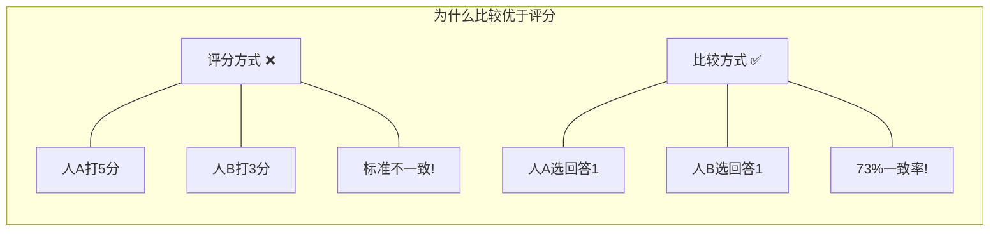
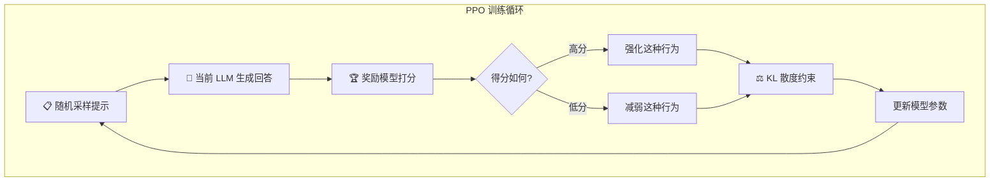
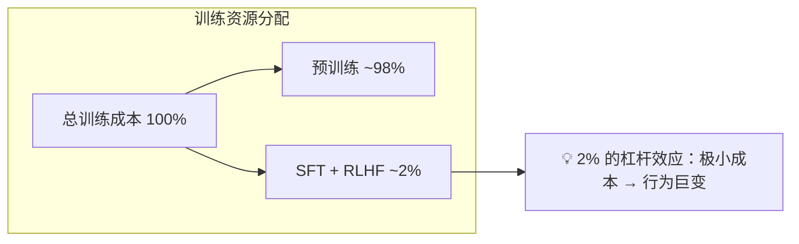

# RLHF / InstructGPT — 基于人类反馈的强化学习

> 🏷️ `难度：⭐⭐⭐⭐` | `阅读时间：18 分钟` | `日期：2026-03-21` | `标签：#RLHF #对齐 #InstructGPT #强化学习 #人类反馈`

**原标题**: Training Language Models to Follow Instructions with Human Feedback
**中文标题**: 用人类反馈训练语言模型遵循指令 —— 从"文本补全机器"到"AI 助手"的关键一步
**原始论文**: Ouyang et al., OpenAI, 2022 (NeurIPS)

---

## 📌 一句话摘要

> InstructGPT 通过三阶段训练流程（监督微调 → 奖励模型训练 → PPO 强化学习），使得仅 13 亿参数的小模型在人类评估中优于 1750 亿参数的 GPT-3，证明了人类反馈是让大语言模型从"能力强"变为"有用且安全"的关键桥梁。

---

## 🗺️ 一图看懂 RLHF 三阶段流程

```mermaid
graph TD
    subgraph 阶段一：监督微调 SFT
        A[📝 人类编写示范回答] --> B[提示 + 回答 对]
        B --> C[微调 GPT-3]
        C --> D[🤖 SFT 模型]
    end

    subgraph 阶段二：训练奖励模型 RM
        D --> E[同一提示生成多个回答]
        E --> F[👥 人类排序回答质量]
        F --> G[比较对数据 A>B]
        G --> H[训练奖励模型]
        H --> I[🏆 奖励模型 RM]
    end

    subgraph 阶段三：PPO 强化学习
        D --> J[SFT 模型作为起点]
        J --> K[生成回答]
        K --> L[RM 打分]
        I --> L
        L --> M[PPO 优化策略]
        M --> N[KL 散度约束]
        N --> K
        M --> O[✅ 最终 InstructGPT 模型]
    end
```

---

## 🟢 通俗版：给所有人看的解释

### 💡 核心思想

想象你训练了一只非常聪明的鹦鹉，它读过整个互联网，能模仿任何文风。但问题是——你问它"北京天气怎么样？"，它可能回答"北京天气怎么样？这是一个常见的问题..."（继续补全文本），而不是真正回答你的问题。

RLHF 就是教这只鹦鹉**理解人类的意图**，让它从"文本补全机器"变成"AI 助手"。

### 🎯 三步训练法（烹饪比喻）

| 阶段 | 比喻 | 实际做法 |
|------|------|---------|
| 🥇 第一步：示范 | 厨师亲自示范做菜 | 人类写 1.3 万个示范回答，模型照着学 |
| 🥈 第二步：品鉴 | 训练一个"美食评委" | 让人类比较回答好坏，训练一个"打分器" |
| 🥉 第三步：练习 | 厨师不断尝试，评委不断打分 | 模型生成回答 → 打分器评分 → 模型改进 |

### 🏆 最惊人的发现

> **13 亿参数的小模型（做了 RLHF）** 打败了 **1750 亿参数的大模型（没做 RLHF）**

这就像一个经过专业训练的小餐馆厨师，做出的菜比一个什么都会但没受过训练的天才厨师更好吃。

---

## 🔴 深入版：技术细节全解析

### 1. ❓ 问题：为什么需要 RLHF？

预训练的语言模型（如 GPT-3）本质上是"文本补全机器" —— 它们被训练来预测下一个 token，而不是来帮助人类。这导致了一个根本性的**对齐问题**：

- 🚫 模型可能生成有害、有偏见或不真实的内容
- 🔄 模型可能"正确地补全文本"但不是用户想要的回答
- 🤷 模型不理解"按照指令行事"意味着什么

RLHF 的核心洞察是：**与其试图定义"好回答"的精确规则，不如直接让人类告诉模型什么是好的。**

### 2. 🔧 三阶段训练流程

#### 阶段一：监督微调（Supervised Fine-Tuning, SFT）

**目标**：将通用的文本补全模型转变为能够响应指令的模型。

**方法**：
- 雇佣约 40 名高素质标注人员（超过 90% 拥有大学学历）
- 标注人员为各类提示（prompt）编写高质量的示范回答
- 使用约 13,000 个（提示，回答）对进行有监督微调
- 损失函数仍为交叉熵损失，但**仅计算回答部分的 token**，不计算提示部分

**关键发现**：即使是 InstructGPT 最小的 13 亿参数版本，在人类评估中也优于原始 GPT-3 的 1750 亿参数版本。这证明了微调数据的质量比模型规模更重要。

**📊 数据规模参考**：

| 项目 | SFT 数据量 |
|------|-----------|
| InstructGPT | ~13,000 对 |
| Stanford Alpaca | 52,000 对 |
| 典型 SFT 数据集 | 10,000 - 100,000 对 |

#### 阶段二：奖励模型训练（Reward Model, RM）

**核心挑战**：如何将人类对回答质量的判断转化为可优化的数学信号？

**为什么不用直接评分？**
实践中发现，让标注人员对回答打 1-7 分是极不可靠的 —— 不同人的评分标准差异巨大，且同一个人在不同时间的评分也不一致。相比之下，**比较两个回答哪个更好**是更自然、更一致的判断。



**数据收集方法**：
1. 对同一个提示，让 SFT 模型生成多个不同的回答
2. 标注人员对这些回答进行**排序**（而非评分）
3. 一次排序 4 个回答（A > B > C > D）可以通过组合产生 6 个比较对
4. InstructGPT 从约 50,000 个提示中生成了 300K 到 180 万个比较对

**标注一致性**：标注人员之间的一致率约为 73%。

**奖励模型的训练**：

损失函数：
```
L = -log(σ(s_w - s_l))
```

其中 `s_w` 是被偏好回答的分数，`s_l` 是被淘汰回答的分数，`σ` 是 sigmoid 函数。这个公式惩罚"好回答得分低于差回答"的情况。

**初始化策略**：从 SFT 模型初始化奖励模型（而非从头训练），效果显著更好。

#### 阶段三：PPO 强化学习微调

**目标**：优化 SFT 模型，使其生成的回答能获得更高的奖励模型分数，同时保持行为的稳定性。

**算法**：近端策略优化（Proximal Policy Optimization, PPO），由 OpenAI 于 2017 年提出。



**关键约束 —— KL 散度惩罚**：

这是整个 RLHF 流程中最关键的技术细节。优化目标包含一个正则化项，防止 RL 模型偏离 SFT 基线模型太远：

```
objective₁ = RM(x, y) - β · log(LLM_RL(y|x) / LLM_SFT(y|x))
```

**⚠️ 为什么需要这个约束？** 如果没有 KL 散度惩罚，RL 模型可能会发现奖励模型的"漏洞" —— 生成一些奇怪但能骗到奖励模型给出高分的回答（"奖励黑客攻击"）。KL 约束确保优化后的模型不会偏离 SFT 模型太远。

**预训练保持目标**：

```
objective₂ = γ · log(LLM_RL(x))
```

在预训练分布上也保持性能，防止模型忘记基础的语言能力。

**超参数**：
- `β`：控制 KL 散度约束的强度
- `γ`：预训练保持目标的权重
- InstructGPT RL 训练使用了约 40,000 个提示

### 3. ⚠️ 一个反直觉的发现：RLHF 增加了幻觉

InstructGPT 的 RLHF 训练实际上**增加了**幻觉率（相比仅做 SFT 的版本），尽管整体回答质量提高了。

**可能的解释**：RLHF 训练模型生成"人类偏好的"回答，而人类偏好自信、详尽的回答 —— 这可能无意中鼓励模型编造听起来合理但无事实依据的信息。

### 4. 📊 资源分配



---

## 🆚 对齐方法演进对比

| 方法 | 年份 | 核心思路 | 优势 | 劣势 |
|------|------|---------|------|------|
| RLHF (PPO) | 2022 | 训练 RM → PPO 优化 | 效果验证充分 | 训练复杂、不稳定 |
| Constitutional AI (RLAIF) | 2022 | AI 生成偏好数据 | 更可扩展 | 依赖 AI 判断质量 |
| DPO | 2023 | 直接从偏好数据优化 | 简单、稳定 | 无在线探索 |
| KTO | 2024 | 仅需好/坏二元标签 | 数据需求更少 | 较新，验证较少 |

---

## 🔑 技术要点

1. **🤝 比较优于评分**：让人类比较两个回答比让人类打分更可靠、更一致。这一设计选择是 RLHF 实际可行的关键。

2. **🐜 小模型 + 好对齐 > 大模型 + 无对齐**：InstructGPT 1.3B 优于 GPT-3 175B 的事实表明，模型行为的"对齐"可能比模型规模更重要。

3. **⚖️ KL 散度约束的必要性**：没有正则化的 RL 优化会导致奖励黑客攻击，KL 惩罚是防止模型行为退化的安全阀。

4. **👻 RLHF 的幻觉悖论**：优化人类偏好可能无意中增加幻觉，提示我们"人类喜欢的"和"事实正确的"之间存在张力。

5. **💰 2% 的杠杆效应**：仅用总训练成本 2% 的资源进行对齐，就能从根本上改变模型的行为模式，这是一个惊人的效率比。

---

## 🧠 深度解读

RLHF/InstructGPT 的发表是 AI 发展史上的一个转折点：

**🚀 ChatGPT 的秘密武器**。ChatGPT 的成功不仅在于 GPT-3.5 的基础能力，更在于 RLHF 让模型学会了"像助手一样说话"。没有 RLHF，ChatGPT 可能只是一个更大的文本补全器，而不是一个能够理解用户意图并有条理地回答问题的 AI 助手。

**⚖️ 对齐税 vs 对齐红利**。传统观点认为安全对齐会降低模型性能（"对齐税"）。InstructGPT 颠覆了这一观点 —— 对齐后的模型不仅更安全，而且对用户更有用。这表明对齐和性能不一定是零和博弈。

**🧑‍🔬 人类偏好的局限性**。RLHF 的基本假设是"人类知道什么是好的回答"。但标注人员的判断受到自身知识、偏见和注意力限制。当模型在某些领域的知识超越标注人员时，人类反馈可能反而误导模型。

**🤖 从 RLHF 到 RLAIF**。Anthropic 的 Constitutional AI（宪法 AI）方法部分用 AI 生成的比较数据替代人类标注（183K AI 生成 vs 135K 人类生成），预示了更可扩展的对齐方法。

**🔄 PPO 的替代者**。PPO 虽然有效但训练不稳定且复杂。后续出现了 DPO（Direct Preference Optimization）等更简单的替代方案，直接从偏好数据优化模型，跳过了显式的奖励模型训练。

---

## 💭 延伸思考

1. **🌍 谁的偏好？** RLHF 训练的模型反映的是标注人员群体的偏好。不同文化、不同背景的人对"好回答"的定义可能截然不同。如何让模型服务于多元化的用户群体，是一个开放性挑战。

2. **🧗 超人类对齐**：当 AI 模型在某些任务上超越人类时，如何继续用人类反馈来对齐它？这是"可扩展监督"（scalable oversight）问题的核心。

3. **⚔️ DPO 与在线 RLHF**：DPO 等离线方法虽然简单，但可能不如在线 RLHF 那样能持续探索新的行为空间。两种方法的优劣权衡仍在研究中。

4. **📏 过程奖励 vs 结果奖励**：InstructGPT 的奖励模型评估的是最终回答的质量（结果奖励）。最新研究开始探索"过程奖励模型"（PRM），对推理的每一步进行评估，可能带来更好的推理对齐。

---

## 🔗 原文链接

- **原始论文**: [Training language models to follow instructions with human feedback (arXiv)](https://arxiv.org/abs/2203.02155)
- **OpenAI 官方博客**: [Aligning language models to follow instructions](https://openai.com/index/instruction-following/)
- **Hugging Face RLHF 详解**: [Illustrating RLHF](https://huggingface.co/blog/rlhf)
- **Huyen Chip 技术博客**: [RLHF: Reinforcement Learning from Human Feedback](https://huyenchip.com/2023/05/02/rlhf.html)

---

*翻译整理日期: 2026-03-21*
