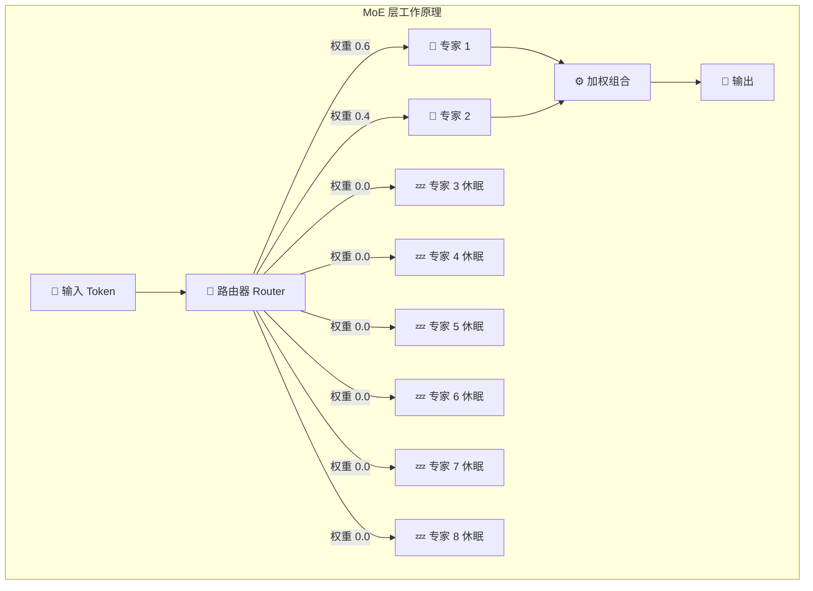
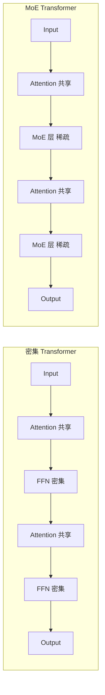
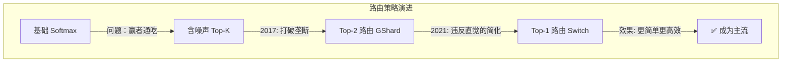
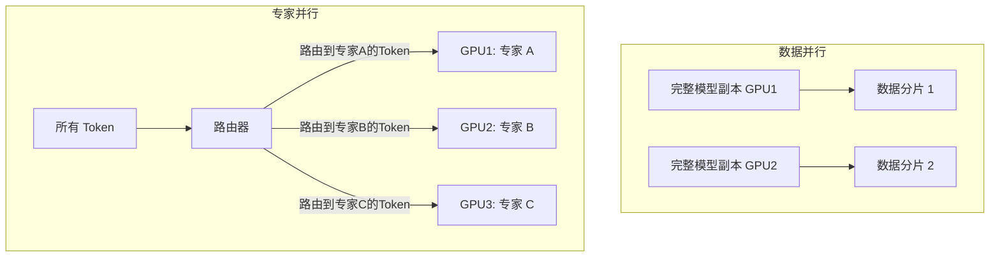

# Mixture of Experts — 混合专家架构

> 🏷️ `难度：⭐⭐⭐⭐` | `阅读时间：20 分钟` | `日期：2026-03-21` | `标签：#MoE #稀疏模型 #条件计算 #路由机制 #Mixtral`

**原标题**: Mixture of Experts Explained
**中文标题**: 混合专家架构全面解析 —— 用条件计算实现"花小钱办大事"的模型设计哲学
**主要参考**: Hugging Face 技术博客; Shazeer et al. 2017; Fedus et al. 2021 (Switch Transformers)

---

## 📌 一句话摘要

> 混合专家（MoE）架构通过将密集的前馈层替换为多个"专家"子网络并用门控机制按需路由，实现了在大幅增加模型参数量的同时保持计算量基本不变 —— Mixtral 8x7B 拥有 470 亿参数但推理速度仅相当于 120 亿参数的密集模型，开创了"稀疏即高效"的新范式。

---

## 🗺️ 一图看懂 MoE 路由机制



---

## 🟢 通俗版：给所有人看的解释

### 💡 核心思想

想象一个大医院。传统密集模型就像**一个全科医生看所有病人** —— 不管你是感冒还是骨折，都找同一个医生。MoE 模型则像**一个有多位专家的医院** —— 前台（路由器）先了解你的症状，然后把你转到最合适的专家那里。

关键在于：虽然医院有很多专家（=参数多），但每个病人只需要看 1-2 位专家（=计算量少）。

### 🎯 核心优势一句话

> **470 亿参数的"大脑"，只用 120 亿参数的"电费"**

### 🏥 医院比喻对照表

| 概念 | 医院比喻 | MoE 实际 |
|------|---------|---------|
| 🏗️ 总参数量 | 医院所有专家总人数 | 470 亿（Mixtral） |
| ⚡ 激活参数量 | 每次看病实际接诊的专家 | 120 亿 |
| 🚦 路由器 | 前台分诊护士 | 学习到的门控网络 |
| 🧠 专家 | 各科室的专家医生 | 独立的 FFN 子网络 |
| 📋 负载均衡 | 确保每个专家工作量均匀 | 辅助损失函数 |

---

## 🔴 深入版：技术细节全解析

### 1. 🧩 什么是混合专家？

混合专家（Mixture of Experts, MoE）的核心思想是**条件计算**（conditional computation）：

- **密集模型**：所有参数处理所有输入
- **稀疏 MoE 模型**：对于每个输入，只激活一小部分参数

在 Transformer 架构中，MoE 通常将标准的前馈网络（FFN）层替换为 MoE 层。每个 MoE 层包含：

1. **多个专家网络**：每个专家本质上就是一个独立的 FFN
2. **门控网络/路由器（Router）**：一个学习到的网络，决定每个 token 被发送到哪些专家

数学表达：
```
y = Σ(i=1 to n) G(x)_i · E_i(x)
```
其中 `G(x)` 是门控输出，`E_i(x)` 是第 i 个专家的输出。当 `G(x)_i = 0` 时，该专家的计算被完全跳过。

### 2. 🔧 架构对比：密集 vs MoE



通常每隔一层替换为 MoE 层（GShard 设计），或替换所有 FFN 层。

### 3. 🚦 路由机制的演进

#### 3.1 基础 Softmax 门控

```
G_σ(x) = Softmax(x · W_g)
```

最简单但存在严重问题：**网络会收敛到只使用少数几个"宠儿专家"**。受欢迎的专家训练更多、表现更好，因此更常被选择 —— 形成正反馈循环。

#### 3.2 含噪声的 Top-K 门控（Shazeer et al., 2017）

三步操作解决负载均衡问题：

**第一步**：添加可调噪声
```
H(x)_i = (x · W_g)_i + StandardNormal() · Softplus((x · W_noise)_i)
```

**第二步**：只保留前 K 个最高值
```
KeepTopK(v, k)_i = v_i（如果 v_i 在前 k 名），否则 = -∞
```

**第三步**：应用 Softmax
```
G(x) = Softmax(KeepTopK(H(x), k))
```

噪声的引入打破了"赢者通吃"的局面，让更多专家有机会被选中和训练。

#### 3.3 Switch Transformer 的创新（Top-1 路由）

Google 在 2021 年提出了一个违反直觉但极为有效的简化：**每个 token 只路由到 1 个专家**（而非 2 个或更多）。



| 特性 | Top-K (K>=2) | Top-1 (Switch) |
|------|-------------|----------------|
| 路由计算量 | 较高 | 更低 |
| 专家批次大小 | 较小 | 翻倍 |
| 设备间通信 | 较多 | 更少 |
| 模型质量 | 基线 | 持平或更好 |

### 4. ⚖️ 负载均衡：MoE 训练的核心挑战

#### 4.1 问题可视化

```mermaid
graph TD
    subgraph 不均衡路由 ❌
        T1[Token 1] --> EX1A[专家 1 过载!]
        T2[Token 2] --> EX1A
        T3[Token 3] --> EX1A
        T4[Token 4] --> EX1A
        T5[Token 5] --> EX1A
        T6[Token 6] --> EX2A[专家 2 闲置]
        T7[Token 7] --> EX3A[专家 3 闲置]
    end

    subgraph 均衡路由 ✅
        T1B[Token 1] --> EX1B[专家 1]
        T2B[Token 2] --> EX1B
        T3B[Token 3] --> EX2B[专家 2]
        T4B[Token 4] --> EX2B
        T5B[Token 5] --> EX3B[专家 3]
        T6B[Token 6] --> EX3B
        T7B[Token 7] --> EX3B
    end
```

#### 4.2 辅助损失（Auxiliary Loss）

通过在训练损失中添加一个额外项来鼓励均匀路由：

```
aux_loss = CV(每个专家接收的token比例) × CV(专家容量利用率)
```

其中 CV 是变异系数（标准差/均值）。这个损失函数惩罚不均匀的分配。

#### 4.3 容量因子（Capacity Factor）

```
专家容量 = (批次token数 / 专家数) × 容量因子
```

| 容量因子 | 效果 |
|---------|------|
| 过高 (>1.5) | 质量好但通信成本增加 |
| 过低 (<1.0) | token 被丢弃 |
| 最佳 (1.0-1.25) | Switch Transformer 的推荐范围 |

超出容量的 token 要么被丢弃，要么通过残差连接传递。

#### 4.4 Router Z-Loss（ST-MoE, 2022）

训练稳定性的突破：惩罚过大的 logit 值

```
L_z = log(Σ exp(logits)²)
```

防止指数函数运算中的数值溢出，显著提升训练稳定性。

### 5. 📊 里程碑模型

| 年份 | 工作 | 关键贡献 | 参数规模 |
|------|------|---------|---------|
| 1991 | Adaptive Mixture of Local Experts | 🏛️ 原始概念 | — |
| 2017 | Outrageously Large Neural Networks | 🔊 含噪声 Top-K 门控 | 1370 亿 |
| 2020 | GShard | 🔗 应用于 Transformer | 6000 亿+ |
| 2021 | Switch Transformers | 1️⃣ Top-1 门控；4 倍加速 | 1.6 万亿 |
| 2022 | ST-MoE | 🛡️ Router Z-Loss | — |
| 2023 | Mixtral 8x7B | 🌐 开源生产就绪 | 470 亿 |

### 6. 🔍 Mixtral 8x7B 详解

作为最具代表性的开源 MoE 模型：

| 指标 | 数值 | 说明 |
|------|------|------|
| 📦 总参数量 | 470 亿 | 8 个 7B FFN 专家 + 共享层 |
| 💾 显存需求 | ~470 亿参数量 | 所有专家需加载 |
| ⚡ 每 token 计算量 | 相当于 120 亿参数模型 | 仅激活 2 个专家 |
| 🏆 性能 | 匹配 Llama 2 70B | 质量对标密集大模型 |

**核心权衡**：高显存占用但推理速度快。

### 7. 🎛️ 微调挑战与对策

#### 7.1 过拟合问题

MoE 模型**比密集模型更容易过拟合**：

| 任务类型 | MoE 表现 |
|---------|---------|
| 🧠 推理类（SuperGLUE） | 较差（泛化性弱） |
| 📚 知识类（TriviaQA） | 较好 |

#### 7.2 有效策略

**🧊 冻结非专家层**：只更新专家权重，接近全参数微调的质量，训练速度更快。

**📋 指令微调的突破**：研究发现 MoE 模型从指令微调中获益比密集模型**更大**。Flan-MoE 的改善幅度远超 Flan-Dense。MoE 需要更多样化的任务来正确地"专业化"。

**⚖️ 辅助损失策略**：
- 单任务微调：可以关闭辅助损失
- 指令微调：保持辅助损失开启

### 8. 🚀 推理优化

| 方法 | 说明 | 效果 |
|------|------|------|
| 🧬 蒸馏 | MoE → 密集模型 | 保留 30-40% 稀疏性收益 |
| ✂️ 专家剪枝与合并 | 聚合专家权重 | 减少推理参数量 |
| 📉 量化 (QMoE) | 量化到 <1 bit/参数 | 3.2TB → 160GB |

### 9. 🖥️ 并行策略



实践中通常将数据并行和专家并行结合使用。

---

## 🆚 密集模型 vs MoE 模型全面对比

| 维度 | 密集模型 | MoE 模型 |
|------|---------|---------|
| 📦 参数利用率 | 100% 全激活 | 10-25% 稀疏激活 |
| ⚡ 训练速度 | 基线 | 4 倍加速 (Switch) |
| 💾 显存需求 | 与参数量成正比 | 需加载全部专家 |
| 🎯 推理速度 | 与参数量成正比 | 远快于同参数密集模型 |
| 🔧 微调难度 | 标准 | 更易过拟合 |
| 📈 扩展效率 | 线性增长 | 亚线性增长 |
| 🏗️ 部署复杂度 | 简单 | 需要专家并行 |

---

## 🔑 技术要点

1. **🎯 稀疏性的本质**：MoE 的核心价值在于"条件计算" —— 不是所有参数都需要参与每次推理，这打破了"参数量=计算量"的等式。

2. **🚦 路由机制是核心瓶颈**：路由器的设计直接决定了模型的训练稳定性、负载均衡和最终性能。从 Top-K 到 Top-1 的简化表明，好的工程选择有时胜过复杂的理论方案。

3. **⚡ 4 倍预训练加速**：Switch Transformer 在相同质量下实现了 4 倍的预训练速度提升，这意味着 MoE 可以在相同时间和计算预算内训练出更好的模型。

4. **💾 显存 vs 计算的权衡**：MoE 模型需要加载所有专家到显存中，但每次推理只使用一小部分。这是"空间换时间"的经典权衡。

5. **🔬 专家专业化的发现**：编码器中的专家会自发地专注于不同类型的 token（标点、专有名词等），而解码器中的专家专业化程度较低。

---

## 🧠 深度解读

MoE 架构代表了一种深刻的工程哲学 —— **"花小钱办大事"**：

**📐 重新定义"模型大小"**。在密集模型中，参数量直接决定了每次推理的计算量。MoE 解耦了这两个概念：你可以拥有一个"名义上"470 亿参数的模型，但每次推理只需要 120 亿参数的计算量。这迫使我们重新思考"大模型"的定义 —— 应该看总参数量还是激活参数量？

**💰 经济学的胜利**。MoE 的流行本质上是一个经济学问题。在 GPU 时间极度昂贵的背景下，用 4 倍的预训练效率获得相同质量的模型，直接意味着训练成本降低 75%。Mixtral 8x7B 能以 120 亿参数模型的推理成本提供 700 亿参数密集模型的质量，这种"性价比"优势是不可忽视的。

**🏥 从"每个人都是全科医生"到"专家会诊"**。MoE 的架构隐喻很有启发性：密集模型像一个全能但可能在特定领域不够深入的全科医生；MoE 像一个由多位专家组成的团队，路由器决定让哪位专家来处理每个问题。这种"分工协作"的模式更接近人类社会的组织方式。

**⚙️ 训练与推理的不对称性**。MoE 在训练时的优势（并行化、计算效率）比推理时更明显。推理时需要将所有专家加载到显存中，即使大部分专家在任何时刻都是"休眠"的。这种不对称性推动了专家蒸馏、动态加载等推理优化技术的发展。

---

## 💭 延伸思考

1. **📈 MoE 与缩放定律**：MoE 模型的缩放行为与密集模型不同。当我们讨论"缩放"时，应该以总参数量还是激活参数量来衡量？这影响了缩放定律的适用性。

2. **🧠 路由的可学习性**：当前的路由机制相对简单（线性层 + softmax）。更复杂的路由策略（如基于上下文的动态路由）是否能带来更好的专家利用？

3. **🔬 专家的涌现行为**：专家的自发专业化（如某个专家专注于标点符号处理）是一个有趣的涌现现象。理解这种专业化如何形成，可能为我们理解大模型的内部组织提供线索。

4. **🔗 超越 FFN 的 MoE**：目前 MoE 主要替换 FFN 层。注意力层是否也可以用 MoE 方式实现？这可能带来更大的效率提升。

5. **🤔 MoE + 推理模型**：当 MoE 与思维链推理结合时，不同的推理步骤可能需要不同类型的专家。路由器能否学会根据推理阶段选择合适的专家？

---

## 🔗 原文链接

- **Hugging Face MoE 详解**: [Mixture of Experts Explained](https://huggingface.co/blog/moe)
- **NVIDIA 技术博客**: [Applying MoE in LLM Architectures](https://developer.nvidia.com/blog/applying-mixture-of-experts-in-llm-architectures/)
- **视觉指南**: [A Visual Guide to Mixture of Experts](https://newsletter.maartengrootendorst.com/p/a-visual-guide-to-mixture-of-experts)
- **Switch Transformers 论文**: [Switch Transformers: Scaling to Trillion Parameter Models (arXiv)](https://arxiv.org/abs/2101.03961)
- **Mixtral 论文**: [Mixtral of Experts (arXiv)](https://arxiv.org/abs/2401.04088)

---

*翻译整理日期: 2026-03-21*
