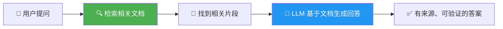
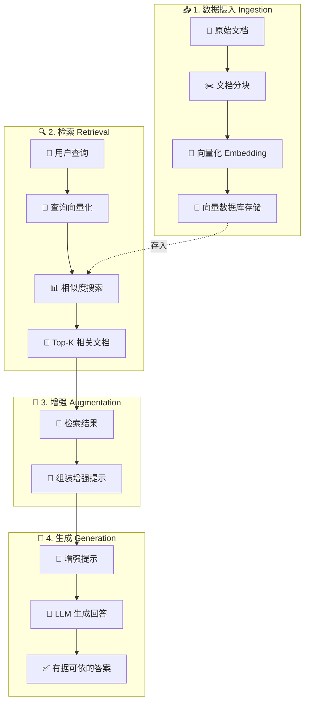
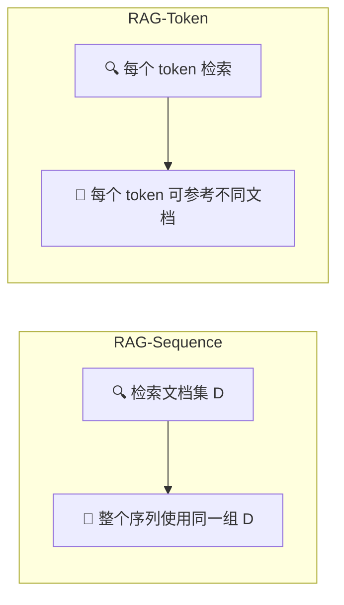

# RAG — 检索增强生成

> ⭐⭐ 中等难度 | ⏱️ 阅读时间：15 分钟 | 📅 2026-03-21 | 🏷️ `RAG` `检索` `向量数据库` `企业AI` `知识管理`

**原标题**: Retrieval-Augmented Generation for Knowledge-Intensive NLP Tasks
**中文标题**: 检索增强生成 —— 让大语言模型"开卷考试"的架构革命
**原始论文**: Lewis et al., Meta AI, 2020 (NeurIPS)

---

## 📌 一句话摘要

> 检索增强生成（RAG）通过在生成回答之前先从外部知识库检索相关信息，让大语言模型从"闭卷考试"变为"开卷考试"，有效解决了知识截止、领域知识不足和幻觉等核心问题，成为当前企业级 AI 应用最广泛采用的架构模式。

---

## 🟢 通俗版：RAG 是什么？

想象你要参加一场考试：

- 📕 **闭卷考试**（传统 LLM）：只能靠自己记住的知识作答，记错了就答错了
- 📖 **开卷考试**（RAG）：可以翻阅参考资料，找到相关内容再回答

RAG 就是给 AI 配了一套"参考资料"，让它在回答问题前先查阅相关文档，再基于查到的内容生成答案。

> 🎯 **核心价值**：不用把所有知识塞进模型的"脑子"里，需要时去"查"就行了。



---

## 🔴 深入版：核心内容详解

### 1. ❓ 为什么需要 RAG？

大语言模型（LLM）面临几个根本性局限：

| 问题 | 说明 | RAG 如何解决 |
|------|------|-------------|
| ⏰ 知识截止 | 知识停留在训练时间点 | ✅ 实时检索最新信息 |
| 📚 领域知识不足 | 专业领域知识浅薄 | ✅ 接入领域知识库 |
| 🔒 缺乏私有数据 | 无法访问企业内部信息 | ✅ 连接内部文档系统 |
| 👻 幻觉问题 | 自信地编造错误信息 | ✅ 基于真实文档生成 |
| 🔗 不可溯源 | 无法验证答案来源 | ✅ 提供来源引用 |

> 💡 RAG 的核心洞察：**与其把所有知识"塞进"模型参数中，不如在需要时动态地"查阅"外部知识。**

### 2. 🏗️ RAG 的核心架构

RAG 系统由四个关键阶段组成：



#### 2.1 📥 数据摄入（Ingestion）

将外部知识转化为可检索的格式：

**✂️ 文档分块（Chunking）**：
- 将长文档切分为较小的文本块
- 分块策略需根据内容类型和查询模式调整
- 常见策略：固定长度、按段落、按语义边界、递归分割
- 块之间通常有重叠，防止信息在边界处丢失

**🔢 向量化（Embedding）**：
- 使用嵌入模型将文本块转化为高维数值向量
- 这些向量捕获了文本的语义含义
- 语义相似的文本在向量空间中距离相近
- 常用模型：OpenAI text-embedding-ada-002, BGE, E5 等

**💾 向量存储**：
- 将嵌入向量存入向量数据库
- 支持高效的相似度搜索
- 主流选择：Pinecone, Weaviate, Milvus, Chroma, FAISS 等

#### 2.2 🔍 检索（Retrieval）

当用户提问时，系统检索最相关的知识：

| 检索方法 | 原理 | 优势 | 局限 |
|---------|------|------|------|
| 🎯 语义搜索（密集向量） | 向量相似度匹配 | 理解概念层面的相似性 | 对专业术语不敏感 |
| 🔤 词汇搜索（稀疏向量） | 关键词匹配（BM25） | 精确匹配专业术语 | 无法理解语义 |
| 🏆 混合搜索 | 两者结合 + 重排序 | 兼顾语义和精确匹配 | 系统复杂度较高 |

> ✅ 实践中**混合搜索**通常优于单一方法。

#### 2.3 🔧 增强（Augmentation）

将检索结果整合到提示中：

```
提示结构：
QUESTION: [用户的问题]
CONTEXT: [检索到的相关文档]
INSTRUCTIONS: [要求模型基于提供的上下文回答，如果上下文中没有相关信息则说明不知道]
```

增强阶段的关键设计决策：
- 📊 包含多少检索结果（太少可能遗漏信息，太多可能引入噪声）
- 📋 如何组织检索结果（按相关性排序、去重、摘要压缩）
- 📝 如何指导模型使用这些上下文信息

#### 2.4 💬 生成（Generation）

LLM 基于增强后的提示生成最终回答：
- 🎯 回答应基于检索到的上下文，而非模型的参数化知识
- 🔗 模型应能引用来源，提高可验证性
- 🤷 当检索上下文不包含相关信息时，模型应诚实地表示不知道

### 3. 📜 原始 RAG 论文（Lewis et al., 2020）

Meta AI 在 2020 年提出 RAG 架构，将检索器和生成器端到端训练：



- **RAG-Sequence**：对整个生成序列使用同一组检索文档
- **RAG-Token**：对每个生成的 token 都可以查阅不同的检索文档

原始论文使用 DPR（Dense Passage Retrieval）作为检索器，BART 作为生成器。论文证明 RAG 在多个知识密集型任务上超越了纯参数化的模型和纯检索的方法。

### 4. 🛠️ 实践中的关键考量

#### 4.1 📏 评估方法

在部署 RAG 之前，建立**基准真值（Ground Truth）评估集**至关重要：
- 🎯 识别典型的查询-答案对
- 📊 衡量 RAG 改进是否真正有效
- 🔄 支持迭代优化

评估维度：
- **🔍 检索质量**：检索到的文档是否相关？
- **📝 生成质量**：基于检索文档的回答是否准确？
- **🎯 端到端质量**：最终回答是否满足用户需求？

#### 4.2 ✂️ 分块策略的影响

分块是 RAG 中最被低估但影响巨大的环节：

| 分块大小 | 优点 | 缺点 |
|---------|------|------|
| 🔹 过大 | 上下文完整 | 包含过多无关信息，稀释相关内容 |
| 🔸 过小 | 精准匹配 | 缺乏必要上下文，信息不完整 |
| ✅ 最佳 (256-1024 tokens) | 平衡精准与上下文 | 需根据场景实验调整 |

#### 4.3 🤖 从传统 RAG 到 Agentic RAG

传统 RAG 是"一次性"流程：检索一次 → 生成一次。

**Agentic RAG** 引入了 AI 代理来编排更复杂的工作流：
- 🔄 迭代地构建和优化查询
- 🧰 选择合适的检索工具
- ✅ 通过推理验证检索到的信息
- 🔁 跨多个检索周期做出决策
- ↩️ 在回答不够满意时自动回溯和补充检索

### 5. ✅ RAG 的优势

1. **⏱️ 实时性**：可以访问训练数据截止日期之后的最新信息
2. **🔗 可验证性**：可以引用来源，用户可以交叉验证
3. **⚙️ 可控性**：各组件可以独立调优，支持细粒度的权限管理
4. **💰 经济性**：无需重新训练或微调模型，成本远低于替代方案
5. **🔌 灵活性**：可以轻松切换知识库，适应不同领域

### 6. ⚠️ RAG 的局限与挑战

- **🎯 检索质量瓶颈**：如果检索不到相关文档，生成质量无从保证
- **⏳ 延迟增加**：检索步骤增加了端到端的响应时间
- **📏 上下文窗口限制**：检索结果需要适配 LLM 的上下文长度
- **🔀 多跳推理困难**：需要综合多个文档才能回答的问题仍然具有挑战性
- **⚔️ 知识冲突**：当检索文档之间或文档与模型知识之间存在矛盾时，如何处理？

---

## 🧪 技术要点

1. **📖 "开卷考试"范式的优越性**：RAG 证明了"在需要时查阅参考资料"比"记住所有知识"更实用、更可靠、更经济。

2. **🏆 混合搜索的实践价值**：纯语义搜索和纯关键词搜索各有盲点，混合搜索（dense + sparse）结合两者优势，是工程实践中的最佳选择。

3. **✂️ 分块策略决定成败**：分块看似简单，实则是 RAG 系统中影响最大的设计决策之一。好的分块策略可以让检索质量提升数倍。

4. **📏 评估先行**：在优化 RAG 系统之前，必须先建立可靠的评估基准。没有评估，所有"优化"都只是猜测。

5. **🤖 从静态到动态（Agentic RAG）**：传统的一次性检索-生成正在被更灵活的代理式 RAG 所取代，后者能够自适应地规划检索策略。

---

## 🔬 深度解读

RAG 的流行反映了 AI 工程实践中的一个深层次趋势：

🏆 **务实主义的胜利**。在"微调模型使其学会专业知识"和"让模型在推理时查阅外部知识"之间，工程师们用脚投票选择了后者。RAG 不需要昂贵的训练基础设施，不需要数据科学团队花数周标注数据，也不需要担心微调后模型在其他任务上性能退化。它就像给 AI 配了一本"参考手册"。

🤝 **信任危机的应对**。幻觉是阻碍企业采用 LLM 的最大障碍。RAG 通过提供可追溯的来源引用，部分解决了信任问题。当用户可以点击查看原始文档并验证回答时，信任就建立了。这不是技术完美，但对于实际部署来说足够有效。

📊 **知识管理的新范式**。RAG 实质上是在重新定义企业知识管理。传统的知识管理系统（Wiki、知识库、FAQ）只能被人类使用；RAG 使得这些知识可以被 AI 系统直接利用。这意味着企业积累的知识资产第一次可以通过自然语言对话的形式被访问。

🔄 **与微调的互补关系**。RAG 和微调不是非此即彼的关系。RAG 提供事实性知识，微调提供行为模式和领域特定的推理能力。最佳实践往往是两者结合：先微调模型学习领域的"语言"和"思维方式"，再用 RAG 提供最新的事实性知识。

### 📊 RAG vs 微调 vs 长上下文 对比

| 维度 | RAG | 微调 | 长上下文 |
|------|-----|------|---------|
| 💰 成本 | 低（仅需向量化） | 高（需 GPU 训练） | 中（推理成本高） |
| ⏱️ 更新速度 | 实时 | 需重新训练 | 实时 |
| 🎯 精确度 | 依赖检索质量 | 高（领域适配） | 受注意力稀释影响 |
| 📏 知识量 | 无限（外部存储） | 有限（参数容量） | 受窗口限制 |
| 🔗 可追溯性 | ✅ 强 | ❌ 弱 | ⚠️ 中等 |

📐 **长上下文窗口的挑战**。随着 LLM 上下文窗口从 4K 扩展到 100K 乃至 100 万 token，一个问题浮现：是否还需要 RAG？答案是肯定的 —— 即使上下文窗口足够大，"将整个知识库塞进提示"既不经济也不有效。RAG 的检索步骤本质上是一种注意力聚焦机制，帮助模型关注最相关的信息。

---

## 💭 延伸思考

1. **📏 RAG vs 长上下文**：当上下文窗口达到百万 token 级别时，RAG 的角色会如何变化？它是否会从"必需品"变为"效率优化工具"？

2. **🖼️ 多模态 RAG**：当检索对象不仅是文本，还包括图像、表格、视频时，RAG 架构需要怎样的扩展？多模态嵌入和跨模态检索是前沿方向。

3. **🕸️ GraphRAG**：将知识图谱与向量检索结合，可以更好地处理多跳推理和实体关系查询。Microsoft 的 GraphRAG 方案展示了这一方向的潜力。

4. **🔐 RAG 的安全性**：如果知识库中包含恶意或错误的信息，RAG 会忠实地将其传递给用户。如何在检索-生成流程中加入事实验证和安全过滤，是一个重要但尚未充分解决的问题。

5. **👤 个性化 RAG**：能否为每个用户维护个性化的知识库，让 AI 助手真正"了解"用户的背景、偏好和历史？这可能是 RAG 的下一个演进方向。

---

## 🔗 原文链接

- **原始论文**: [Retrieval-Augmented Generation for Knowledge-Intensive NLP Tasks (arXiv)](https://arxiv.org/abs/2005.11401)
- **Pinecone RAG 指南**: [Retrieval-Augmented Generation](https://www.pinecone.io/learn/retrieval-augmented-generation/)
- **Google Cloud RAG 介绍**: [What is RAG?](https://cloud.google.com/use-cases/retrieval-augmented-generation)
- **AWS RAG 指南**: [What is RAG?](https://aws.amazon.com/what-is/retrieval-augmented-generation/)
- **NVIDIA RAG 博客**: [What Is Retrieval-Augmented Generation?](https://blogs.nvidia.com/blog/what-is-retrieval-augmented-generation/)

---

*翻译整理日期: 2026-03-21*
