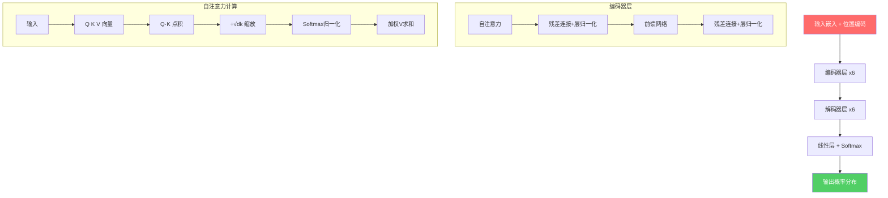

# The Illustrated Transformer / 图解Transformer：一切的起点

> 📊 难度：⭐⭐⭐ | ⏱️ 阅读：20分钟 | 📅 2018年（持续更新至2025年） | 🏷️ Transformer, 自注意力, 多头注意力, 位置编码

> **原标题**: The Illustrated Transformer
> **作者**: Jay Alammar
> **发布日期**: 2018年（持续更新，2025年配套动画课程上线）
> **原文链接**: https://jalammar.github.io/illustrated-transformer/

## 📝 一句话摘要

通过精心设计的可视化图解，将"Attention is All You Need"论文中的Transformer架构分解为可直觉理解的组件——从自注意力机制到多头注意力，从位置编码到编码器-解码器交互——这是全球影响力最大的深度学习科普文章之一，被斯坦福、哈佛、MIT等顶尖高校列为推荐教材。

---

## 🔍 核心内容翻译

### 为什么Transformer如此重要？

Transformer 是2017年 Google 团队在论文"Attention is All You Need"中提出的架构。它彻底改变了深度学习的格局，成为 GPT、BERT、Claude 等所有现代大语言模型的基础架构。Jay Alammar 这篇图解文章的贡献在于，将这个精妙但抽象的架构变得人人可懂。

### 高层架构

Transformer 由两个主要部分组成：

**编码器（Encoder）** 处理输入序列。它由多个相同的层堆叠而成（原始论文中为6层）。每个编码器层包含两个子层：
- 自注意力机制（Self-Attention）
- 前馈神经网络（Feed-Forward Neural Network）

**解码器（Decoder）** 生成输出序列。结构与编码器类似，但在自注意力和前馈网络之间多了一个**编码器-解码器注意力层**，使解码器能够"关注"编码器的输出。

### 自注意力机制（Self-Attention）——核心中的核心

自注意力机制是 Transformer 最关键的创新。它允许模型在处理每个词时，"看到"句子中所有其他词的信息，并决定应该给予每个词多少"注意力"。

Alammar 将自注意力的计算分解为六个清晰的步骤：

1. **创建 Query、Key、Value 向量**：将每个词的嵌入向量分别乘以三个训练得到的权重矩阵（W^Q, W^K, W^V），生成查询向量（Query）、键向量（Key）和值向量（Value）。

2. **计算注意力分数**：对当前词的 Query 向量与所有词的 Key 向量做点积运算。分数越高，说明两个词之间的关联越强。

3. **缩放归一化**：将分数除以 Key 向量维度的平方根（通常为 $\sqrt{64} = 8$），防止在高维空间中点积值过大导致 softmax 函数梯度消失。

4. **Softmax 归一化**：将缩放后的分数通过 softmax 函数，转换为概率分布。这确保所有注意力权重之和为1。

5. **加权值向量**：将每个词的 Value 向量乘以对应的注意力权重。

6. **求和输出**：将所有加权后的 Value 向量相加，得到该位置的自注意力输出。

### 多头注意力（Multi-Head Attention）

Transformer 不只使用单个注意力计算，而是使用**8个并行的注意力"头"**（原始论文设置）。这带来两个核心优势：

- **多角度关注**：不同的注意力头可以学习关注输入的不同方面。例如，一个头关注语法结构，另一个头关注语义关系。
- **多重表示子空间**：每个头维护独立的 Q/K/V 权重矩阵，在不同的表示空间中捕获不同类型的关联。

8个头各自产生输出矩阵后，将它们**拼接**（concatenate），再通过一个额外的权重矩阵投影，得到最终的多头注意力输出。

### 位置编码（Positional Encoding）

Transformer 的自注意力机制本身没有序列顺序的概念——它将输入视为一个"集合"而非"序列"。为了注入位置信息，Transformer 使用**位置编码向量**，将其加到输入嵌入上。

位置编码遵循特定的正弦和余弦数学模式：
- 偶数维度使用正弦函数：$PE_{(pos, 2i)} = \sin(pos / 10000^{2i/d_{model}})$
- 奇数维度使用余弦函数：$PE_{(pos, 2i+1)} = \cos(pos / 10000^{2i/d_{model}})$

这种编码方式不仅能表示绝对位置，还能让模型学习相对位置关系，且理论上可以处理比训练数据更长的序列。

### 残差连接与层归一化

每个子层都包含**残差连接**（Residual Connection）和**层归一化**（Layer Normalization）。残差连接通过将输入直接加到子层输出上，帮助缓解深层网络中的梯度消失问题。层归一化则稳定训练过程。

### 解码器的特殊机制

解码器每次只生成一个token。在训练过程中，它对所有先前位置进行注意力计算，但通过**掩码**（mask）阻止对未来位置的关注，防止信息泄露。最后一层通过线性变换 + softmax 生成词汇表上的概率分布，选择概率最高的词作为输出。

---

## 🔬 技术要点

1. **自注意力的 Q/K/V 机制**：Query-Key 点积计算关联强度，Value 承载实际信息——这种"注意力寻址"的设计是 Transformer 性能的核心来源。

2. **缩放点积的数学必要性**：在高维空间中，点积值的方差随维度增长，除以 $\sqrt{d_k}$ 确保 softmax 输入在合理范围内，避免梯度消失。

3. **多头注意力的并行化优势**：多个注意力头不仅提升了表示能力，还天然适合GPU并行计算，这是 Transformer 训练效率远超 RNN 的关键原因。

4. **位置编码的设计哲学**：基于三角函数的位置编码具有外推性（可处理更长序列）和可学习相对位置的特性，这一设计后来演化出 RoPE、ALiBi 等改进方案。

5. **残差连接对深层训练的必要性**：没有残差连接，6层以上的 Transformer 几乎无法训练。这一技术直接借鉴自 ResNet，是深度学习中最重要的工程技巧之一。

---

## 🧠 深度解读

### 🟢 通俗版

Jay Alammar 的这篇文章之所以成为经典，不仅因为它准确地解释了 Transformer，更因为它证明了一个理念：**最深刻的技术洞见可以通过最直觉的方式传达**。在学术论文充斥数学符号的AI领域，Alammar 选择用视觉和类比来解构复杂概念，使这篇文章成为全球数百万工程师和研究者的入门教材。

### 🔴 深入版

从历史角度看，Transformer 论文发表于2017年，当时RNN和LSTM仍是序列建模的主流。Transformer 的革命性不仅在于性能提升，更在于它证明了**纯注意力机制可以完全替代循环结构**。这一洞见的深远影响远超其作者的预期——它催生了 BERT、GPT 系列，最终引发了2022年至今的大语言模型革命。

值得注意的是，虽然这篇文章最初发布于2018年，但 Alammar 持续对其进行更新，并在2025年推出了配套的动画课程。这种持续维护的态度也解释了为什么这篇文章经久不衰。

---

## 💡 延伸思考

1. **从 Transformer 到现代 LLM 的演化**：原始 Transformer 是编码器-解码器结构，但 GPT 系列仅使用解码器，BERT 仅使用编码器。这种"拆分使用"的演化路径本身就是一个值得研究的现象。

2. **注意力的局限性**：自注意力的计算复杂度为 O(n^2)，这限制了上下文窗口的长度。Flash Attention、线性注意力等后续创新都在试图解决这个瓶颈。

3. **位置编码的持续演进**：从原始的三角函数位置编码到 RoPE（旋转位置编码），再到 ALiBi，位置信息的编码方式仍在快速演化，直接影响模型处理长文本的能力。

4. **Transformer 的替代架构**：Mamba（状态空间模型）等新架构正在挑战 Transformer 的统治地位。理解 Transformer 的优势和局限，是评估这些新架构的前提。

---

*翻译整理日期：2026年3月21日*
