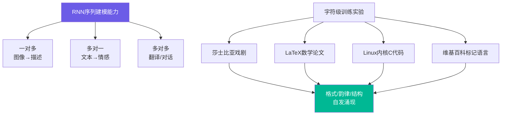

# The Unreasonable Effectiveness of Recurrent Neural Networks | RNN 的不合理有效性

> 📊 难度：⭐⭐⭐ | ⏱️ 阅读：18分钟 | 📅 2015年5月21日 | 🏷️ RNN, LSTM, 字符级建模, 序列生成

> **原标题**: The Unreasonable Effectiveness of Recurrent Neural Networks
> **中文标题**: 循环神经网络的不合理有效性
> **作者**: Andrej Karpathy
> **发表时间**: 2015年5月21日
> **原文链接**: https://karpathy.github.io/2015/05/21/rnn-effectiveness/

---

## 📝 一句话摘要

RNN（循环神经网络）能够在字符级别学习到令人惊叹的文本结构——从莎士比亚戏剧到 LaTeX 数学论文再到 Linux 内核源码——揭示了序列模型"不合理"的强大生成能力。

---

## 🔍 完整核心内容翻译

### 核心论点：RNN 的"魔法"

Karpathy 的核心论断直白而有力：训练 RNN 时，"某种魔法发生了"。他强调，"模型的简洁程度与你得到的结果质量之间的比率，远远超出你的预期。"

### 为什么 RNN 特殊？

传统神经网络接受**固定大小**的输入，产生**固定大小**的输出，经过**预定数量**的计算步骤。RNN 突破了这一限制——它们可以处理**序列**，无论是输入端、输出端还是两端都是序列：

- **一对多**：图像描述（固定输入 → 序列输出）
- **多对一**：情感分析（序列输入 → 固定输出）
- **多对多**：机器翻译（序列输入 → 序列输出）
- **同步多对多**：视频逐帧标注

更深层的洞察：**RNN 是图灵完备的**——它们在理论上可以模拟任意程序（只要权重合适）。

### RNN 的数学机制

RNN 通过一个隐藏向量维持内部状态，随每个输入更新：

- 隐藏状态演化：`h_t = tanh(W_hh * h_{t-1} + W_xh * x_t)`
- 输出：`y = W_hy * h`

网络通过反向传播学习三个权重矩阵。在实践中，几乎所有实现都使用 LSTM（长短期记忆）架构，它采用更精密的更新方程来改善梯度流动。

### 字符级语言建模

核心实验方法极其简洁：将文本视为字符序列，训练 RNN 预测下一个字符。使用 one-hot 编码将每个字符转化为向量，逐步馈入 RNN。

生成时，从预测的字符概率分布中采样，将采样的字符作为下一步输入，循环生成新文本。

### 实验结果：惊艳的生成能力

#### Paul Graham 的文章（1MB 数据集）

用 2 层、512 个隐藏单元的 LSTM 训练。生成文本捕获了创业建议的某些模式（如"a company is a meeting to think to investors"），甚至学会了放置引用标记 [2]。

#### 莎士比亚戏剧（4.4MB 数据集）

3 层 RNN 生成了惊人地类似莎士比亚的文本：正确的角色名、台词标签、抑扬格节奏、对话结构和独白诗行。虽然长程连贯性有限，但格式和韵律令人信服。

#### 维基百科（96MB 数据集）

训练于原始维基百科标记语言，模型生成了：
- 有效的 Markdown 格式和正确的括号嵌套
- 逼真的章节标题和引用
- 看起来合法的 URL（虽然不存在）
- 正确的 XML 结构和匹配的标签

#### 代数几何 LaTeX（16MB 数据集）

**最令人惊叹的实验之一**：LSTM 在高等数学教科书上训练后，生成了几乎可以编译的 LaTeX：
- 正确打开和关闭的数学环境
- 有效的数学符号
- 连贯的定理/证明结构
- 常见错误仅限于长距离依赖导致的环境标签不匹配

#### Linux 内核源码（474MB 数据集）

在整个 Linux 内核上训练，生成的 C 代码展现了：
- 正确的括号和花括号匹配
- 一致的缩进
- 有效的注释语法
- 逼真的函数结构
- 适当的指针和内存操作
- 完整的文件头和版权声明

#### 婴儿名字

在 8000 个婴儿名字上训练，模型生成了不在训练集中的新名字，同时保持了逼真的语音模式。

### 训练过程的解剖

通过观察不同训练迭代的样本，可以看到清晰的学习进程：

| 迭代次数 | 模型学到了什么 |
|---------|-------------|
| 100 | 随机字符序列，偶尔有空格 |
| 300 | 出现标点和引号意识 |
| 500 | 常见单词正确出现 |
| 700 | 类英语的句子结构 |
| 1200 | 正确的引用和更长的词汇 |
| 2000 | 正确拼写和合理的句子组合 |

模型首先学习词边界，然后是高频短词，接着是更长的词汇，最后是跨词依赖关系。

### 神经元可视化：可解释的内部专化

分析单个隐藏单元揭示了令人兴奋的模式：

- **URL 检测神经元**：在 URL 内强烈激活，其他地方沉默
- **Markdown 括号追踪**：在 [[括号]] 内激活，需要两个开括号字符
- **线性位置编码**：在分隔区域内保持梯度
- **字符计数**：追踪重复序列中的位置（如 www）

这些模式**完全自发涌现**，没有任何显式编程。

### 温度采样

调整 softmax 温度控制输出多样性：
- **低温度**（接近 0）：极度保守，产生重复模式
- **温度 1.0**：默认概率分布
- **高温度**：更多样但更易出错

### 更广的研究语境

Karpathy 将 RNN 的应用放在更大的背景下：NLP（语音转文本、翻译、手写生成）、计算机视觉（图像描述、视频分类、视觉问答）。

他特别点出了几个前沿架构：
- **神经图灵机**：外部可微分读写内存
- **注意力机制**：他称之为"神经网络中最有趣的近期架构创新"

### 结论

Karpathy 断言 RNN 将成为"智能系统中无处不在的关键组件"。训练循环网络本质上是**对程序的优化**（而非仅对函数的优化），这赋予了它们独特的计算能力。

---

## 🔬 技术要点

1. **序列建模的通用性**：RNN 打破了固定输入/输出的限制，通过隐藏状态实现了对任意长度序列的处理，理论上是图灵完备的
2. **字符级学习的惊人能力**：不需要词汇表、语法规则或领域知识，仅从原始字符序列就能学习到复杂的结构（LaTeX、C 代码、诗歌格式）
3. **LSTM 解决梯度消失**：标准 RNN 存在梯度消失/爆炸问题，LSTM 通过门控机制（遗忘门、输入门、输出门）维持长距离信息流
4. **可解释的内部表征**：隐藏单元自发发展出可理解的功能专化，无需显式编程
5. **温度控制探索-利用权衡**：采样温度提供了生成质量与多样性之间的平滑调节

---

## 🧠 深度解读

### 🟢 通俗版

这篇文章写于 2015 年，是深度学习普及运动中的里程碑文本。它的伟大之处不在于技术创新，而在于**展示能力**——用一系列生动到令人难以置信的实验，让非专业读者也能感受到神经网络的力量。

### 🔴 深入版

从历史视角看，这篇文章处于一个特殊的时间节点：Transformer 尚未出现（要等到 2017 年的 "Attention Is All You Need"），但 Karpathy 已经在文中重点讨论了注意力机制，称其为"最有趣的近期架构创新"。从 RNN 到 LSTM 再到 Attention 再到 Transformer——这条进化路径在文章中已露端倪。

更深层的启示在于 Karpathy 对"程序搜索"的理解：他指出训练 RNN 本质上是**对程序的优化**。这个洞察直接指向了后来 Software 2.0 的核心论点，也预示了 LLM 作为"通用程序"的未来。

文章中的 Linux 内核源码实验尤其预言性——一个仅在字符级别训练的模型能生成看起来合法的 C 代码。10 年后，我们拥有了 GitHub Copilot 和各种 AI 编程助手，它们做的本质上是同一件事，只是规模大了几个数量级。

---

## 💡 延伸思考

1. **从字符到 Token**：这篇文章使用字符级建模，现代 LLM 使用子词 Token（BPE）。这种粒度的变化带来了什么本质区别？更大的词汇表如何影响模型的"世界理解"？

2. **涌现能力的早期信号**：文章中展示的 LaTeX 和 C 代码生成，是否是大语言模型"涌现能力"的早期信号？小模型中的这些能力与大模型中的涌现能力有何本质不同？

3. **RNN 的衰落与复兴**：Transformer 在 2017 年后几乎完全取代了 RNN。但近年来 RWKV、Mamba 等线性注意力/状态空间模型重新回归了"循环"思想。历史是否在螺旋上升？

4. **可解释性的希望与现实**：Karpathy 发现的"URL 检测神经元"令人兴奋，但现代大模型中的可解释性研究（如 mechanistic interpretability）表明，随着模型规模增长，这种简洁的对应关系变得更加复杂。规模是否杀死了可解释性？
