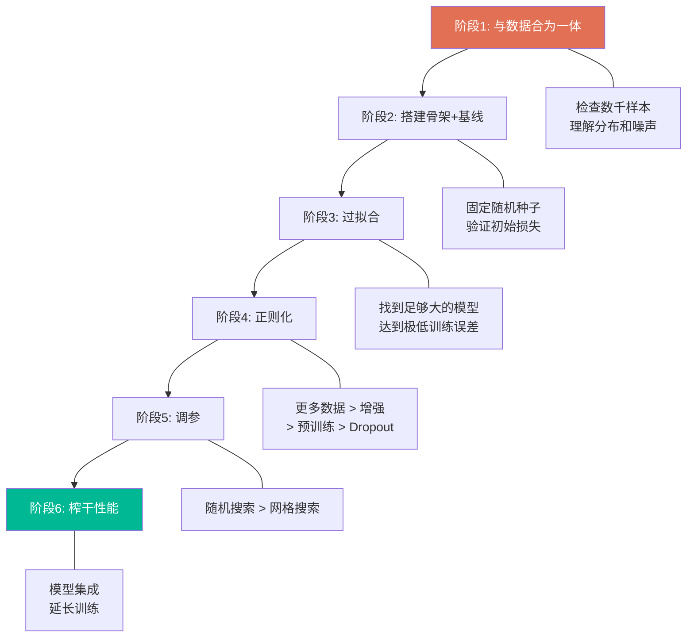

# A Recipe for Training Neural Networks | 训练神经网络的秘诀

> 📊 难度：⭐⭐⭐⭐ | ⏱️ 阅读：20分钟 | 📅 2019年4月25日 | 🏷️ 训练方法论, 调试技巧, 正则化, 神经网络

> **原标题**: A Recipe for Training Neural Networks
> **中文标题**: 训练神经网络的秘诀：从入门到避坑的完整方法论
> **作者**: Andrej Karpathy
> **发表时间**: 2019年4月25日
> **原文链接**: https://karpathy.github.io/2019/04/25/recipe/

---

## 📝 一句话摘要

神经网络训练是一门需要耐心、细致和方法论的"手艺"——本文提供了一套六阶段的系统性方法，帮助从业者从数据理解到模型优化逐步推进，避免"快而猛"的陷阱。

---

## 🔍 完整核心内容翻译

### 核心问题：神经网络是一种"漏洞百出的抽象"

Karpathy 开篇点出两个关键观察：

**第一，泄漏的抽象（Leaky Abstraction）**。神经网络与传统软件库有本质区别。使用 Python 的 Requests 库时，你不需要理解 TCP/IP 协议栈；但使用神经网络时，你不能把它当作黑盒。"Batch Norm 并不会魔法般地让模型收敛更快"——你必须理解底层机制。

**第二，沉默的失败（Silent Failures）**。传统代码出错会抛出异常，但神经网络中的逻辑错误会**静默地**存在。一个配置错误的网络可能仍然通过补偿性学习机制产出看起来还不错的结果——比如在数据增强时忘记翻转标签，或者自回归模型中的 off-by-one 错误。

**核心警告**："用'快而猛'的方法训练神经网络行不通，只会带来痛苦。"

### 六阶段秘诀

#### 第一阶段：与数据合为一体

**核心原则**：在写任何一行网络代码之前，先花数小时仔细检查数据。

**具体做法**：
- 逐一查看数千个样本
- 理解数据分布，发现模式
- 找出重复项、损坏的图像和标注错误
- 识别数据不平衡和偏差
- 观察自己的分类过程——你自己是怎么判断的？

**关键问题清单**：
- 局部特征是否足够，还是需要全局上下文？
- 数据中有多少变异？
- 空间位置是否重要？
- 标签的噪声有多大？

**深层逻辑**：神经网络本质上是对数据集的"压缩"。检查网络的预测错误，往往能揭示你对数据理解的盲区。写代码来过滤、排序和可视化分布——**尤其关注异常值，它们几乎总能揭示 bug**。

#### 第二阶段：搭建端到端训练/评估骨架 + 获得"愚蠢"的基线

**策略**：用有意保持简单的模型建立基础设施，在引入复杂性之前验证正确性。

**关键技巧**（逐条）：

1. **固定随机种子**：保证可重复性，消除随机变异
2. **极简化**：初始阶段关闭数据增强——"它只是引入愚蠢 bug 的又一个机会"
3. **评估要精确**：在完整测试集上运行评估，而不是单个批次
4. **验证初始损失**：确认起始损失值正确（例如 softmax 分类器应为 `-log(1/n_classes)`）
5. **正确初始化**：最后一层权重设置要合理——回归的偏置匹配数据均值，不平衡数据集的 logits 预测正确的基础概率
6. **人类基线**：监控人类可理解的指标，与人类准确率对比
7. **输入无关基线**：验证模型在全零输入上的表现比真实数据差，确认信息确实被提取
8. **过拟合单个批次**：增大模型容量，让它完美拟合 2-3 个样本。在最小损失处可视化标签与预测的对齐——这能捕获大量 bug
9. **验证训练损失下降**：稍微增加容量时，训练损失应该下降
10. **在网络入口处可视化**：**"无歧义的正确可视化位置是紧接在 `y_hat = model(x)` 之前"**——看到的必须是模型实际接收到的
11. **可视化预测动态**：在训练过程中监控固定测试批次的预测变化
12. **用反向传播检查依赖关系**：将损失设为第 i 个样本的输出之和，反向传播，验证梯度只出现在第 i 个输入上——确保批次维度没有信息泄漏
13. **先写特殊情况再泛化**：先写具体实现，再泛化，同时验证结果一致

#### 第三阶段：过拟合

**目标**：找到一个足够大的模型，使其能达到极低的训练误差。

**核心逻辑**：如果没有模型能达到低训练误差，说明还存在 bug 或配置错误。

**关键建议**：

- **别当英雄**："直接找到最相关的论文，复制粘贴他们最简单的架构。"抵制一开始就自定义设计的冲动——先用 ResNet-50 这样的成熟方案
- **Adam 是安全的**：初始阶段使用 Adam 优化器，学习率 3e-4。Adam "对超参数的容错性远高于 SGD"
- **每次只加一个变量**：逐步引入多个信号，每次只加一个，验证每次的预期增益
- **永远不要相信学习率衰减的默认值**：继承的衰减计划可能依赖于数据集特定的 epoch 数，可能过早将学习率推向零

#### 第四阶段：正则化

**目标**：通过牺牲训练精度来提升验证精度。

**方法排序**（按有效性递减）：

1. **获取更多数据**："增加更多数据几乎是唯一一种保证单调提升性能的方法。"优先于在小数据集上做工程优化
2. **数据增强**：激进地使用增强；考虑创造性方法如域随机化、仿真数据或合成数据
3. **预训练**：尽可能使用预训练网络，即使你有足够的数据
4. **聚焦监督学习**：避免被无监督预训练的热潮分散注意力
5. **减少输入维度**：移除虚假特征，在细节不重要时降低图像分辨率
6. **缩减模型尺寸**：利用领域知识减少参数（如用全局平均池化替代全连接层）
7. **减小批次大小**：更小的批次通过 Batch Norm 的近似提供更强的正则化
8. **添加 Dropout**：ConvNet 使用 Dropout2D，谨慎使用（可能与 Batch Norm 不兼容）
9. **增加权重衰减**：加强 L2 惩罚
10. **早停**：验证损失趋平时停止训练
11. **尝试更大的模型**：反直觉地，更大模型的早停性能有时优于更小的模型

**验证检查**：检查第一层权重是否呈现可识别的模式（边缘特征）；如果看起来像噪声，需要排查问题。

#### 第五阶段：调参

**核心策略**：

- **随机搜索优于网格搜索**：因为"神经网络往往对某些参数远比其他参数敏感"——随机搜索能更有效地探索关键参数的变化范围
- **贝叶斯优化**：可以考虑自动化调参工具，但 Karpathy 幽默地指出"用实习生"也依然有效

#### 第六阶段：榨干最后一滴性能

- **模型集成**："几乎保证"能带来约 2% 的精度提升。如果计算成本太高，用知识蒸馏将集成模型压缩到单个网络
- **延长训练**：网络的改善会持续惊人地长时间。不要在验证损失刚趋平时就停止。Karpathy 提到自己不小心让模型在寒假期间持续训练，结果达到了最先进水平

### 结论

成功的实践者将对技术、数据集和问题的深刻理解，与正确配置的基础设施和系统性的复杂度探索相结合。每一步改进都应该是**可预测的、可解释的**。

方法论的核心精神：**彻底性优于速度**。耐心和细致入微的关注，是深度学习成功最强的相关因素。

---

## 🔬 技术要点

1. **沉默失败是深度学习最危险的特性**：与传统软件不同，神经网络不会为逻辑错误抛出异常——一个配置错误的网络可能仍然"训练"并产出看似合理的结果
2. **数据第一原则**：在写任何模型代码之前，必须深入理解数据的分布、噪声和边界情况；异常值检查几乎总能发现 bug
3. **从简单到复杂的渐进策略**：先用极简模型验证管道正确性，再逐步增加复杂度；每次只改变一个变量
4. **正则化的优先级排序**：更多数据 > 数据增强 > 预训练 > 架构修改 > 训练技巧
5. **Adam 作为安全起点**：在探索阶段使用 Adam（lr=3e-4）而非 SGD，因为它对超参数更宽容

---

## 🧠 深度解读

### 🟢 通俗版

这篇文章之所以在深度学习社区被广泛传播，是因为它填补了一个巨大的空白：**教科书教你神经网络的数学原理，论文告诉你最新的架构创新，但没有人告诉你"如何从零开始不犯错地训练一个模型"**。

### 🔴 深入版

Karpathy 的方法论本质上是**防御性编程**在深度学习中的应用。他的六阶段方法可以类比为软件工程中的：
1. 需求分析（理解数据）
2. 原型开发（端到端骨架）
3. 可行性验证（过拟合）
4. 质量保证（正则化）
5. 性能优化（调参）
6. 发布准备（榨干性能）

文章的深层信息是关于**认知态度**的——他反复强调"耐心"和"对细节的关注"。这与当时（2019 年）深度学习社区中普遍存在的"暴力美学"（更大的模型 + 更多的数据 + 更多的 GPU）形成了鲜明对比。

到了 2025-2026 年，虽然基础模型的训练已经高度工业化，但这篇文章的核心智慧依然适用——无论是微调 LLM、训练领域特定模型，还是调试 RAG 管道，Karpathy 的"先理解数据、后建模型"的原则仍然是最重要的实践指导。

---

## 💡 延伸思考

1. **AutoML 与人工调参**：这篇文章写于 2019 年，当时 AutoML 还不成熟。到了 2025 年，自动化调参和架构搜索已大幅进步。Karpathy 的手工方法论是否已经过时？还是其背后的"理解优先"哲学永不过时？

2. **大模型时代的适用性**：当模型有千亿参数、训练需要数千 GPU 时，"过拟合单个批次"这样的诊断技巧还能用吗？大规模训练是否需要全新的"秘诀"？

3. **从训练到提示工程**：在 LLM 时代，很多"训练"工作已被"提示工程"取代。Karpathy 的"先理解数据"原则如何映射到"先理解模型能力边界"？

4. **沉默失败的新形态**：LLM 的幻觉问题是否是"沉默失败"在更高层次的体现？模型自信地给出错误答案，与训练时 bug 被补偿性学习掩盖，本质上是同一类问题吗？
